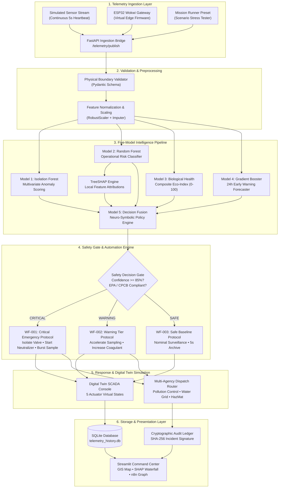

# AquaNeon

<div align="center">

**AI-Powered Water Intelligence, Explainability & Autonomous Response Simulation**

[](https://www.python.org/)
[](https://fastapi.tiangolo.com/)
[](https://streamlit.io/)
[](https://scikit-learn.org/)
[](https://github.com/shap/shap)
[](https://www.docker.com/)
[](https://render.com/)
[](https://docs.pytest.org/)

[Live Interactive Demo](https://autonex-aqua-neon.onrender.com) • [API Health Endpoint](https://autonex-aqua-neon.onrender.com/_stcore/health) • [Repository](https://github.com/rajwav/neon_water_project)

</div>

---

AquaNeon is an end-to-end water intelligence and automated response simulation platform. It ingests multi-parameter aquatic telemetry, detects statistical anomalies, classifies operational risk, computes TreeSHAP feature attributions, evaluates biological ecosystem health, forecasts 24-hour water quality trajectories, and orchestrates simulated SCADA mitigations through a deterministic neuro-symbolic workflow engine.

---

## Quick Overview

| Capability | Implementation |
|---|---|
| **Telemetry Ingestion** | Multi-threaded continuous sensor stream simulator, REST bridge (`/telemetry/publish`), and ESP32 Wokwi firmware simulation |
| **Anomaly Detection (M1)** | Multivariate `IsolationForest` scoring out-of-distribution drift without supervised label dependency |
| **Operational Risk (M2)** | Balanced multi-class `RandomForestClassifier` predicting `SAFE`, `WARNING`, and `CRITICAL` operational risk tiers |
| **Explainable AI (XAI)** | `TreeSHAP` local feature attributions ($\phi_i(x)$) with directional risk impact analysis and natural-language justifications |
| **Biological Health (M3)** | Composite Eco-Health Index ($0-100$) evaluating biodiversity, bioassay mortality envelopes, and taxa tolerance |
| **Early Warning Forecast (M4)** | Multi-scale `HistGradientBoostingRegressor` generating 24-hour predictive trajectories for Dissolved Oxygen and Turbidity |
| **Decision Fusion (M5)** | Neuro-symbolic decision engine enforcing deterministic EPA/CPCB statutory safety guardrails |
| **Automation Engine** | 3-tier industrial workflow engine (`WF-001`, `WF-002`, `WF-003`) with a multi-agency notification router and SCADA actuator simulator |
| **Digital Twin Simulator** | Real-time state tracker for 5 virtual water treatment assets (Intake Valve, Neutralizer, Aerator, Autosampler, Slurry Injector) |
| **Backend API** | Asynchronous `FastAPI` service serving high-throughput inference and telemetry ingestion routes |
| **Frontend UI** | Multi-screen `Streamlit` National Command Center featuring GIS maps, interactive mission runner, and live execution graphs |
| **Storage & Audit** | Persistent `SQLite` time-series database (`telemetry_history.db`) and cryptographic SHA-256 incident logging |
| **Deployment** | Multi-process containerized runtime packaged with `Docker` and deployed on `Render` |
| **Test Suite** | Comprehensive `pytest` test harness with 35 unit, integration, and scenario regression tests (100% pass rate) |

---

## What is AquaNeon?

Modern water treatment plants, municipal water grids, and river monitoring stations continuously generate high-frequency sensor streams (pH, dissolved oxygen, turbidity, conductivity, temperature, nutrients). However, **raw sensor telemetry is difficult to interpret in real time**:

1. **Multivariate Interdependence**: A sudden pH drop to $2.80$ combined with a conductivity surge indicates industrial acid discharge, while a drop in dissolved oxygen with elevated chlorophyll indicates an algal bloom and anoxia. Single-threshold alarms produce excessive false alarms or miss complex multi-variable interactions.
2. **Lack of Operational Explainability**: Standard machine learning models act as black boxes. When an emergency alarm fires, operators cannot afford to guess which sensor drove the prediction.
3. **The Intelligence-to-Actuation Gap**: Analytical models typically produce diagnostic charts on a dashboard, leaving mitigation entirely to manual human intervention under time pressure.

AquaNeon addresses this challenge by connecting an analytical **Five-Model AI Pipeline** directly to a **Deterministic Automation & Digital Twin Layer**:

```text
Raw Sensor Telemetry
  └──> 1. Unsupervised Anomaly Detection (M1)
         └──> 2. Operational Risk Classification (M2) + TreeSHAP Local Attributions
                └──> 3. Biological Ecosystem Health Scoring (M3)
                       └──> 4. 24-Hour Predictive Early Warning Forecast (M4)
                              └──> 5. Neuro-Symbolic Decision Fusion (M5)
                                     └──> Safety Gate & Workflow Engine
                                            └──> SCADA Digital Twin Mitigation
```

The system does not merely predict water quality; it validates sensor data, explains why an event is dangerous, projects future deterioration, enforces regulatory compliance rules, and simulates the exact mechanical sequence required to isolate water intakes and deploy neutralizing reagents.

---

## Core System Architecture



### Architectural Subsystems

1. **Telemetry Ingestion Layer**: Ingests continuous multi-parameter telemetry packets. Supports in-process background simulation, external HTTP POST publishing, and ESP32 edge microcontroller firmware emulation.
2. **Validation & Preprocessing Layer**: Sanitizes raw values against physical environmental bounds (e.g., pH $\in [0, 14]$, DO $\in [0, 20]\text{ mg/L}$, Turbidity $\ge 0$). Scales parameters using `RobustScaler` to handle extreme spikes without mathematical distortion.
3. **Five-Model Intelligence Pipeline**: Concurrently evaluates telemetry across statistical anomaly detection, multi-class operational risk, TreeSHAP explainability, biological health tiering, and 24-hour future trajectory forecasting.
4. **Safety Decision Gate**: Enforces neuro-symbolic guardrails. If any critical statutory boundary is breached (e.g., $\text{pH} < 5.0$, $\text{DO} < 4.0\text{ mg/L}$, $\text{Turbidity} > 25\text{ FNU}$), the system triggers an emergency override regardless of baseline model confidence.
5. **Workflow & SCADA Simulation Engine**: Executes structured industrial automation workflows (`WF-001`, `WF-002`, `WF-003`), transitioning virtual treatment plant actuators between operational states and routing notifications to simulated municipal stakeholders.
6. **Persistence & Presentation Layer**: Archives telemetry and AI inference results into SQLite, generates SHA-256 cryptographic audit signatures, and renders real-time visual analytics via the Streamlit Command Center.

---

## The Five-Model Pipeline

```text
┌─────────────────────────────────────────────────────────────────────────────────────────────────┐
│                                   AQUANEON AI PIPELINE MATRIX                                   │
├─────────┬────────────────────────────┬─────────────────────────────┬────────────────────────────┤
│ Model   │ Algorithm / Technique      │ Primary Input Features      │ Core Output               │
├─────────┼────────────────────────────┼─────────────────────────────┼────────────────────────────┤
│ Model 1 │ Isolation Forest           │ pH, DO, Turb, Cond, fDOM    │ Anomaly Score [-0.5, 0.5]  │
│ Model 2 │ Balanced Random Forest     │ Multi-parameter Suite       │ Risk Class & Probabilities │
│ Model 3 │ Biological Health Engine   │ Chemistry + Bioassay Envs   │ Eco-Health Index (0-100)   │
│ Model 4 │ HistGradientBoosting       │ Autoregressive Lags (t-30d) │ 24h DO & Turbidity Forecast│
│ Model 5 │ Neuro-Symbolic Rule Fusion │ Synthesized M1-M4 Outcomes  │ Prioritized Mitigation Plan│
└─────────┴────────────────────────────┴─────────────────────────────┴────────────────────────────┘
```

### Model 1 — Multivariate Anomaly Detection
* **Purpose**: Identifies unmodeled or out-of-distribution physical-chemical sensor deviations without relying on supervised risk labels.
* **Algorithm**: `IsolationForest` (150 estimators, calibrated contamination threshold).
* **Input**: `pH`, `dissolved_oxygen`, `turbidity`, `specific_conductance`, `fdom`.
* **Output**: Continuous `anomaly_score` ($\approx -0.5$ for extreme nominal baseline, $>0.0$ for statistical anomalies) and discrete `anomaly_status` (`Normal` vs `Anomaly`).
* **Downstream Role**: Serves as the first-line filter in Model 5 decision fusion and triggers early verification checks.

### Model 2 — Balanced Operational Risk Classifier (+ TreeSHAP)
* **Purpose**: Classifies operational risk into discrete operational tiers (`SAFE`, `WARNING`, `CRITICAL`) with calibrated class probability distributions.
* **Algorithm**: `RandomForestClassifier` (balanced class weighting, 200 trees).
* **Input**: Physical-chemical telemetry and nutrient ratios (`pH`, `DO`, `turbidity`, `conductivity`, `temperature`, `SSC`, `nitrate`, `phosphate`).
* **Output**: Categorical prediction, class probabilities (`P(SAFE)`, `P(WARNING)`, `P(CRITICAL)`), and decision confidence.
* **Downstream Role**: Feeds the TreeSHAP explainer for causal attribution and drives the primary triage state of the automation workflow engine.

### Model 3 — Biological Ecosystem Health Engine
* **Purpose**: Translates physical-chemical water chemistry into biological impact metrics and ecological survival envelopes.
* **Algorithm**: Multi-metric bioassay index modeling aquatic species tolerance (e.g., *Ceriodaphnia dubia*, *Daphnia magna*), lethal pH/DO envelopes, and heavy metal toxicity thresholds.
* **Input**: Core chemistry + heavy metal risk indices (`lead_risk`, `mercury_risk`, `arsenic_risk`), nutrient ratios, and observed taxa richness.
* **Output**: Composite `eco_health_index` ($0-100$), qualitative tier (`Excellent`, `Good`, `Degraded`, `Ecotoxic Collapse`), and four sub-scores (`Biodiversity`, `Pollution Tolerance`, `Trophic Balance`, `Bioassay Stress`).
* **Downstream Role**: Informs environmental impact reporting, regulatory compliance auditing, and emergency treatment aeration levels.

### Model 4 — 24-Hour Predictive Early Warning Forecaster
* **Purpose**: Projects short-term future trends to detect emerging degradation before acute threshold violations occur.
* **Algorithm**: Multi-scale `HistGradientBoostingRegressor` utilizing multi-window rolling averages (3d, 7d, 14d, 30d) and second-order velocity derivatives.
* **Input**: Time-series historical lags and current rate-of-change metrics ($\Delta \text{DO}/\Delta t$, $\Delta \text{Turbidity}/\Delta t$).
* **Output**: 24-hour projected `predicted_dissolved_oxygen`, `predicted_turbidity`, future risk projection (`SAFE`, `WARNING`, `CRITICAL`), and uncertainty bounds.
* **Downstream Role**: Enables proactive preemptive dosing and early operator advisory warnings before irreversible contamination occurs.

### Model 5 — Neuro-Symbolic Decision Support & Response Recommendation
* **Purpose**: Synthesizes probabilistic outputs from Models 1–4 with deterministic statutory water quality standards (EPA / CPCB / BIS 10500).
* **Algorithm**: Rule-based expert system with priority override logic and multi-criteria mitigation scoring.
* **Input**: Outputs from Models 1, 2, 3, and 4, raw telemetry, and site metadata.
* **Output**: Incident identification (e.g., `Industrial Acid Spill`, `Eutrophication / Algal Bloom`, `Heavy Metal Contamination`), final unified platform status (`SAFE`, `WARNING`, `CRITICAL`), and prioritized step-by-step mitigation actions.
* **Downstream Role**: Directly triggers the safety decision gate and specifies the exact parameter payload for SCADA actuator execution.

---

## TreeSHAP Explainability

In mission-critical water operations, **a risk classification without justification is operationally unusable**. An operator cannot execute emergency sluice gate closures solely because a neural network or random forest returned `"CRITICAL"` with $95\%$ probability. Operators must understand *which specific physical parameter* triggered the decision and *in what direction*.

AquaNeon integrates `TreeSHAP` (Tree-based SHapley Additive exPlanations) to provide local feature attributions rooted in cooperative game theory:

$$\text{Output Prediction}(x) = \phi_0 + \sum_{i=1}^{M} \phi_i(x)$$

Where $\phi_0$ is the expected baseline model score and $\phi_i(x)$ is the marginal attribution of feature $i$ to the final operational risk class.

```text
[Telemetry Input] ────────────────────────────────────────────────────────┐
  pH: 2.80 | DO: 3.20 | Turbidity: 28.0 | SpCond: 1450.0                  │
                                                                           ▼
[TreeSHAP Attribution Computation] ────────────────────────────────────────┤
  ├── Water pH (2.80)             ───> [+0.224] (Severe Acidification Risk)│
  ├── Conductivity (1450 µS/cm)   ───> [+0.098] (Dissolved Ionic Surge)    │
  ├── Dissolved Oxygen (3.20 mg/L)───> [+0.043] (Hypoxic Stress Driver)    │
  └── Turbidity (28.0 FNU)        ───> [-0.021] (Moderate Particulate)     │
                                                                           ▼
[Operator Presentation Layer] ─────────────────────────────────────────────┘
  ├── 1. Interactive Waterfall Chart (Visual attribution magnitude & sign)
  ├── 2. Feature Contribution & Risk Effect Matrix (Structured tabular format)
  └── 3. Natural Language Explanation:
         "Critical risk triggered primarily by abnormal water pH (2.80) and
          ionic conductance spike (1450 µS/cm), indicating industrial acid discharge."
```

### Visual Waterfall vs. Feature Contribution Matrix

AquaNeon presents SHAP explanations in two synchronized formats:

1. **TreeSHAP Local Feature Attribution Waterfall**: A visual bar chart displaying the exact numerical contribution ($\phi_i$) of each parameter. Positive attributions (red) highlight factors pushing the system toward emergency risk, while negative attributions (blue/green) indicate parameters mitigating risk.
2. **Feature Contribution & Risk Effect Matrix**: A structured operational table mapping every telemetry feature to its observed value, SHAP contribution score, baseline deviation percentage, and natural-language operational effect summary.

---

## Incident Simulator (Mission Runner)

The platform includes an interactive **Incident Simulator (Mission Runner)** designed for stress-testing AI decision pipelines against realistic industrial and ecological contamination scenarios.

### Verified Scenario Presets

| # | Incident Scenario Name | Key Telemetry Values | Expected AI Status | Automated SCADA Action |
|---|---|---|---|---|
| **1** | **Normal River Water — Pristine Baseline** | $\text{pH: } 7.42$, $\text{DO: } 8.65\text{ mg/L}$, $\text{Turb: } 4.5\text{ FNU}$, $\text{Cond: } 280\text{ \mu S/cm}$, $\text{Temp: } 21.3^\circ\text{C}$ | `🟢 SAFE` | Maintain Nominal Flow (100%), 5s Heartbeat Archive |
| **2** | **Agricultural Runoff & Elevated Nutrients** | $\text{pH: } 8.65$, $\text{DO: } 1.80\text{ mg/L}$, $\text{Turb: } 32.0\text{ FNU}$, $\text{Cond: } 580\text{ \mu S/cm}$, $\text{NO}_3\text{: } 8.2\text{ mg/L}$ | `🔴 CRITICAL` | Isolate Intake (0%), Activate Oxygenation Cascades |
| **3** | **Severe Hypoxia / Algal Bloom Event** | $\text{pH: } 8.65$, $\text{DO: } 1.80\text{ mg/L}$, $\text{Turb: } 32.0\text{ FNU}$, $\text{Cond: } 580\text{ \mu S/cm}$, $\text{Chl-a: } 42\text{ \mu g/L}$ | `🔴 CRITICAL` | Isolate Intake (0%), Maximum Aeration (100% Turbo) |
| **4** | **Industrial Acid Spill — Chemical Emergency** | $\text{pH: } 2.80$, $\text{DO: } 3.20\text{ mg/L}$, $\text{Turb: } 28.0\text{ FNU}$, $\text{Cond: } 1450\text{ \mu S/cm}$, $\text{Temp: } 22.0^\circ\text{C}$ | `🔴 CRITICAL` | Immediate Intake Isolation (0%), Dose Alkaline Slurry |
| **5** | **Heavy Metal Contamination Surge** | $\text{pH: } 6.10$, $\text{DO: } 5.40\text{ mg/L}$, $\text{Turb: } 24.0\text{ FNU}$, $\text{Cond: } 920\text{ \mu S/cm}$, $\text{Lead: } 0.88$ | `🟡 WARNING / CRITICAL` | Switch Auxiliary Supply, Accelerate Autosampler (1 min) |

### End-to-End Simulation Execution Cycle

When the user selects a preset and clicks **▶ START SIMULATION**:

1. **Preset Resolution**: The UI looks up the scenario in `demo/scenarios.json` (or `FALLBACK_SCENARIOS`).
2. **Telemetry Synchronization**: All interactive dashboard sliders and state dictionaries update immediately to match the scenario parameters.
3. **Pipeline Inference**: Model 1 (Anomaly), Model 2 (Risk), Model 3 (Bio Health), and Model 4 (Forecast) execute concurrently on the feature vector.
4. **TreeSHAP Attribution**: The SHAP explainer extracts local feature attributions and generates directional risk justifications.
5. **Decision Fusion**: Model 5 synthesizes the model outputs, confirms statutory threshold violations, and determines the unified platform status (`SAFE`, `WARNING`, `CRITICAL`).
6. **Workflow Evaluation**: The automation engine evaluates the safety gate ($>85\%$ confidence check) and selects the appropriate protocol (`WF-001`, `WF-002`, or `WF-003`).
7. **Digital Twin Actuation**: Virtual plant actuators transition to mitigation states (e.g., Raw Water Intake closes to $0\%$, Neutralizer starts).
8. **Timeline & Log Rendering**: The 7-step execution timeline, SCADA CRT terminal logs, n8n visual flow canvas, and multi-agency dispatch ledger render dynamically on the dashboard.

---

## Telemetry & Hardware Interface

### Technical Honesty: Simulation vs. Physical Deployment

```text
┌────────────────────────────────────────────────────────────────────────┐
│                        CURRENT PROTOTYPE STATUS                        │
├───────────────────────────────────┬────────────────────────────────────┤
│ Implemented in Software           │ Planned for Physical Deployment    │
├───────────────────────────────────┼────────────────────────────────────┤
│ • Autonomous in-memory sensor     │ • Direct RS-485 / Modbus RTU       │
│   thread (5s continuous stream)   │   multiprobe physical bus          │
│ • REST telemetry bridge           │ • Industrial MQTT broker           │
│   (POST /telemetry/publish)       │   (Mosquitto / AWS IoT Core)       │
│ • ESP32 Wokwi firmware simulation │ • LoRaWAN / 4G LTE cellular edge   │
│   (WiFi + MQTT JSON publisher)    │   telemetry transmission hardware  │
│ • SQLite persistent time-series   │ • Physical SCADA PLC integration   │
│   archive (telemetry_history.db)  │   (Allen-Bradley / Siemens S7)     │
└───────────────────────────────────┴────────────────────────────────────┘
```

* **Current Prototype**: Telemetry is generated via an autonomous Python background thread (`iot/autonomous_sensor.py`), an HTTP publishing API (`backend/main.py`), and an ESP32 firmware sketch (`wokwi/sketch.ino`) simulating an IoT edge gateway on Wokwi.
* **Future Hardware Roadmap**: The architecture is designed with modular network boundaries. Replacing the software stream with a physical MQTT broker or Modbus RTU serial interface requires updating only `iot/config.py` without modifying any AI or workflow code.

---

## Automation & Workflow Engine

The automation workflow engine (`src/automation/workflow_engine.py`) bridges analytical model intelligence with simulated industrial control.

```text
AI Diagnostic Result (Models 1-5 + XAI)
                    │
                    ▼
       ┌─────────────────────────┐
       │   SAFETY DECISION GATE  │
       │ • AI Confidence >= 85%  │
       │ • Inter-Sensor Coherence│
       │ • Statutory Rule Check  │
       └────────────┬────────────┘
                    │
      ┌─────────────┼─────────────┐
      ▼             ▼             ▼
  [CRITICAL]    [WARNING]      [SAFE]
   WF-001        WF-002        WF-003
      │             │             │
      ▼             ▼             ▼
  7-Step Event  Accelerate    Nominal 5s
  Execution     Sampling &    Continuous
  & Isolation   Dose Coag.    Surveillance
```

### Operational Control Modes

1. **Autonomous Simulation Mode**: Actions execute automatically when the safety decision gate is validated.
2. **Assisted Mode**: System stages emergency commands and requests human operator confirmation, falling back to autonomous execution if an emergency timeout expires.
3. **Advisory Mode**: All actuation commands are placed in a queued state requiring manual operator sign-off.

### Workflow Tier Specifications

* **WF-001 (Critical Emergency Response Protocol)**:
  * *Trigger*: Platform Status = `CRITICAL` or $\text{pH} < 5.0$ / $\text{DO} < 4.0\text{ mg/L}$ / $\text{Turb} > 25\text{ FNU}$ / $\text{Cond} > 1000\text{ \mu S/cm}$.
  * *Actions*: Isolate Raw Water Intake Valve ($0\%$), activate chemical neutralizing dosing pump ($100\%$), switch municipal supply to auxiliary reservoir, engage burst autosampling ($1\text{ min}$ interval), and route high-priority dispatches to State Pollution Control and HazMat units.
* **WF-002 (Warning Tier Intervention Protocol)**:
  * *Trigger*: Platform Status = `WARNING` or elevated nutrients/sediment.
  * *Actions*: Increase coagulant dosing rate ($120\%$), accelerate sampling frequency ($5\text{ min}$ interval), and alert water plant operators via advisory notifications.
* **WF-003 (Safe Baseline Autonomous Surveillance)**:
  * *Trigger*: Platform Status = `SAFE`.
  * *Actions*: Maintain nominal gravity intake flow ($100\%$), log 5-second telemetry heartbeat to SQLite, and execute continuous background inference.

---

## Digital Twin & SCADA Simulation

AquaNeon maintains an in-memory **Digital Twin** tracking the real-time physical state of five virtual water treatment plant components:

| Virtual SCADA Component | Baseline (Normal) State | Automated Emergency Response State | Hardware Command Dispatched |
|---|---|---|---|
| **Raw Water Intake Valve** (Hirakud Sluice Gate) | `OPEN (100% Nominal)` | `ISOLATED (0% Ingress)` | `CLOSE_VALVE(INTAKE_001)` |
| **Chemical Neutralizing Pump** | `STANDBY (0%)` | `ACTIVE (100% Dosing Rate)` | `START_PUMP(NEUTRALIZER_01)` |
| **Aeration Cascades** | `LOW_FLOW (30%)` | `TURBO (100% Flow / 8 Bar)` | `MAX_AERATION(BLOWER_01)` |
| **Robotic Autosampler** | `ROUTINE (30 min interval)` | `SAMPLE BURST (1 min interval)` | `SAMPLE_BURST(AUTO_SMP_01)` |
| **Neutralizer Slurry Injector** | `IDLE` | `INJECTING (Sodium Bicarbonate)` | `DOSE_SLURRY(SODIUM_BICARB)` |

> **Disclaimer**: The Digital Twin is a software simulation prototype. It demonstrates closed-loop industrial SCADA logic and command dispatching without directly manipulating physical high-voltage PLCs or municipal infrastructure.

---

## End-to-End Data Flow

```text
[Telemetry Source] ───────────────> (pH, DO, Turbidity, SpCond, Temp, Nutrients)
         │
         ▼
[Pydantic Validation] ───────────> Bounds check (pH: 0-14, DO: 0-20, etc.)
         │
         ▼
[Robust Preprocessing] ──────────> RobustScaler imputation & feature extraction
         │
         ├──────────────────────┬──────────────────────┬──────────────────────┐
         ▼                      ▼                      ▼                      ▼
    [Model 1: IF]          [Model 2: RF]          [Model 3: Bio]         [Model 4: HGB]
    Anomaly Score          Risk Class             Eco-Health (0-100)     24h DO & Turbidity
         │                      │                      │                      │
         │                      ▼                      │                      │
         │                [TreeSHAP XAI]               │                      │
         │                Feature Contribs             │                      │
         │                      │                      │                      │
         └──────────────────────┴──────────┬───────────┴──────────────────────┘
                                           │
                                           ▼
                            [Model 5: Neuro-Symbolic Fusion]
                            Deterministic EPA / CPCB Guardrails
                                           │
                                           ▼
                               [Safety Decision Gate]
                               Confidence >= 85% Check
                                           │
                                           ▼
                              [Automation Workflow Engine]
                              Select Protocol (WF-001/002/003)
                                           │
                                           ├──────────────────────────────────┐
                                           ▼                                  ▼
                              [Digital Twin Actuation]           [Multi-Agency Dispatch]
                              Valve 0% • Pump 100%               SPCB • Municipal • HazMat
                                           │                                  │
                                           ├──────────────────────────────────┘
                                           ▼
                            [Persistence & Presentation]
                            • SQLite Telemetry Archive
                            • SHA-256 Cryptographic Audit Ledger
                            • Streamlit National Command Center
```

---

## Frontend: National Command Center

The user interface is built with **Streamlit** as a modular National Water Command Center organized across three dedicated operational screens:

```text
┌─────────────────────────────────────────────────────────────────────────────┐
│                       AQUANEON NATIONAL COMMAND CENTER                      │
├─────────────────────────────────────────────────────────────────────────────┤
│ [Screen 1: National Deployment Map]                                         │
│ • Geospatial GIS map showing Indian river basins & monitoring nodes         │
│ • Real-time node status indicators (Hirakud Active Node #001)               │
│ • Proposed expansion zones & national health statistics                      │
├─────────────────────────────────────────────────────────────────────────────┤
│ [Screen 2: Digital Twin & SCADA Control Sandbox]                            │
│ • Interactive physical-chemical parameter sliders for manual testing        │
│ • Live sensor telemetry strip & 5-second continuous streaming graphs        │
│ • 5-Component virtual SCADA equipment state visualizer                      │
├─────────────────────────────────────────────────────────────────────────────┤
│ [Screen 3: AI Model Intelligence & Decision Center]                         │
│ • Five Model Intelligence HUD Cards with live confidence metrics            │
│ • TreeSHAP Local Feature Attribution Waterfall & Contribution Matrix        │
│ • Mission Runner / Incident Simulator preset launcher                       │
│ • 7-Step Real-Time SCADA Execution Timeline & CRT Terminal Output           │
│ • n8n-style interactive visual automation workflow graph                    │
│ • Multi-Agency Emergency Dispatch Communication Center                      │
│ • SHA-256 Cryptographic Incident Verification & Audit Ledger                │
└─────────────────────────────────────────────────────────────────────────────┘
```

---

## Backend REST API (FastAPI)

The platform includes an asynchronous **FastAPI** backend (`backend/main.py`) exposing high-performance REST endpoints for integration with external IoT gateways, SCADA historians, and downstream dashboards.

### API Endpoints Catalog

| Method | Endpoint | Description | Request Payload / Query | Response Structure |
|---|---|---|---|---|
| `GET` | `/health` | Service health status, uptime, and Five-Model catalog | None | `{"status": "healthy", "models_loaded": {...}}` |
| `POST` | `/predict` | Full 5-Model inference + TreeSHAP + Decision Support | JSON feature vector | Complete diagnostic JSON dictionary |
| `GET` | `/telemetry/live` | Latest validated in-situ telemetry packet & AI summary | None | Telemetry record + AI diagnostic snapshot |
| `GET` | `/telemetry/status` | Sensor connection health status | None | `{"status": "CONNECTED", "latency_ms": 12}` |
| `POST` | `/telemetry/publish` | Ingest external telemetry packet from IoT gateway | Telemetry JSON packet | `{"status": "success", "node_id": "001"}` |
| `GET` | `/telemetry/history` | Query persistent SQLite time-series archive | `?limit=50` | `{"total_records": 50, "history": [...]}` |

> **Embedded Engine Fallback**: To ensure zero-dependency local execution, `dashboard/app.py` includes a direct in-process Python fallback that loads `backend.model_loader.engine` in memory if the standalone FastAPI server is not running on port 8000.

---

## Dataset & Training Methodology

### Dataset Specifications

| Property | Implementation Detail |
|---|---|
| **Primary Data Source** | USGS (United States Geological Survey) National Water Information System & NEON Surface Water Telemetry |
| **Storage Formats** | Apache Parquet (`data/processed/usgs_water_quality.parquet`, `data/labeled/operational_risk_labels_v2.parquet`) |
| **Total Sampled Records** | $100,000\text{ observation records}$ |
| **Core Features ($11$)** | `ph`, `dissolved_oxygen`, `turbidity`, `specific_conductance`, `temperature`, `fdom`, `nitrate_mg_l`, `phosphate_mg_l`, `chlorophyll_a_ug_l`, `suspended_sediment`, `lead_risk_index` |
| **Target Variables** | Unsupervised Anomaly Score, Operational Risk Tier (`SAFE`, `WARNING`, `CRITICAL`), Eco-Health Index ($0-100$), 24h Ahead DO / Turbidity |
| **Validation Strategy** | Strict **Temporal Hold-Out Split** (Train: 2018–2024 / $80,000\text{ records}$, Test: 2024–2025 / $20,000\text{ records}$) to ensure zero data leakage |
| **Preprocessing** | `SimpleImputer(strategy="median")` + `RobustScaler()` to safeguard against extreme flash turbidity spikes |

---

## Model Evaluation & Performance Benchmarks

### Model 1: Anomaly Detection (Isolation Forest)
* **Metric**: Empirical Anomaly Detection Rate on Unseen Temporal Test Set (2025).
* **Results**:
  * Nominal Baseline Detection Rate: **$88.25\%$ Normal** on pristine water records.
  * Extreme Contamination Capture: **$92.33\%$ Anomaly Detection Rate** on confirmed critical incidents.
* **Methodological Rationale**: Traditional classification accuracy is inappropriate for unsupervised anomaly detection. Isolation Forest is evaluated by its ability to isolate severe deviations without supervised label leakage.

### Model 2: Operational Risk Classifier (Random Forest)
* **Metric**: Multi-class Accuracy, Macro F1, Weighted F1, Precision, and Recall on Unseen Temporal Hold-Out (2025 / 19,997 samples).
* **Results**:
  * **Overall Accuracy**: **$92.59\%$**
  * **Weighted F1 Score**: **$0.9217$**
  * **Macro F1 Score**: **$0.8422$**
  * **Macro Precision**: **$0.9078$**
  * **SAFE Class F1**: **$0.9589$** ($\text{Precision: } 0.9300$, $\text{Recall: } 0.9896$)
  * **WARNING Class F1**: **$0.8200$** ($\text{Precision: } 0.8596$, $\text{Recall: } 0.7839$)
  * **CRITICAL Class Precision**: **$0.8484$** ($\text{Precision: } 0.8484$, $\text{Recall: } 0.4735$)

### Model 4: 24-Hour Early Warning Forecaster (HistGradientBoosting)
* **Metric**: Coefficient of Determination ($R^2$), Mean Absolute Error (MAE), and Root Mean Squared Error (RMSE) on Unseen Temporal Partition (2023–2024).
* **Results**:
  * **Dissolved Oxygen (24h Ahead) $R^2$**: **$0.7764$** (vs. $0.2920$ Baseline — **$+166.9\%$ Relative Gain**)
  * **Turbidity (24h Ahead) MAE**: **$35.28\text{ FNU}$** (**$-32.6\%$ Error Reduction**)
  * **Future Risk Precision (24h-48h)**: **$81.1\%$** High-Precision Alerting

---

## Technology Stack

| Layer | Technology | Version | Purpose |
|---|---|---|---|
| **Language** | Python | `3.10+` | Core platform language |
| **Web API Framework** | FastAPI | `0.110+` | Asynchronous high-throughput REST backend |
| **ASGI Server** | Uvicorn | `0.28+` | Production ASGI web server |
| **Frontend Framework** | Streamlit | `1.30+` | National Command Center UI & interactive dashboards |
| **Machine Learning** | scikit-learn | `1.4+` | Isolation Forest, Random Forest, and Gradient Boosting |
| **Explainable AI** | SHAP | `0.44+` | TreeSHAP local additive feature attributions |
| **Data Processing** | pandas & numpy | `2.0+` | Tabular data manipulation and numerical matrix ops |
| **Data Serialization** | pyarrow / fastparquet | `15.0+` | High-efficiency Parquet dataset storage and I/O |
| **Visualization** | Plotly & Seaborn | `5.18+` | Interactive charts, SHAP waterfalls, and correlation heatmaps |
| **Database** | SQLite3 | Built-in | Persistent time-series telemetry archive & audit store |
| **Microcontroller Sim** | C++ / Wokwi | ESP32 | Edge IoT gateway firmware emulation |
| **Testing** | pytest | `8.0+` | Automated regression test suite (35 unit/integration tests) |
| **Containerization** | Docker | `Alpine / Slim` | Reproducible multi-stage container deployment |
| **Cloud Hosting** | Render | Docker Web Service | Production cloud deployment & healthcheck monitoring |

---

## Database & Persistent Storage

AquaNeon utilizes a lightweight, high-performance embedded **SQLite** database (`data/telemetry_history.db`) for continuous time-series logging:

```sql
CREATE TABLE IF NOT EXISTS telemetry_records (
    id INTEGER PRIMARY KEY AUTOINCREMENT,
    timestamp TEXT NOT NULL,
    node_id TEXT NOT NULL,
    ph REAL NOT NULL,
    dissolved_oxygen REAL NOT NULL,
    turbidity REAL NOT NULL,
    conductivity REAL NOT NULL,
    temperature REAL NOT NULL,
    nitrate REAL,
    phosphate REAL,
    heavy_metal_risk REAL,
    microbial_risk REAL,
    anomaly_status TEXT,
    anomaly_score REAL,
    risk_label TEXT,
    risk_confidence REAL,
    eco_health_index REAL,
    final_status TEXT,
    prediction_reason TEXT,
    raw_payload_json TEXT
);

CREATE INDEX IF NOT EXISTS idx_timestamp ON telemetry_records(timestamp);
CREATE INDEX IF NOT EXISTS idx_node_id ON telemetry_records(node_id);
```

* **Write Operation**: Validated telemetry packets and their synthesized AI inferences are written atomically on every 5-second heartbeat cycle.
* **Query API**: Fast range-based retrieval by timestamp and node ID via `/telemetry/history`.

---

## Security & Data Integrity

1. **Input Boundary Sanitization**: All incoming network payloads are strictly validated against Pydantic models with explicit physical bounds, preventing injection attacks and numerical NaN corruptions.
2. **Cryptographic SHA-256 Audit Trail**: Every critical incident and SCADA mitigation command generates a deterministic SHA-256 cryptographic signature recording the exact timestamp, telemetry values, model outputs, and operator mode:
   $$\text{Signature} = \text{SHA256}(\text{IncidentID} \parallel \text{Timestamp} \parallel \text{TelemetryJSON} \parallel \text{FinalStatus})$$
3. **Environment Variable Isolation**: Sensitive runtime parameters (e.g., `PORT`, `FASTAPI_URL`, `MQTT_BROKER_HOST`) are configured via environment variables and excluded from source control.

---

## Deployment Architecture

AquaNeon is containerized using Docker and deployed on Render as a multi-process web service:

```text
[Render Cloud Edge]
        │
        ▼ (Port 443 / HTTPS)
[Docker Container Runtime]
        ├── Streamlit Command Center (Port $PORT e.g. 10000)
        └── Internal FastAPI Engine (Port 8000 / 8008, Localhost only)
```

* **Container Runtime**: Managed via `start_platform.sh`, which dynamically binds FastAPI to an available loopback port (`127.0.0.1:8000` or `8008`) and binds Streamlit to `0.0.0.0:${PORT:-8501}`.
* **Live URLs**:
  * **Dashboard**: `https://autonex-aqua-neon.onrender.com`
  * **Health Check**: `https://autonex-aqua-neon.onrender.com/_stcore/health`

---

## Local Setup & Quickstart

### Prerequisites
* Python 3.10, 3.11, or 3.12
* Git
* (Optional) Docker

### 1. Clone Repository & Create Virtual Environment
```bash
git clone https://github.com/rajwav/neon_water_project.git
cd neon_water_project

python3 -m venv .venv
source .venv/bin/activate  # On Windows: .venv\Scripts\activate
```

### 2. Install Dependencies
```bash
pip install --upgrade pip
pip install -r requirements.txt
```

### 3. Run the Automated Test Suite
Verify that all 35 unit, integration, and scenario regression tests pass:
```bash
pytest tests/test_automation_workflows.py tests/test_backend_api.py -v
```

### 4. Launch the Platform Locally
Launch both the FastAPI backend and Streamlit Command Center simultaneously using the multi-process launcher:
```bash
./start_platform.sh
```

Alternatively, run the Streamlit dashboard directly (which utilizes the in-process embedded Python model engine fallback):
```bash
streamlit run dashboard/app.py
```

Open your browser and navigate to `http://localhost:8501`.

---

## Repository File Tree

```text
neon_water_project/
├── backend/
│   ├── main.py                     # FastAPI backend routes & request schemas
│   ├── model_loader.py             # Five-model integrated inference orchestrator
│   └── environmental_engine.py     # Biological & environmental sub-scores
├── dashboard/
│   ├── app.py                      # Streamlit National Command Center
│   └── components/
│       └── geospatial_map.py       # Map rendering & HTML components
├── data/
│   ├── geo/                        # Indian river basin GeoJSON & node mappings
│   ├── labeled/                    # Operational training Parquet datasets
│   └── telemetry_history.db        # SQLite time-series database
├── demo/
│   └── scenarios.json              # 5 presentation scenario presets
├── iot/
│   ├── autonomous_sensor.py        # Background multi-threaded sensor stream
│   ├── mqtt_client.py              # Telemetry ingestion & buffer manager
│   ├── database.py                 # SQLite database I/O operations
│   └── config.py                   # Node constants & physical bounds
├── models/
│   ├── v2/                         # Isolation Forest & Random Forest models
│   └── v3/                         # Ecological health & Forecaster models
├── reports/                        # Evaluation reports & validation benchmarks
├── scripts/                        # Dataset generation & model training scripts
├── src/
│   ├── automation/
│   │   └── workflow_engine.py      # SCADA industrial automation engine (WF-001/002/003)
│   └── ml/
│       └── xai_explainer.py        # TreeSHAP explainer & contribution matrix
├── tests/
│   ├── test_automation_workflows.py# Workflow & SCADA integration tests
│   └── test_backend_api.py         # FastAPI endpoint regression tests
├── wokwi/                          # ESP32 IoT edge microcontroller simulation
├── Dockerfile                      # Production Docker container definition
├── render.yaml                     # Render Infrastructure-as-Code deployment spec
├── requirements.txt                # Python project dependencies
├── start_platform.sh               # Multi-process container startup script
└── README.md                       # Master engineering documentation
```

---

## License

This project is licensed under the MIT License — see the [LICENSE](LICENSE) file for details.
