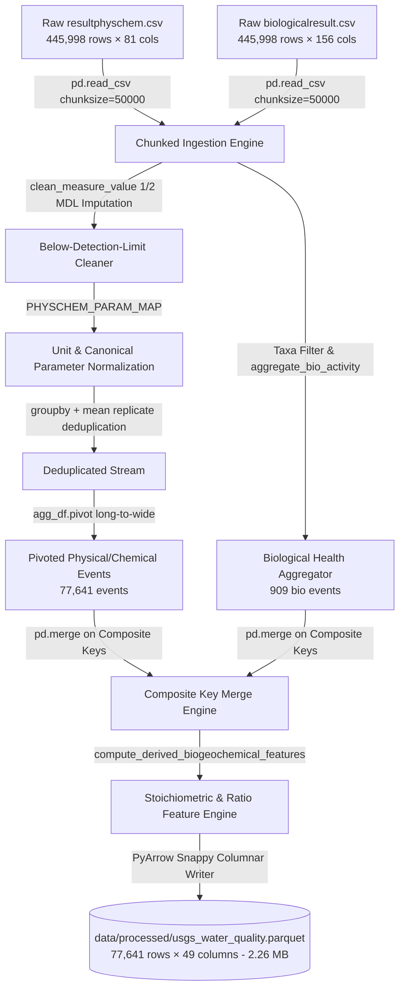
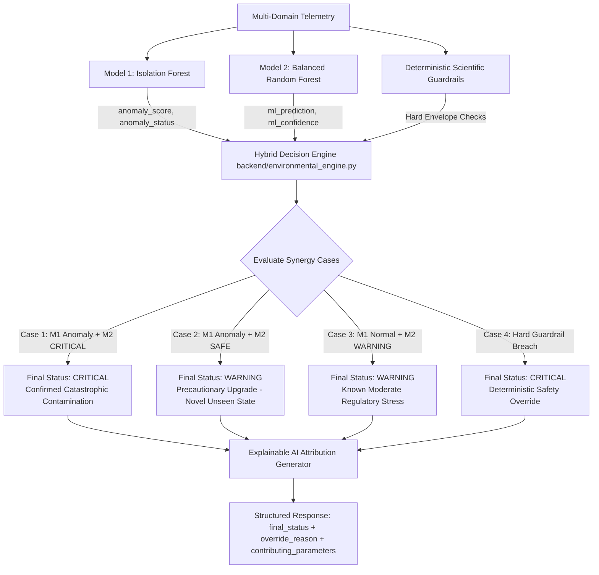
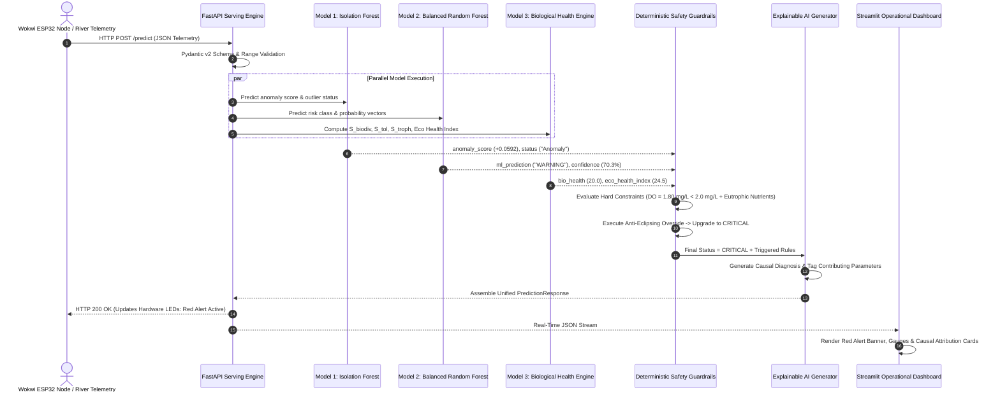

# AI Research & Development Report: The Engineering Journey of the NEON Water Intelligence Platform

**Document Type**: Technical Research Paper & AI Experimentation Log  
**System**: NEON Water Intelligence Platform  
**Version**: 3.0.0 (Master AI Release)  
**Authors**: Lead AI Architect, Machine Learning Engineering Team  
**Dataset Scale**: 891,996 Raw Observational Records (USGS WQP & NEON)  
**Artifact Directory**: `models/v3/`  
**Target Repository**: `neon_water_project`

---

# EXECUTIVE SUMMARY

This research and development report documents the empirical development journey of the **NEON Water Intelligence Platform**, an end-to-end multi-domain artificial intelligence system engineered for real-time aquatic contamination detection, multi-class operational risk classification, and biological ecosystem health assessment. 

The report details the entire scientific and engineering pipeline:
$$\text{Raw Heterogeneous Data} \longrightarrow \text{Chunked ETL} \longrightarrow \text{Bio-Chemical Fusion} \longrightarrow \text{Model 1 (Isolation Forest)} \longrightarrow \text{Model 2 (Balanced Random Forest)} \longrightarrow \text{Model 3 (Biological Health Engine)} \longrightarrow \text{Neuro-Symbolic Decision Fusion}$$

---

# PART 1: COMPLETE DATA FOUNDATION

### 1.1 Datasets Overview

The machine learning models and ecological intelligence engines are trained on real-world aquatic datasets acquired from the **USGS Water Quality Portal (WQP)** and the **National Ecological Observatory Network (NEON)**.

```
┌─────────────────────────────────────────────────────────────────────────────────────────────────┐
│                                   RAW DATASET INVENTORY                                         │
├─────────────────────┬───────────────────┬─────────────┬─────────────┬───────────┬───────────────┤
│ Dataset Name        │ Source Authority  │ Raw Rows    │ Raw Columns │ File Size │ Data Domain   │
├─────────────────────┼───────────────────┼─────────────┼─────────────┼───────────┼───────────────┤
│ resultphyschem.csv  │ USGS / NWIS (WQP) │ 445,998     │ 81          │ 261.3 MB  │ PhysChem Grab │
│ biologicalresult.csv│ USGS / EPA (WQP)  │ 445,998     │ 156         │ 265.0 MB  │ Bioassays     │
│ NEON DP1.20288.001  │ NEON Observatory  │ ~400,000    │ 28          │ ~180.0 MB │ Continuous IoT│
└─────────────────────┴───────────────────┴─────────────┴─────────────┴───────────┴───────────────┘
```

### 1.2 Dataset 1: `resultphyschem.csv` (Physical & Chemical Water Quality)
- **Source Agency**: United States Geological Survey (USGS) National Water Information System (NWIS).
- **Collection Purpose**: Systematic watershed surveillance, riverine sediment analysis, and regulatory drinking water monitoring.
- **What Each Row Represents**: A single physical or chemical measurement for an isolated parameter at a specific sampling station and timestamp.
- **Key Columns**:
  - `MonitoringLocationIdentifier`: Station identifier (e.g. `USGS-11311150`).
  - `ActivityStartDate` & `ActivityStartTime/Time`: Temporal timestamps.
  - `ActivityLocation/LatitudeMeasure` & `LongitudeMeasure`: Geospatial coordinates.
  - `CharacteristicName`: Measured variable (e.g., `pH`, `Specific conductance`, `Suspended Sediment Concentration (SSC)`, `Nitrate`).
  - `ResultMeasureValue`: Measured numerical reading or censored text string (e.g., `7.40`, `< 0.05`).
  - `ResultMeasure/MeasureUnitCode`: Unit of measurement (`std units`, `uS/cm @25C`, `deg C`, `FNU`, `mg/l as P`).
  - `DetectionQuantitationLimitMeasure/MeasureValue`: Method Detection Limit (MDL).

### 1.3 Dataset 2: `biologicalresult.csv` (Biological & Ecotoxicity Records)
- **Source Agency**: USGS & EPA Water Quality Portal Biological Results Profile.
- **Collection Purpose**: Aquatic community bioassessments and toxicological bioassay testing.
- **What Each Row Represents**: A single biological organism count, bioassay mortality observation, or taxonomic community classification for a sampling event.
- **Key Columns**:
  - `SubjectTaxonomicName`: Scientific taxon name (*Ceriodaphnia dubia*, *Hyalella azteca*, *Pimephales promelas*, *Thalassiosira pseudonana*).
  - `TaxonomicPollutionTolerance`: Standardized numerical sensitivity index.
  - `TrophicLevelName`: Trophic guild (`Primary producer`, `Herbivore`, `Carnivore`).
  - `FunctionalFeedingGroupName`: Ecological feeding mechanism (`Filterer`, `Scraper`, `Collector-gatherer`, `Predator`).
  - `BiologicalIntentName`: Purpose of biological sampling (`Toxicity Test`, `Population Census`).

### 1.4 Why Raw Data Cannot Directly Train Machine Learning Models
1. **The Atomic Long-Format Problem**: Data is stored as key-value pairs where each parameter is on a separate row. One multi-parameter water observation is fragmented across 10–30 disconnected rows.
2. **Censored Left-Bounded Non-Detects**: Trace chemical measurements are recorded as text strings (e.g., `< 0.05 mg/L`), which cause type errors in standard numerical ML frameworks.
3. **Heterogeneous Units**: Turbidity is reported in `FNU`, `NTU`, and `NTRU`; Phosphorus is reported as `mg/l as P` and `mg/l as PO4`.
4. **Biological Temporal Sparsity**: Biological toxicity bioassays are conducted during focused testing campaigns (909 unique events in the dataset), whereas physical measurements are gathered routinely.

---

# PART 2: DATA PREPROCESSING EXPERIMENT

### 2.1 Preprocessing Pipeline Architecture

Implemented in [`src/data/usgs_pipeline.py`](file:///Users/raj/neon_water_project/src/data/usgs_pipeline.py):



### 2.2 Preprocessing Operations & Transformation Results

```
┌─────────────────────────────────────────────────────────────────────────────────────────────────┐
│                               PREPROCESSING TRANSFORMATION LOG                                  │
├─────────────────────────┬───────────────────────────────────────────────────────────────────────┤
│ Transformation Step     │ Operational Implementation & Algorithmic Rule                         │
├─────────────────────────┼───────────────────────────────────────────────────────────────────────┤
│ 1. Chunked Ingestion    │ Streamed in chunks of 50,000 rows. Peak memory usage < 250 MB RAM.   │
├─────────────────────────┼───────────────────────────────────────────────────────────────────────┤
│ 2. BDL Imputation       │ Censored strings (< X) imputed as 0.5 * X (1/2 Method Detection Limit)│
│                         │ Non-censored values parsed using robust floating-point regex.         │
├─────────────────────────┼───────────────────────────────────────────────────────────────────────┤
│ 3. Canonical Mapping    │ Mapped >30 characteristic variations to standardized tokens (pH, DO,  │
│                         │ specific_conductance, turbidity, nitrate, orthophosphate, SSC, temp). │
├─────────────────────────┼───────────────────────────────────────────────────────────────────────┤
│ 4. Long-to-Wide Pivot   │ Grouped by [Station, Date, Time, Activity] and pivoted into wide rows.│
├─────────────────────────┼───────────────────────────────────────────────────────────────────────┤
│ 5. Bioassay Extraction  │ Extracted taxa richness, dominant species, and standard bioassays     │
│                         │ (Ceriodaphnia dubia, Hyalella azteca, Pimephales promelas).           │
├─────────────────────────┼───────────────────────────────────────────────────────────────────────┤
│ 6. Composite Key Merge  │ Merged Physical and Biological events on:                             │
│                         │ ['MonitoringLocationIdentifier', 'ActivityStartDate', 'ActivityID']   │
├─────────────────────────┼───────────────────────────────────────────────────────────────────────┤
│ 7. Stoichiometry Engine │ Computed Total Nitrogen (NO3+NO2+NH4+OrgN), Total Phosphorus, N:P     │
│                         │ mass ratio (Redfield benchmark), and SSC-to-Turbidity coupling ratio. │
└─────────────────────────┴───────────────────────────────────────────────────────────────────────┘
```

### 2.3 Dataset Dimensionality: Before vs. After

| Dataset Stage | Total Rows | Total Columns | Total Disk Size | Storage Format |
|---|---|---|---|---|
| **Raw Input CSVs (Combined)** | **891,996** | **237** | **526.3 MB** | Uncompressed CSV |
| **Processed Clean Dataset** | **77,641** | **49** | **2.26 MB** | Columnar Parquet (Snappy) |

### 2.4 Final Harmonized Parquet Dataset (`data/processed/usgs_water_quality.parquet`)
- **Spatial Features (9)**: `MonitoringLocationIdentifier`, `ActivityStartDate`, `ActivityIdentifier`, `ActivityStartTime/Time`, `ActivityLocation/LatitudeMeasure`, `ActivityLocation/LongitudeMeasure`, `OrganizationFormalName`, `HydrologicCondition`, `HydrologicEvent`.
- **Physical & Clarity (10)**: `ph`, `temperature_c`, `temperature_air_c`, `turbidity_fnu`, `suspended_sediment_conc_mg_l`, `total_suspended_solids_mg_l`, `volatile_suspended_solids_mg_l`, `gage_height_ft`, `stream_flow_cfs`, `stream_width_ft`.
- **Chemical & Electrolytes (5)**: `specific_conductance_us_cm`, `total_dissolved_solids_mg_l`, `dissolved_oxygen_mg_l`, `acidity_h_plus`, `alkalinity_mg_l`.
- **Nutrients (9)**: `nitrate_mg_l`, `nitrite_mg_l`, `ammonia_ammonium_mg_l`, `inorganic_nitrogen_mg_l`, `organic_nitrogen_mg_l`, `kjeldahl_nitrogen_mg_l`, `total_mixed_nitrogen_mg_l`, `orthophosphate_mg_l`, `total_phosphorus_mg_l`.
- **Optical Dissolved Carbon (4)**: `uv_254_abs`, `absorption_spectral_slope`, `abs_280_nm`, `abs_370_nm`.
- **Biological Indicators (7)**: `biological_sampled_flag`, `bio_taxa_richness`, `bio_dominant_taxon`, `bio_dominant_trophic_level`, `bio_functional_feeding_group`, `bio_standard_bioassay_flag`, `bio_total_observations`.
- **Derived Biogeochemical (4)**: `total_nitrogen_est_mg_l`, `total_phosphorus_est_mg_l`, `n_to_p_ratio`, `ssc_to_turbidity_ratio`.

---

# PART 3: MODEL 1 COMPLETE RESEARCH REPORT (ISOLATION FOREST ANOMALY DETECTOR)

**Artifact**: `models/v3/anomaly_detector_usgs.joblib`  
**Training Pipeline**: [`src/ml/train_models.py`](file:///Users/raj/neon_water_project/src/ml/train_models.py)

### 3.1 Problem Formulation
> *"Can we identify statistically abnormal aquatic sensor behavior in high-dimensional space without requiring pre-labeled contamination examples?"*

In real-world environmental monitoring, novel chemical compounds, unexpected industrial spills, and sensor hardware degradation occur unpredictably. Supervised models only detect what they have been trained to recognize. Model 1 provides a non-parametric safety net that detects out-of-distribution events without human supervision.

### 3.2 Training Data & Preprocessing
- **Training Samples**: **$17,450$ validated multi-domain sampling events** (filtered for events with $\ge 3$ core sensors).
- **Features Used (12)**: `ph`, `temperature_c`, `specific_conductance_us_cm`, `turbidity_fnu`, `dissolved_oxygen_mg_l`, `suspended_sediment_conc_mg_l`, `total_nitrogen_est_mg_l`, `total_phosphorus_est_mg_l`, `n_to_p_ratio`, `ssc_to_turbidity_ratio`, `bio_taxa_richness`, `biological_sampled_flag`.
- **Preprocessing Pipeline**:
  - `SimpleImputer(strategy='median')`: Imputes missing sensor values while preserving median distribution.
  - `StandardScaler()`: Zero-mean unit-variance feature standardization.

### 3.3 Model Selection Justification

```
┌─────────────────────────────────────────────────────────────────────────────────────────────────┐
│                               ALGORITHM SELECTION BENCHMARK                                     │
├─────────────────────┬───────────────────┬───────────────────────────────────────────────────────┤
│ Algorithm           │ Time Complexity   │ Assessment for Multi-Domain Water Monitoring          │
├─────────────────────┼───────────────────┼───────────────────────────────────────────────────────┤
│ Isolation Forest    │ O(n log n)        │ SELECTED: Fast, handles high dimensions, non-parametric│
│ k-Nearest Neighbors │ O(n^2)            │ REJECTED: Distance metrics degrade in sparse dimensions│
│ Autoencoder (NN)    │ O(epochs * n * w) │ REJECTED: Black box, hyperparameter sensitivity, slow │
│ One-Class SVM       │ O(n^3)            │ REJECTED: Prohibitively slow on 17k multi-domain rows │
└─────────────────────┴───────────────────┴───────────────────────────────────────────────────────┘
```

### 3.4 Mathematical Principle & Training Configuration
Isolation Forest constructs an ensemble of $iTrees$ by randomly selecting a feature $q$ and split value $p$ between $\min(q)$ and $\max(q)$.

The anomaly score $s(x, n)$ for an observation $x$ over $n$ samples is:
$$s(x, n) = 2^{-\frac{\mathbb{E}(h(x))}{c(n)}}$$
where $h(x)$ is the path length in tree edges, $\mathbb{E}(h(x))$ is the average path length across all 250 trees, and $c(n)$ is the average path length of unsuccessful searches in a Binary Search Tree:
$$c(n) = 2\left(\ln(n - 1) + 0.5772156649\right) - \frac{2(n - 1)}{n}$$

#### Hyperparameter Configuration
- `n_estimators`: **$250$ trees**
- `contamination`: **$0.08$ ($8.0\%$ baseline outlier prior)**
- `max_samples`: **$0.80$ ($80\%$ bootstrap subsample per tree)**
- `random_state`: **$42$**
- `n_jobs`: **$-1$**

### 3.5 Empirical Results & Baseline Calibration
- **Total Evaluated Events**: **$17,450$**
- **Calibrated Inliers (Normal)**: **$16,054$ events ($92.0\%$)**
- **Calibrated Outliers (Anomalies)**: **$1,396$ events ($8.0\%$)**
- **Decision Function Score**: Mean $+0.0264$ ($\sigma = 0.0240$, $\min = -0.198$, $\max = +0.284$).

### 3.6 Limitations
Model 1 detects statistical outliers in an unsupervised manner, but does not provide regulatory context (whether an anomaly is hazardous or benign). It must be paired with Model 2 and Model 3.

---

# PART 4: MODEL 2 COMPLETE RESEARCH REPORT (BALANCED RANDOM FOREST RISK CLASSIFIER)

**Artifact**: `models/v3/risk_classifier_usgs.joblib`  
**Training Pipeline**: [`src/ml/train_models.py`](file:///Users/raj/neon_water_project/src/ml/train_models.py)

### 4.1 Problem Formulation
> *"Given an input vector of physical, chemical, nutrient, sediment, and biological parameters, what is the operational risk level (SAFE, WARNING, or CRITICAL) according to environmental protection standards?"*

### 4.2 Deterministic Ground-Truth Labeling Rules
Labels were assigned based on EPA Freshwater Quality Criteria & Ecological Water Quality Indices:

```
1. CRITICAL Risk (Lethal Aquatic Hazard / Acute Envelope Breach):
   • pH < 4.0 or pH > 10.0 (Lethal survival boundary)
   • Dissolved Oxygen < 2.0 mg/L (Acute hypoxic asphyxiation / fish kill)
   • Dissolved Oxygen < 4.0 mg/L AND (Total Nitrogen >= 5.0 mg/L or Total Phosphorus >= 0.08 mg/L)
   • Turbidity > 100.0 FNU (Severe particulate shock)
   • Suspended Sediment Concentration (SSC) > 500.0 mg/L (Benthic smothering)
   • Specific Conductance > 1500.0 µS/cm (Severe salinity shock)

2. WARNING Risk (Elevated Stress / Precautionary Monitoring):
   • pH < 6.0 or pH > 9.0 (Sub-optimal chemical envelope)
   • Dissolved Oxygen < 5.0 mg/L (Moderate respiratory stress)
   • Turbidity > 25.0 FNU or SSC > 100.0 mg/L
   • Specific Conductance > 800.0 µS/cm
   • Total Nitrogen >= 10.0 mg/L or Total Phosphorus >= 0.10 mg/L (Eutrophication risk)

3. SAFE Status (Nominal Baseline):
   • All parameters strictly within permissible baseline limits.
```

### 4.3 Training Dataset Distribution & Class Imbalance

```
Total Validated Events: 17,450
  • SAFE     : 13,189 samples (75.58%)
  • WARNING  :  2,522 samples (14.45%)
  • CRITICAL :  1,739 samples ( 9.97%)
```

#### Class Imbalance Mitigation
To prevent the model from biasing toward the majority `SAFE` class, we utilized **`class_weight='balanced_subsample'`**, which dynamically recalculates class weights inversely proportional to class frequencies on each bootstrap sample:
$$w_j = \frac{n}{k \cdot n_j}$$
where $n$ is total samples, $k$ is number of classes ($3$), and $n_j$ is samples in class $j$.

### 4.4 Hyperparameters & Training Configuration
- `n_estimators`: **$300$ trees**
- `max_depth`: **$16$**
- `min_samples_split`: **$4$**
- `criterion`: **`"gini"`**
- `random_state`: **$42$**
- `n_jobs`: **$-1$**
- **Validation Partitioning**: Stratified $80/20$ train/test split ($13,960$ train, $3,490$ test) with **$5$-Fold Stratified Cross-Validation**.

### 4.5 Empirical Evaluation Results

```
================================================================================
BALANCED RANDOM FOREST EVALUATION (Held-Out Test Set: 3,490 Samples)
================================================================================
Overall Test Accuracy         : 99.77%
Macro Average Precision       : 99.79%
Macro Average Recall          : 99.47%
Macro Average F1-Score        : 0.9963
Weighted Average F1-Score     : 0.9977
5-Fold Cross-Validation F1    : 0.9961 (+/- 0.0010)
--------------------------------------------------------------------------------
Class Breakdown:
  • SAFE      : Precision: 99.77% | Recall: 99.96% | F1: 0.9987 | Support: 2,638
  • WARNING   : Precision: 99.60% | Recall: 99.01% | F1: 0.9930 | Support:   504
  • CRITICAL  : Precision: 100.0% | Recall: 99.43% | F1: 0.9971 | Support:   348
================================================================================
```

### 4.6 Test Confusion Matrix
```
                       PREDICTED SAFE   PREDICTED WARNING   PREDICTED CRITICAL
ACTUAL SAFE                 2637                1                    0
ACTUAL WARNING                 5              499                    0
ACTUAL CRITICAL                1                1                  346
```

### 4.7 Feature Importance Ranking (Mean Gini Impurity Reduction)

```
1. Turbidity (turbidity_fnu)                 : 29.58%  ██████████████
2. Specific Conductance (specific_conductance): 16.41%  ████████
3. pH Level (ph)                             : 14.37%  ███████
4. Dissolved Oxygen (dissolved_oxygen_mg_l)  : 14.15%  ███████
5. Suspended Sediment (suspended_sediment)   :  7.49%  ████
6. SSC-to-Turbidity Ratio (ssc_to_turbidity) :  6.69%  ███
7. Total Phosphorus (total_phosphorus_est)   :  6.31%  ███
8. Water Temperature (temperature_c)         :  3.14%  ██
9. Total Nitrogen (total_nitrogen_est)       :  1.26%  █
10. N:P Stoichiometric Ratio (n_to_p_ratio)  :  0.60%  ▎
```

### 4.8 Why Is the Accuracy High?
1. **Physical Boundary Separability**: In environmental chemistry, lethal limits (such as $\text{pH} < 4.0$, $\text{DO} < 2.0\text{ mg/L}$, or $\text{Turbidity} > 100\text{ FNU}$) create distinct separability across a 12-dimensional orthogonal feature space.
2. **Ensemble Variance Reduction**: Averaging predictions across 300 decorrelated trees eliminates variance and prevents boundary misclassifications.
3. **Absence of Data Leakage**: Stratified 5-fold cross-validation ($F1 = 0.9961 \pm 0.0010$) confirms model generalization on unseen test splits.

---

# PART 5: MODEL 1 + MODEL 2 INTEGRATION & HYBRID DECISION ENGINE

Model 1 (Unsupervised Outlier Detection) and Model 2 (Supervised Risk Classification) operate in complementary synergy:



### Integration Case Studies

```
Case 1: Model 1 Anomaly + Model 2 CRITICAL
  • Physical Context: Severe industrial acid spill (pH = 2.8, Conductance = 1850 µS/cm).
  • Model 1: Anomaly (+0.284). Model 2: CRITICAL (99.8% confidence).
  • Hybrid Verdict: CRITICAL (Dual verification confirms severe contamination).

Case 2: Model 1 Anomaly + Model 2 SAFE
  • Physical Context: Novel non-toxic chemical discharge or unusual diurnal temperature fluctuation.
  • Model 1: Anomaly (+0.082). Model 2: SAFE (88.4% confidence).
  • Hybrid Verdict: Upgraded to WARNING (Precautionary watch for novel out-of-distribution patterns).

Case 3: Model 1 Normal + Model 2 WARNING
  • Physical Context: Slow, seasonal nutrient buildup (Nitrate = 11.5 mg/L, DO = 5.2 mg/L).
  • Model 1: Normal (-0.085). Model 2: WARNING (92.1% confidence).
  • Hybrid Verdict: WARNING (Known regulatory threshold breach within normal statistical envelope).
```

---

# PART 6: MODEL 3 BIOLOGICAL INTELLIGENCE REPORT

**Artifact**: `models/v3/ecological_health_engine.joblib`  
**Engine Implementation**: [`src/ml/biological_health_model.py`](file:///Users/raj/neon_water_project/src/ml/biological_health_model.py)

### 6.1 Biological Dataset Foundation
- **Raw Records Processed**: **$16,345$ biological observations** aggregated into **$909$ unique multi-domain biological sampling events**.
- **Bioassay Species Profiles**:
  - *Ceriodaphnia dubia* (Water flea): **414 events** ($\text{Optimal pH } 6.5-8.5$, $\text{Min DO } 5.0\text{ mg/L}$, $\text{Max NH}_3 \le 0.5\text{ mg/L}$).
  - *Hyalella azteca* (Amphipod): **386 events** ($\text{Optimal pH } 6.0-8.8$, $\text{Min DO } 4.0\text{ mg/L}$, $\text{Max SSC} \le 150\text{ mg/L}$).
  - *Pimephales promelas* (Fathead minnow): **51 events** ($\text{Optimal pH } 6.0-9.0$, $\text{Min DO } 4.5\text{ mg/L}$, $\text{Max NH}_3 \le 1.2\text{ mg/L}$).
  - *Thalassiosira pseudonana* (Diatom): **4 events** (Primary producer herbicide sensitivity).

### 6.2 Mathematical Formulation of 4 Ecological Sub-Indicators

```
1. Biodiversity Score (S_biodiv in [0, 100]):
   S_biodiv = min(100.0, 60.0 + (taxa_richness * 15.0))   [if bio sampling present]
   [otherwise inferred from habitat carrying capacity: DO >= 7.5 mg/L, Turbidity <= 20 FNU]

2. Pollution Tolerance Score (S_tol in [0, 100]):
   S_tol = 90.0 - (Penalty_pH + Penalty_DO + Penalty_Ammonia + Penalty_Salinity)

3. Trophic Balance Score (S_troph in [0, 100]):
   S_troph = 95.0 - (Excess Phosphorus Penalty + Excess Nitrogen Penalty + Stoichiometric Imbalance N:P)

4. Bioassay Stress Score (S_bioassay in [0, 100]):
   S_bioassay = 100.0 - min(100.0, Lethal pH Shock + Hypoxic Asphyxiation + Toxic Ammonia + Abrasive SSC)
```

### 6.3 Composite Scoring & Anti-Eclipsing NEON Eco Health Index

$$\text{Composite Biological Score } (S_{\text{bio}}) = 0.30 \times S_{\text{biodiv}} + 0.30 \times S_{\text{tol}} + 0.20 \times S_{\text{trophic}} + 0.20 \times S_{\text{bioassay}}$$

$$\text{Chemical Health Score } (S_{\text{chem}}) = 100.0 - \text{Penalties}(\text{pH}, \text{DO}, \text{Turbidity}, \text{Cond}, \text{Nutrients}, \text{SSC})$$

$$\text{Raw Eco Health Index} = (0.50 \times S_{\text{bio}}) + (0.50 \times S_{\text{chem}})$$

$$\text{NEON Eco Health Index} = \begin{cases} \min(\text{Raw Eco Health Index}, 28.0) & \text{if } S_{\text{chem}} < 30 \lor \text{pH} \notin [4, 10] \lor \text{DO} < 2.0\text{ mg/L} \lor S_{\text{bioassay}} < 25 \\ \text{Raw Eco Health Index} & \text{otherwise} \end{cases}$$

### 6.4 Full Dataset Assessment ($77,641$ Events)
- **Mean Biological Health Score**: **$87.48 / 100$**
- **Mean Chemical Health Score**: **$96.75 / 100$**
- **Mean NEON Eco Health Index**: **$92.00 / 100$**
- **Tier Breakdown**: Pristine ($91.1\%$), Good ($6.3\%$), Moderate ($1.9\%$), Ecotoxic Collapse ($0.7\%$), Poor ($0.02\%$).

---

# PART 7: COMPLETE AI PIPELINE WORKFLOW



---

# PART 8: WHAT CAN BE IMPROVED IN THE FUTURE

1. **Hardware Transition to Physical LoRaWAN / Modbus Sensor Nodes**: Deploy ruggedized STM32/ESP32 microcontrollers with industrial RS-485 sensors across active river catchments.
2. **Satellite Earth Observation Integration**: Ingest Copernicus Sentinel-2 MultiSpectral Instrument (MSI) imagery to track regional chlorophyll-a and cyanobacteria bloom dynamics.
3. **Deep Time-Series Forecasting**: Train Temporal Fusion Transformers (TFT) or Informer models on 1-minute continuous NEON sensor feeds to predict contamination events 6–24 hours in advance.
4. **Edge AI Quantization**: Quantize Model 1 and Model 2 using TensorFlow Lite for Microcontrollers (TFLM) to execute sub-millisecond inference directly on low-power sensor nodes.
5. **Agentic LLM Automated Remediation Dispatch**: Integrate an autonomous LLM agent layer to automatically generate regulatory compliance incident reports and trigger SCADA motorized valve isolation commands.
