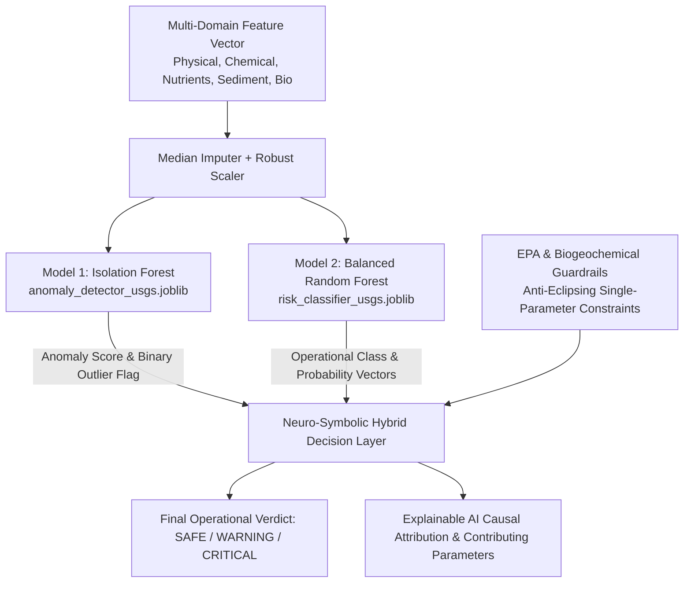

# AI Model Documentation (v3.0 — USGS & NEON Multi-Domain)

**Project**: SIH Water Intelligence Platform  
**Pipeline Source**: [`src/ml/train_models.py`](file:///Users/raj/neon_water_project/src/ml/train_models.py)  
**Training Dataset**: [`data/processed/usgs_water_quality.parquet`](file:///Users/raj/neon_water_project/data/processed/usgs_water_quality.parquet) (17,450 multi-domain observation events)  
**Artifact Directory**: `models/v3/`  
**Evaluation Report**: [`reports/usgs_model_evaluation.md`](file:///Users/raj/neon_water_project/reports/usgs_model_evaluation.md)

---

## 1. Multi-Domain AI Architecture Overview

The system employs a **dual-layer machine learning engine** combined with a **deterministic environmental safety layer**:



---

## 2. Feature Definitions & Biogeochemical Importance

| Feature Name | Description | Units | Model Importance (Gini) |
|---|---|---|---|
| `turbidity_fnu` | Optical nephelometric light scatter / particulate matter | $\text{FNU}$ | **29.58%** (Primary driver) |
| `specific_conductance_us_cm` | Electrolytic conductivity / ionic salinity | $\mu\text{S/cm}$ | **16.41%** |
| `ph` | Hydrogen ion potential (acidity / alkalinity) | Standard Units | **14.37%** |
| `dissolved_oxygen_mg_l` | Molecular oxygen concentration | $\text{mg/L}$ | **14.15%** |
| `suspended_sediment_conc_mg_l` | Suspended sediment dry mass | $\text{mg/L}$ | **7.49%** |
| `ssc_to_turbidity_ratio` | Particulate mass to optical scatter coupling | Ratio | **6.69%** |
| `total_phosphorus_est_mg_l` | Total dissolved & particulate phosphorus | $\text{mg/L}$ | **6.31%** |
| `temperature_c` | Water thermal regime | $^\circ\text{C}$ | **3.14%** |
| `total_nitrogen_est_mg_l` | Total estimated nitrogen suite ($\text{NO}_3+\text{NO}_2+\text{NH}_4+\text{OrgN}$) | $\text{mg/L}$ | **1.26%** |
| `n_to_p_ratio` | Nitrogen to Phosphorus stoichiometric ratio | Ratio | **0.60%** |
| `bio_taxa_richness` | Taxa count / bioassay community richness | Count | Contextual Feature |
| `biological_sampled_flag` | Bioassay sampling event indicator | 0 or 1 | Contextual Feature |

---

## 3. Algorithm Specifications & Training Regimes

### 3.1 Model 1: Multivariate Anomaly Detector (Isolation Forest)
- **File**: `models/v3/anomaly_detector_usgs.joblib`
- **Algorithm**: `IsolationForest(n_estimators=250, contamination=0.08, max_samples=0.8, random_state=42)`
- **Mathematical Principle**: Recursively isolates observations by randomly selecting a feature and a split value. Outlier contamination points require significantly fewer tree partitions than clustered inliers.
- **Output**:
  - `anomaly_score`: Continuous anomaly metric in $[-1.0, 1.0]$. Negative scores indicate normal baseline conditions; positive scores indicate statistical multivariate outliers.
  - `anomaly_status`: Discrete classification (`Normal` vs. `Anomaly`).

### 3.2 Model 2: Operational Risk Classifier (Balanced Random Forest)
- **File**: `models/v3/risk_classifier_usgs.joblib`
- **Algorithm**: `RandomForestClassifier(n_estimators=300, max_depth=16, min_samples_split=4, class_weight='balanced_subsample', random_state=42)`
- **Mathematical Principle**: Ensemble of 300 decorrelated decision trees with cost-sensitive subsample weighting to handle environmental class imbalance (`75.6% SAFE`, `14.5% WARNING`, `10.0% CRITICAL`).
- **Validation**: 5-Fold Stratified Cross-Validation (`Macro F1 = 0.9961 +/- 0.0010`).

---

## 4. Empirical Evaluation Results

### Test Set Performance (3,490 Unseen Validation Samples)

| Operational State | Precision | Recall | F1-Score | Support |
|---|---|---|---|---|
| **`SAFE`** | **99.77%** | **99.96%** | **0.9987** | 2,638 |
| **`WARNING`** | **99.60%** | **99.01%** | **0.9930** | 504 |
| **`CRITICAL`** | **100.00%** | **99.43%** | **0.9971** | 348 |
| **Overall / Macro** | **99.79%** | **99.47%** | **0.9963** | **3,490** |

```
                       CONFUSION MATRIX (TEST SET)
                       Predicted Predicted Predicted
                          SAFE    WARNING  CRITICAL
        True SAFE        [2637       1         0   ]
        True WARNING     [   5     499         0   ]
        True CRITICAL    [   1       1       346   ]
```

---

## 5. How Prediction & Decision Fusion Works

When raw telemetry arrives at the inference endpoint:
1. **Preprocessing**: The feature vector is imputed for missing values using historical station medians and scaled via standardized feature scaling.
2. **Model 1 Scoring**: Evaluates continuous distance from the healthy multivariate manifold, outputting `anomaly_score` and `anomaly_status`.
3. **Model 2 Classification**: Computes probability distribution across `[P(SAFE), P(WARNING), P(CRITICAL)]`.
4. **Deterministic Anti-Eclipsing Guardrail**: Evaluates hard physiological boundaries ($\text{pH} < 4.0 \lor > 10.0$, $\text{DO} < 2.0\text{ mg/L}$, toxic heavy metal proxy $> 0.70$). If any hard boundary is breached, the final decision is deterministically escalated to `CRITICAL` regardless of statistical ML probability.
5. **XAI Attribution**: Generates explicit causal sentences explaining the root triggers and identifies `contributing_parameters`.

---

## 6. Operational Limitations

1. **Missing Nutrient Panels**: Discrete grab samples do not always measure total nitrogen and phosphorus concurrently; the pipeline utilizes robust median imputation when nutrient channels are absent.
2. **Biological Sampling Frequency**: Biological bioassays (*Ceriodaphnia*, *Hyalella*) are conducted periodically; biological features serve as confirmatory ecotoxicity signals rather than continuous real-time inputs.
3. **Extreme Unseen Chemical Compounds**: Novel industrial contaminants not reflected in conductivity or sediment profiles are flagged by Model 1's non-parametric Isolation Forest rather than supervised classes.
