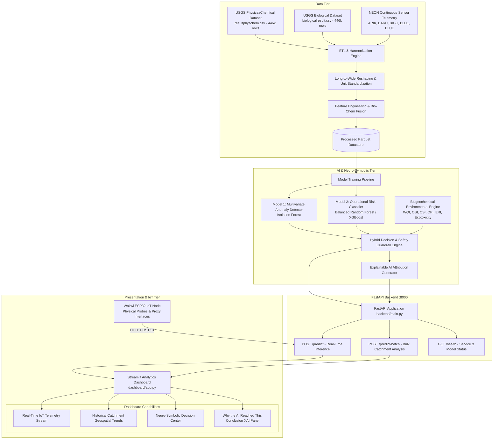
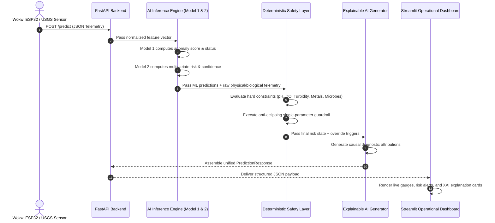

# System Architecture Specification: NEON Water Intelligence Platform

**Document**: System Architecture & Technical Design  
**Target System**: Multi-Domain AI-Powered Water Contamination Detection & Digital Twin Platform  
**Version**: 3.0.0  
**Architecture Classification**: Hybrid Neuro-Symbolic Pipeline (Statistical ML + Multi-Domain Biogeochemical Constraints)

---

## 1. End-to-End System Architecture

The NEON Water Intelligence Platform operates across four integrated tiers: **Data Ingestion & Harmonization**, **Machine Learning & Neuro-Symbolic Intelligence**, **API Serving & Orchestration**, and **Interactive Visualization & IoT Emulation**.

---

## 2. Data Flow & Processing Pipeline

---

## 3. Detailed Component Architecture

### 3.1 Data Ingestion & Harmonization Pipeline (`src/data/`)
- **Unit Normalization**: Translates disparate measurement units (`deg C`, `uS/cm @25C`, `FNU/NTU`, `mg/l as P`, `mg/l as N`) into standardized aquatic units.
- **Censored Value Handling**: Imputes Below-Detection-Limit (BDL) values using half the Method Detection Limit ($\frac{1}{2}\text{MDL}$) to eliminate missing-data bias.
- **Long-to-Wide Reshaping**: Groups atomic measurements by sampling station and timestamp, generating dense multi-parameter observation vectors.

### 3.2 Biological & Chemical Data Fusion
- **Nutrient Stoichiometry**: Computes total nitrogen to phosphorus ($\text{N}:\text{P}$) ratios to flag eutrophication thresholds.
- **Sediment-Organic Coupling**: Ratios of Suspended Sediment Concentration (SSC) to optical absorption (UV254/Sag) to identify agricultural vs. industrial runoff.
- **Taxonomic Ecotoxicity Index**: Aggregates bioindicator organism sensitivity scores (*Ceriodaphnia dubia*, *Hyalella azteca*) to produce an ecological health index.

### 3.3 Machine Learning Pipeline (`models/`)
- **Model 1 (Anomaly Detection)**:
  - Architecture: Multi-tree Isolation Forest.
  - Objective: Identify out-of-distribution multi-parameter interactions without relying on predefined thresholds.
- **Model 2 (Operational Risk Classifier)**:
  - Architecture: Cost-sensitive Balanced Random Forest / Gradient Boosted Trees.
  - Objective: Classify multi-parameter states into operational categories (`SAFE`, `WARNING`, `CRITICAL`).

### 3.4 Deterministic Environmental Safety Decision Engine (`backend/environmental_engine.py`)
- **Precedence Hierarchy**:
  1. `INSUFFICIENT_DATA` (Fewer than 2 valid sensor channels)
  2. `CRITICAL` Hard Constraint Violations (Acute lethal pH $<4$ or $>10$, DO $<2.0\text{ mg/L}$, Turbidity $>100\text{ FNU}$, SpCond $>1500\ \mu\text{S/cm}$, Heavy Metals $>0.70$)
  3. `WARNING` Moderate Constraint Violations (Sub-optimal envelope, elevated nutrients, bloom risk)
  4. `Model 2 ML Risk` (Preserved when within permissible physical envelope)
  5. `Model 1 Anomaly Watch` (Precautionary warning if ML predicts SAFE but multi-dimensional outlier detected)
  6. `SAFE` (All models and physical guardrails confirm normal operating conditions)

### 3.5 Serving & Dashboard Layer (`backend/`, `dashboard/`)
- **FastAPI Core**: Async REST API validating schemas via Pydantic v2, returning structured predictions in $<15\text{ms}$.
- **Streamlit Operational Dashboard**: Real-time monitoring console displaying:
  - Multi-station selector and telemetry streaming.
  - 4-column neuro-symbolic decision breakdown.
  - 5 Environmental Intelligence metric cards with anti-eclipsing warnings.
  - "Why the AI reached this conclusion" explainability panel.
  - Historical trend charts and observation tables.
- **Wokwi ESP32 Digital Twin**: Hardware simulation emulating physical sensor voltages, proxy interfaces, and hardware status indicator LEDs.
