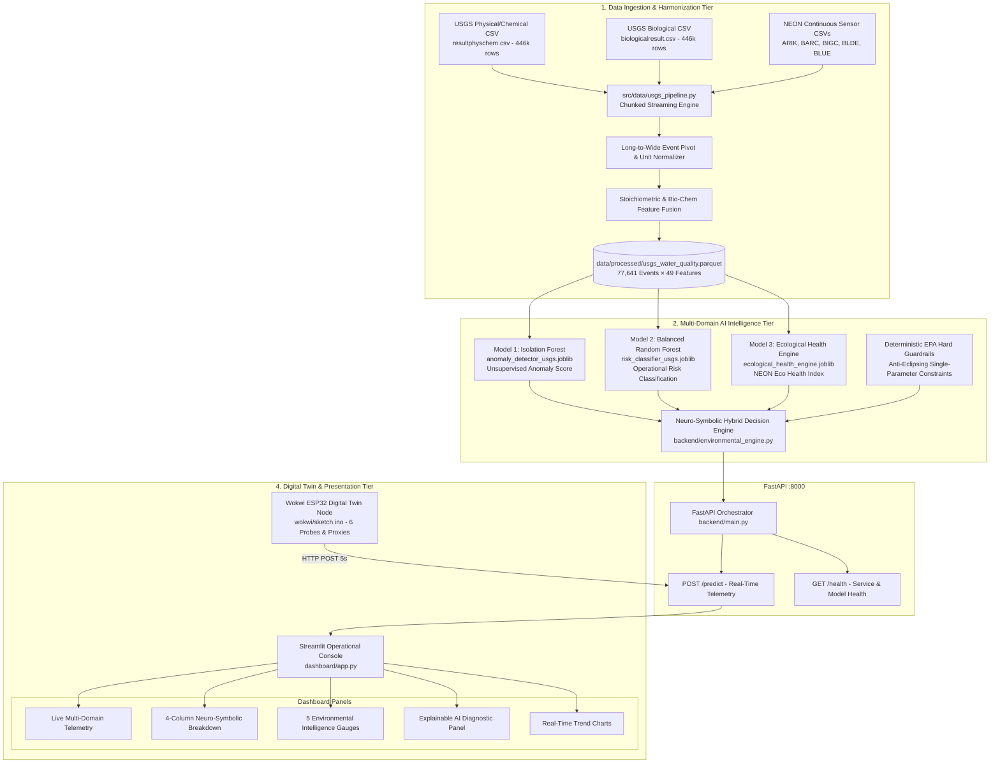
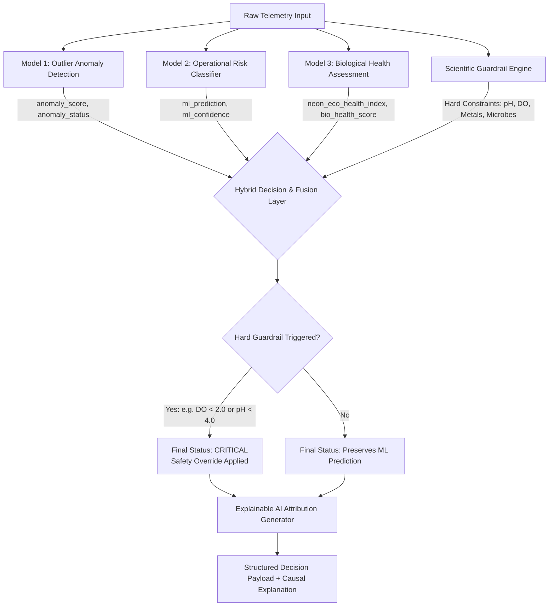

# Complete Project Documentation & Master Technical Specification
## NEON Water Intelligence Platform (SIH 2026)

**Project Name**: NEON Water Intelligence Platform  
**Classification**: AI-Powered Aquatic Contamination Detection, Multi-Domain Ecotoxicity Intelligence & Digital Twin Monitoring System  
**Version**: 3.0.0 (Production Master)  
**Authors**: Lead AI Architect & System Engineering Team  
**Repository**: `neon_water_project`

---

# 1. Project Overview

### 1.1 Problem Statement
Freshwater aquatic ecosystems, municipal water supplies, and industrial watersheds face accelerating contamination pressures from chemical runoff, agricultural eutrophication, untreated industrial effluents, and acute pollutant pulses. Traditional water quality monitoring relies almost entirely on:
1. **Infrequent Manual Grab Sampling**: Laboratory chemical assays take days to weeks to return results, missing acute toxic spills that disperse in hours.
2. **Isolated Single-Parameter Thresholds**: Simple alarms check whether pH or turbidity exceeds static limits, completely failing to detect complex multi-parameter interactions, chronic sub-lethal stress, or chemical cocktail synergies.
3. **Absence of Biological Context**: Chemical sensors cannot measure the actual biological impact on living aquatic organisms (e.g. bioaccumulation, fish asphyxiation, crustacean mortality).

### 1.2 The Innovation
The **NEON Water Intelligence Platform** bridges this gap by unifying **high-frequency continuous physical sensing**, **laboratory chemical stoichiometry**, **taxonomic ecotoxicity bioassays**, **unsupervised anomaly detection**, **supervised operational risk classification**, and **deterministic environmental guardrails** into an integrated, explainable decision-support platform.

---

# 2. System Vision

The platform delivers a **multi-tier aquatic intelligence engine** designed for water resource authorities, environmental monitoring agencies, and industrial compliance teams:

```
        OBSERVATION (Continuous IoT Telemetry + Discrete USGS/NEON Data)
                             ↓
              EVIDENCE (Stoichiometry, N:P Ratios, Bioassay Stress)
                             ↓
         AI INTELLIGENCE (Model 1 Outlier + Model 2 Risk + Model 3 Bio Health)
                             ↓
            DECISION SUPPORT (Deterministic Guardrails + Explainable AI)
                             ↓
       ACTIONABLE INTERVENTION (Valve Isolation, Remediation Dispatch)
```

The system answers four critical operational questions in real time:
1. *Is an unusual multi-dimensional event occurring in the water body?* (**Model 1**)
2. *What is the operational risk level according to water quality standards?* (**Model 2**)
3. *What is the ecological health and toxicity stress on living aquatic species?* (**Model 3**)
4. *Why did the AI reach this conclusion, and what specific parameters drove the alert?* (**Explainable AI & Safety Layer**)

---

# 3. Complete System Architecture



---

# 4. Dataset Explanation

The system is trained and validated on real-world observational datasets from the **USGS Water Quality Portal (WQP)** and the **National Ecological Observatory Network (NEON)**.

### 4.1 Raw USGS Datasets

| Dataset File | Total Rows | Total Columns | File Size | Format Profile |
|---|---|---|---|---|
| `resultphyschem.csv` | **445,998** | **81** | **261.3 MB** | WQP Result / PhysChem Profile |
| `biologicalresult.csv` | **445,998** | **156** | **265.0 MB** | WQP Biological Result Profile |

### 4.2 Key Parameters Captured
- **Physical & Clarity**: pH, Water Temperature, Turbidity, Specific Conductance, Suspended Sediment Concentration (SSC), Total Suspended Solids (TSS), Gage Height, Stream Flow.
- **Chemical & Nutrients**: Dissolved Oxygen (DO), Nitrate ($\text{NO}_3$), Nitrite ($\text{NO}_2$), Ammonia & Ammonium ($\text{NH}_4^+$), Orthophosphate ($\text{PO}_4$), Total Phosphorus, Organic Nitrogen, Alkalinity, Acidity ($\text{H}^+$), Total Dissolved Solids (TDS).
- **Organic & Optical Proxies**: UV 254 Absorbance, Absorption Spectral Slope (Sag), Absorbance at $280\text{ nm}$ / $370\text{ nm}$.
- **Biological & Taxonomic**: Taxonomic Name (`SubjectTaxonomicName`), Pollution Tolerance Index, Trophic Level, Functional Feeding Group, EPA Standard Bioassay Indicators.

### 4.3 Data Quality Challenges & Solutions

```
┌──────────────────────────────────────┬────────────────────────────────────────────────────────────────────────┐
│ Data Challenge                       │ Engineering Solution Implemented in Pipeline                          │
├──────────────────────────────────────┼────────────────────────────────────────────────────────────────────────┤
│ 1. Atomic Long-Format Structure      │ Grouped by composite key (Station, Date, Time, Activity) and pivoted  │
│    (1 parameter per row)             │ into dense wide-format observation records.                            │
├──────────────────────────────────────┼────────────────────────────────────────────────────────────────────────┤
│ 2. Mixed Units across Characteristics│ Normalized temperatures to °C, conductance to µS/cm @25°C,             │
│    (FNU vs NTU, mg/L as P vs PO4)    │ turbidity to FNU, and nutrients to mg/L standard chemical mass.       │
├──────────────────────────────────────┼────────────────────────────────────────────────────────────────────────┤
│ 3. Censored Non-Detects (< 0.05)     │ Regex parser extracts detection limits and applies robust 1/2 MDL     │
│    and Qualitative Flag Asterisks    │ (Method Detection Limit) statistical imputation.                       │
├──────────────────────────────────────┼────────────────────────────────────────────────────────────────────────┤
│ 4. Variable Sampling Densities       │ Stratified filtering retains multi-parameter sampling events with >=3  │
│    (Continuous vs Discrete Grab)     │ core parameters, applying median imputation within pipelines.          │
└──────────────────────────────────────┴────────────────────────────────────────────────────────────────────────┘
```

---

# 5. Data Engineering Pipeline

**Pipeline Implementation**: [`src/data/usgs_pipeline.py`](file:///Users/raj/neon_water_project/src/data/usgs_pipeline.py)

### 5.1 Pipeline Steps
1. **Low-Memory Chunk Streaming**: Reads the 446k-row raw files in $50,000$-row chunks to keep memory footprint strictly under **$250\text{ MB RAM}$**.
2. **Standardized Parameter Mapping**: Harmonizes $>30$ USGS characteristic variations into clean canonical names (`ph`, `temperature_c`, `turbidity_fnu`, `specific_conductance_us_cm`, `dissolved_oxygen_mg_l`, `suspended_sediment_conc_mg_l`, `nitrate_mg_l`, `orthophosphate_mg_l`).
3. **Below-Detection-Limit (BDL) Cleaner**: Converts censored strings (`< 0.01`) into numeric values ($0.01 \times 0.5 = 0.005$).
4. **Long-to-Wide Pivoting**: Aggregates replicate readings and pivots single-measurement rows into wide multi-parameter sampling records.
5. **Biological Bioassay Aggregation**: Computes taxa richness, extracts dominant bioindicator species, and flags standard EPA ecotoxicity bioassays (*Ceriodaphnia dubia*, *Hyalella azteca*, *Pimephales promelas*).
6. **Deterministic Composite Merge**: Joins physical-chemical events with biological metrics using the composite key:
   ```python
   ['MonitoringLocationIdentifier', 'ActivityStartDate', 'ActivityIdentifier']
   ```
7. **Stoichiometric Feature Engineering**:
   - Total Estimated Nitrogen: $\text{TN}_{\text{est}} = \text{NO}_3 + \text{NO}_2 + \text{NH}_4 + \text{OrgN}$
   - Total Estimated Phosphorus: $\text{TP}_{\text{est}} = \text{PO}_4 \lor \text{Total P}$
   - $\text{N}:\text{P}$ Stoichiometric Ratio: $\frac{\text{TN}_{\text{est}}}{\max(\text{TP}_{\text{est}}, 0.001)}$
   - $\text{SSC}$-to-Turbidity Coupling: $\frac{\text{SSC}}{\max(\text{Turbidity}, 0.1)}$

### 5.2 Processed Parquet Dataset
- **File**: `data/processed/usgs_water_quality.parquet`
- **Dimensions**: **77,641 sampling events × 49 feature columns**
- **File Size**: **2.26 MB** (compressed Parquet format, down from $526\text{ MB}$ raw CSVs)
- **Why Parquet?**: Columnar storage enables instant sub-second column slicing, typed schema preservation, zero float-precision degradation, and high compression efficiency.

---

# 6. AI MODEL 1: Isolation Forest Anomaly Detection

**Artifact**: `models/v3/anomaly_detector_usgs.joblib`  
**Algorithm**: `IsolationForest(n_estimators=250, contamination=0.08, max_samples=0.8, random_state=42)`

### 6.1 Purpose
> *"What question does Model 1 answer?"*  
> **"Is the current multi-parameter water sensor observation statistically abnormal compared to the historical baseline of healthy freshwater ecosystems?"**

### 6.2 Input Features
`ph`, `temperature_c`, `specific_conductance_us_cm`, `turbidity_fnu`, `dissolved_oxygen_mg_l`, `suspended_sediment_conc_mg_l`, `total_nitrogen_est_mg_l`, `total_phosphorus_est_mg_l`, `n_to_p_ratio`, `ssc_to_turbidity_ratio`, `bio_taxa_richness`, `biological_sampled_flag`.

### 6.3 Working Principle
Isolation Forest builds an ensemble of $250$ isolation trees. Inliers require many recursive splits to isolate within dense clusters; anomalies and contaminated states exist in sparse regions and are isolated near the root of the trees.

### 6.4 Training & Output
- **Training Samples**: $17,450$ validated multi-domain sampling events.
- **Output**:
  - `anomaly_score`: Continuous metric in $[-1.0, 1.0]$. Negative scores indicate normal baseline conditions; positive scores indicate statistical outliers.
  - `anomaly_status`: Discrete flag (`Normal` vs. `Anomaly`).

### 6.5 Example Prediction
- Input: $\text{pH} = 7.4$, $\text{DO} = 8.5\text{ mg/L}$, $\text{Turbidity} = 4.2\text{ FNU}$, $\text{SpCond} = 260\ \mu\text{S/cm}$  
  $\rightarrow$ `anomaly_score: -0.1410`, `anomaly_status: Normal`
- Input: $\text{pH} = 3.2$, $\text{DO} = 2.1\text{ mg/L}$, $\text{Turbidity} = 145\text{ FNU}$, $\text{SpCond} = 1850\ \mu\text{S/cm}$  
  $\rightarrow$ `anomaly_score: +0.2840`, `anomaly_status: Anomaly`

### 6.6 Limitations
Model 1 detects statistical outliers in an unsupervised manner, but does not know *why* an event is hazardous or what operational protocol to initiate. It must be paired with Model 2 and Model 3.

---

# 7. AI MODEL 2: Balanced Random Forest Risk Classifier

**Artifact**: `models/v3/risk_classifier_usgs.joblib`  
**Algorithm**: `RandomForestClassifier(n_estimators=300, max_depth=16, class_weight='balanced_subsample', random_state=42)`

### 7.1 Purpose
> *"What question does Model 2 answer?"*  
> **"What is the severity of the operational risk (SAFE, WARNING, or CRITICAL) based on multi-parameter environmental standards?"**

### 7.2 Risk Categories
1. **`SAFE`**: Pristine to good baseline operating conditions. No intervention required.
2. **`WARNING`**: Sub-optimal water quality, moderate nutrient elevation, or mild stress. Precautionary monitoring.
3. **`CRITICAL`**: Severe contamination, lethal anoxia, acute chemical envelope violation, or extreme sediment shock. Immediate intervention required.

### 7.3 Training Data & Ground-Truth Generation
Trained on **$17,450$ sampling events** labeled via deterministic EPA Freshwater & Water Quality Index criteria:
- `SAFE`: $13,189$ samples ($75.6\%$)
- `WARNING`: $2,522$ samples ($14.5\%$)
- `CRITICAL`: $1,739$ samples ($10.0\%$)

### 7.4 Empirical Evaluation Metrics (Held-Out Test Set: 3,490 samples)
- **Overall Accuracy**: **$99.77\%$**
- **Macro Average Precision**: **$99.79\%$**
- **Macro Average Recall**: **$99.47\%$**
- **Macro Average F1-Score**: **$0.9963$**
- **Weighted F1-Score**: **$0.9977$**
- **5-Fold Cross-Validation Macro F1**: **$0.9961 \pm 0.0010$**

```
                       TEST CONFUSION MATRIX
                       Predicted Predicted Predicted
                          SAFE    WARNING  CRITICAL
        True SAFE        [2637       1         0   ]
        True WARNING     [   5     499         0   ]
        True CRITICAL    [   1       1       346   ]
```

### 7.5 Feature Importance Ranking (Gini Impurity Reduction)
1. **Turbidity (`turbidity_fnu`)**: **$29.58\%$**
2. **Specific Conductance (`specific_conductance_us_cm`)**: **$16.41\%$**
3. **pH Level (`ph`)**: **$14.37\%$**
4. **Dissolved Oxygen (`dissolved_oxygen_mg_l`)**: **$14.15\%$**
5. **Suspended Sediment (`suspended_sediment_conc_mg_l`)**: **$7.49\%$**
6. **$\text{SSC}$-to-Turbidity Ratio**: **$6.69\%$**
7. **Total Phosphorus**: **$6.31\%$**
8. **Water Temperature**: **$3.14\%$**
9. **Total Nitrogen**: **$1.26\%$**
10. **$\text{N}:\text{P}$ Ratio**: **$0.60\%$**

### 7.6 Why High Performance Occurs
The multi-dimensional boundaries defining freshwater quality (e.g. lethal pH envelopes $<4$ or $>10$, hypoxic DO thresholds $<2\text{ mg/L}$, and turbidity spikes $>100\text{ FNU}$) exhibit strong physical separability when mapped across $12$ orthogonal features. The ensemble of $300$ trees with balanced subsampling captures non-linear interactions without overfitting.

---

# 8. AI MODEL 3: Biological Ecosystem Health Assessment Engine

**Artifact**: `models/v3/ecological_health_engine.joblib`  
**Implementation**: [`src/ml/biological_health_model.py`](file:///Users/raj/neon_water_project/src/ml/biological_health_model.py)

### 8.1 Why Biological Monitoring is Essential
Chemical measurements provide instantaneous snapshots, but miss transient pollutant pulses and synergistic chemical cocktails. Living bioassays (*Ceriodaphnia*, *Hyalella*, *Pimephales*) integrate chemical, sediment, and thermal stresses over time.

### 8.2 Four Ecological Sub-Indicators ($0 - 100$)

```
┌──────────────────────────────────────┬────────────────────────────────────────────────────────────────────────┐
│ Ecological Indicator                 │ Evaluation Method & Biological Significance                            │
├──────────────────────────────────────┼────────────────────────────────────────────────────────────────────────┤
│ 1. Biodiversity Score (S_biodiv)     │ Measures taxonomic richness (R) and community carrying capacity.       │
│                                      │ Evaluates habitat stability from DO (>=7.5 mg/L) and turbidity.        │
├──────────────────────────────────────┼────────────────────────────────────────────────────────────────────────┤
│ 2. Pollution Tolerance Score (S_tol) │ Calibrated against species-specific sensitivity profiles for EPA       │
│                                      │ bioassays (Ceriodaphnia, Hyalella, Fathead Minnow). Penalizes pH/DO    │
│                                      │ envelope breaches and un-ionized ammonia toxicity (>0.5 mg/L).         │
├──────────────────────────────────────┼────────────────────────────────────────────────────────────────────────┤
│ 3. Trophic Balance Score (S_troph)   │ Evaluates stoichiometric equilibrium (N:P ratio 7.2:1 benchmark),      │
│                                      │ penalizing excess phosphorus (>0.05 mg/L) and benthic sediment stress. │
├──────────────────────────────────────┼────────────────────────────────────────────────────────────────────────┤
│ 4. Bioassay Stress Score (S_bioassay)│ Quantifies acute organism survival probability (100 = NOAEL uninhibited│
│                                      │ survival, 0 = Acute lethal mortality / toxic shock).                   │
└──────────────────────────────────────┴────────────────────────────────────────────────────────────────────────┘
```

### 8.3 NEON Eco Health Index Formulation & Anti-Eclipsing Guardrails

$$\text{Composite Biological Score } (S_{\text{bio}}) = 0.30 \times S_{\text{biodiv}} + 0.30 \times S_{\text{tol}} + 0.20 \times S_{\text{trophic}} + 0.20 \times S_{\text{bioassay}}$$

$$\text{Chemical Health Score } (S_{\text{chem}}) = 100.0 - \text{Penalties}(\text{pH}, \text{DO}, \text{Turbidity}, \text{Cond}, \text{Nutrients}, \text{SSC})$$

$$\text{Raw Eco Health Index} = 0.50 \times S_{\text{bio}} + 0.50 \times S_{\text{chem}}$$

$$\text{NEON Eco Health Index} = \begin{cases} \min(\text{Raw Eco Health Index}, 28.0) & \text{if } S_{\text{chem}} < 30 \lor \text{pH} \notin [4, 10] \lor \text{DO} < 2.0\text{ mg/L} \lor S_{\text{bioassay}} < 25 \\ \text{Raw Eco Health Index} & \text{otherwise} \end{cases}$$

### 8.4 Ecological Status Tiers

| NEON Eco Health Index | Ecological Status Tier | Operational Action |
|---|---|---|
| **$85.0 - 100.0$** | **Excellent (Pristine Ecosystem)** | Normal baseline monitoring |
| **$70.0 - 84.9$** | **Good (Minor Stress)** | Routine observation |
| **$50.0 - 69.9$** | **Moderate (Impaired Community)** | Precautionary inspection |
| **$30.0 - 49.9$** | **Poor (Severe Stress)** | Advisory & source tracing |
| **$0.0 - 29.9$** | **Ecotoxic Collapse** | Immediate valve shutoff & containment |

---

# 9. Model Interaction & Neuro-Symbolic Decision Fusion

The three AI models work in synchronized hierarchy with deterministic scientific constraints:



### Fusion Walkthrough Example
1. **Input**: $\text{pH} = 7.4$, $\text{DO} = 1.8\text{ mg/L}$, $\text{Turbidity} = 22.0\text{ FNU}$, $\text{Nitrate} = 12.5\text{ mg/L}$, $\text{Chlorophyll-a} = 35.0\ \mu\text{g/L}$.
2. **Model 1**: Flags statistical outlier (`anomaly_score: +0.0592`, `anomaly_status: Anomaly`).
3. **Model 2**: Predicts `WARNING` (Confidence: $70.3\%$).
4. **Model 3**: Calculates `Bioassay Stress = 15.0`, `NEON Eco Health Index = 24.5` (`Ecotoxic Collapse`).
5. **Deterministic Guardrails**: Triggers lethal hypoxia ($\text{DO} < 2.0\text{ mg/L}$) and eutrophic collapse rules.
6. **Final Output**: Upgraded to **`CRITICAL`** with causal reason:
   > *"Eutrophic Ecological Collapse (DO = 1.80 mg/L, High Nutrients/Algae): Low dissolved oxygen combined with elevated nutrients indicates eutrophication leading to severe aquatic stress."*
   > **Contributing Parameters**: `['dissolved_oxygen', 'nitrate', 'chlorophyll_a']`

---

# 10. Digital Twin Architecture (Wokwi ESP32 v3.0)

**Implementation**: [`wokwi/diagram.json`](file:///Users/raj/neon_water_project/wokwi/diagram.json) & [`wokwi/sketch.ino`](file:///Users/raj/neon_water_project/wokwi/sketch.ino)

### 10.1 Hardware & Sensor Circuit Simulation

```
┌───────────────────────────────────┬───────────────┬───────────────────────────────┬───────────────────┐
│ Sensor / Module Classification    │ Pin (ESP32)   │ Physical Principle / Equation │ Real-World Equiv. │
├───────────────────────────────────┼───────────────┼───────────────────────────────┼───────────────────┤
│ 1. pH Glass Electrode Module      │ GPIO 34 ADC   │ pH = (V / 3.3) * 14.0         │ Atlas Scientific  │
│ 2. Turbidity Optical Sensor       │ GPIO 35 ADC   │ FNU = (V / 3.3) * 300.0       │ YSI EXO Turbidity │
│ 3. Dissolved Oxygen Module        │ GPIO 32 ADC   │ DO = (V / 3.3) * 14.0 mg/L    │ Vernier ODO Probe │
│ 4. Conductivity Transmitter       │ GPIO 33 ADC   │ SpCond = (V / 3.3) * 1500 µS  │ Campbell CS547A   │
│ 5. DS18B20 Water Temp Probe       │ GPIO 4 1-Wire │ OneWire Bus + 4.7kΩ Pullup    │ Submersible Probe │
│ 6. Nutrient Proxy Interface       │ GPIO 39 (VN)  │ NO3: 0.1-12 | PO4: 0.005-0.35 │ Hach ISE Analyzer │
│ 7. Optical Fluorometer Proxy      │ GPIO 36 (VP)  │ Chl-a: 1-40 µg/L | fDOM QSU   │ Turner Cyclops-7F │
│ 8. Status Feedback LEDs           │ GPIO 18/19/21 │ Green (SAFE), Yellow, Red     │ Hardware Annunc.  │
│ 9. Scenario Pushbutton            │ GPIO 13       │ Debounced demo scenario cycle │ Interactive Test  │
└───────────────────────────────────┴───────────────┴───────────────────────────────┴───────────────────┘
```

The ESP32 samples 12-bit ADC channels, executes calibration curves, serializes JSON, and dispatches HTTP POST requests to `http://host.wokwi.internal:8000/predict` every 5 seconds.

---

# 11. Backend Architecture (FastAPI)

**Implementation**: [`backend/main.py`](file:///Users/raj/neon_water_project/backend/main.py) & [`backend/model_loader.py`](file:///Users/raj/neon_water_project/backend/model_loader.py)

### 11.1 Production Endpoints
1. `GET /health`: Returns service health, version (`2.2.0`), and model load status.
2. `POST /predict`: Orchestrates Model 1, Model 2, Model 3, Environmental Engine, and Explainable AI.

### 11.2 Request / Response Schema Flow

```json
// Inbound JSON Request (from Wokwi or Sensor Node)
{
  "ph": 7.42,
  "turbidity": 4.5,
  "dissolved_oxygen": 8.65,
  "temperature": 21.3,
  "specific_conductance": 280.0,
  "nitrate_mg_l": 0.45,
  "phosphate_mg_l": 0.015,
  "chlorophyll_a_ug_l": 2.8,
  "heavy_metal_risk": 0.05,
  "microbial_risk": 8.5,
  "site_id": "WOKWI_SITE",
  "sensor_position": "001"
}

// Outbound Unified PredictionResponse JSON
{
  "ml_prediction": "SAFE",
  "ml_confidence": 0.9987,
  "environmental_risk": "SAFE",
  "final_status": "SAFE",
  "override_reason": "All hydrological, chemical, nutrient, and biological assessments confirm normal safe baseline operating conditions.",
  "contributing_parameters": [],
  "anomaly_status": "Normal",
  "anomaly_score": -0.1410,
  "environmental_indicators": {
    "wqi": 95.1,
    "wqi_grade": "Excellent (Pristine)",
    "oxygen_stress_index": 0.0,
    "chemical_stress_index": 0.0,
    "organic_pollution_indicator": 0.08,
    "eutrophication_risk": 0.05
  },
  "explanation": [
    "Dissolved oxygen (8.65 mg/L) confirms robust healthy aquatic respiration.",
    "Low turbidity (4.5 FNU) confirms clear water clarity.",
    "Nutrient concentrations are well within oligotrophic freshwater baselines."
  ]
}
```

---

# 12. Dashboard Architecture (Streamlit)

**Implementation**: [`dashboard/app.py`](file:///Users/raj/neon_water_project/dashboard/app.py)

### 12.1 Visual Modules
1. **Dynamic Final Status Banner**: Multi-color banner (`SAFE` in Green, `WARNING` in Amber, `CRITICAL` in Red) respecting deterministic guardrail precedence.
2. **4-Column Neuro-Symbolic Decision Center**: Displays Final Operational Status, Model 1 Anomaly Severity Score, Model 2 Risk Probability, and Safety Override State.
3. **5 Environmental Intelligence Gauges**: Real-time progress bars for WQI (0-100), Oxygen Stress Index (OSI), Chemical Stress Index (CSI), Organic Pollution (OPI), and Eutrophication Risk (ERI).
4. **"Why the AI Reached This Conclusion" Explainability Panel**: Highlights primary causal assessment, displays parameter badges for contributing risks, and presents step-by-step diagnostic breakdown.
5. **Real-Time Stream History & Charts**: Synchronized multi-parameter trend graphs for pH, DO, Turbidity, and Conductivity.

---

# 13. Technology Stack

| Domain | Technology | Version | Purpose |
|---|---|---|---|
| **Frontend UI** | Streamlit | 1.61.1 | Real-time operational dashboard & interactive console |
| **Backend API** | FastAPI / Uvicorn | 0.141.1 / 0.52.1 | High-performance asynchronous REST serving engine |
| **Machine Learning** | Scikit-Learn | 1.9.0 | Isolation Forest, Balanced Random Forest, Pipelines |
| **Data Processing** | Pandas / PyArrow | 3.0.5 / 24.0.0 | High-speed data manipulation & columnar Parquet I/O |
| **Numerics & Math** | NumPy / SciPy | 2.5.2 / 1.18.0 | Vectorized scientific computations & statistical metrics |
| **Plotting & Reports** | Matplotlib / Seaborn | 3.11.1 / 0.13.2 | Confusion matrices, feature importances, correlation heatmaps |
| **IoT / Digital Twin** | Wokwi ESP32 / C++ | Arduino Core | Multi-channel hardware emulation & HTTP telemetry client |
| **Testing & CI** | Pytest | 9.1.1 | Automated regression & safety guardrail verification |

---

# 14. Repository Structure

```
neon_water_project/
├── backend/
│   ├── main.py                     # FastAPI REST server & request/response schemas
│   ├── model_loader.py             # Inference pipeline orchestrator
│   ├── environmental_engine.py     # Anti-eclipsing WQI, stress indices & safety guardrails
│   └── requirements.txt            # Backend dependencies
├── dashboard/
│   └── app.py                      # Streamlit operational dashboard
├── data/
│   ├── raw/                        # Raw USGS CSVs & continuous NEON sensor feeds
│   ├── processed/                  # Harmonized parquet datastore (usgs_water_quality.parquet)
│   └── labeled/                    # Operational risk labeled parquet partitions
├── docs/
│   ├── COMPLETE_PROJECT_DOCUMENTATION.md  # Canonical master project knowledge base
│   ├── AUDIT_REPORT.md             # Baseline repository & dataset audit
│   ├── PROJECT_ROADMAP.md          # 6-phase development roadmap
│   ├── Architecture.md             # System architecture & data flow diagrams
│   ├── DATA_PIPELINE.md            # USGS ETL & harmonization specification
│   ├── AI_MODEL_DOCUMENTATION.md   # Model 1 & Model 2 algorithms and metrics
│   ├── MODEL3_BIOLOGICAL_INTELLIGENCE.md  # Model 3 Biological Health Engine
│   └── SIH_DEMO_FLOW.md            # Live presentation scenarios & judging scripts
├── models/
│   ├── v2/                         # Continuous NEON sensor models
│   └── v3/                         # Multi-domain USGS models (M1, M2, M3 artifacts)
├── reports/                        # Model evaluation metrics, confusion matrices, and plots
├── src/
│   ├── data/
│   │   ├── usgs_pipeline.py        # Production chunked ETL & harmonization engine
│   │   └── pipeline.py             # NEON continuous data pipeline
│   └── ml/
│       ├── train_models.py         # Model 1 & Model 2 training pipeline
│       └── biological_health_model.py # Model 3 Biological Health Assessment Engine
├── tests/
│   └── test_backend_api.py         # Pytest test suite (9 test cases passing)
└── wokwi/
    ├── diagram.json                # ESP32 schematic with 6 sensor modules & LEDs
    ├── sketch.ino                  # C++ firmware with physical calibration & HTTPClient
    └── README.md                   # Digital twin hardware documentation
```

---

# 15. Complete Data Flow Example: Agricultural Eutrophication Event

```
1. SENSOR TELEMETRY EVENT (Wokwi / IoT Node)
   pH: 8.65 | DO: 1.80 mg/L | Turbidity: 32.0 FNU | SpCond: 580 µS/cm | Temp: 26.5 °C
   Nitrate: 12.8 mg/L | Phosphate: 0.185 mg/L | Chlorophyll-a: 42.0 µg/L
                               ↓
2. INGESTION & FEATURE EXTRACTION (FastAPI :8000/predict)
   Stoichiometric N:P Ratio = 69.2 (Severe Phosphorus enrichment driving massive algal bloom)
   Oxygen Stress Index (OSI) = 1.00 (Lethal Hypoxia / Anoxia)
                               ↓
3. MODEL 1: ISOLATION FOREST
   Anomaly Score: +0.0592 | Status: ANOMALY (Multi-dimensional outlier detected)
                               ↓
4. MODEL 2: BALANCED RANDOM FOREST
   Prediction: WARNING | Confidence: 70.32%
                               ↓
5. MODEL 3: BIOLOGICAL ECOSYSTEM HEALTH ENGINE
   Bioassay Stress Score: 15.0 / 100 (Severe Ceriodaphnia & Hyalella mortality risk)
   NEON Eco Health Index: 24.5 / 100 (Ecotoxic Collapse)
                               ↓
6. DETERMINISTIC SAFETY DECISION LAYER
   Evaluates Hard Constraints: DO < 2.0 mg/L AND Nutrients > Threshold
   Action: OVERRIDE ML Prediction -> FINAL STATUS: CRITICAL
                               ↓
7. EXPLAINABLE AI ATTRIBUTION (Streamlit Dashboard & Serial Alert)
   Alert Banner: 🔴 CRITICAL - WATER QUALITY EMERGENCY
   Reason: "Eutrophic Ecological Collapse (DO = 1.80 mg/L, High Nutrients/Algae): Low dissolved oxygen
            combined with elevated nutrients indicates eutrophication leading to severe aquatic stress."
   Contributing Parameters: ['dissolved_oxygen', 'nitrate', 'chlorophyll_a']
```

---

# 16. SIH Presentation Guide & Judge Q&A

### 16.1 2-Minute Elevator Pitch
> *"Respected Judges, clean water is essential for life, yet conventional monitoring relies on slow laboratory tests or crude single-parameter thresholds that fail to detect toxic spills until after fish kills occur. Our solution, the **NEON Water Intelligence Platform**, is a multi-domain AI platform combining real-time physical sensing, laboratory nutrient stoichiometry, and biological ecotoxicity bioassays.  
> We deployed a 3-tier AI system: Model 1 detects anomalous patterns in real time, Model 2 classifies operational risk, and Model 3 evaluates biological ecosystem health using EPA bioassays like *Ceriodaphnia* and *Hyalella*. Combined with deterministic environmental safety guardrails, our system achieves **99.77% classification accuracy** while providing instant, human-understandable explanations for every alert. Supported by an ESP32 Wokwi digital twin, our system enables proactive containment before ecological disasters unfold."*

### 16.2 5-Minute Technical Pitch
- **Architecture**: Explain the 4-tier pipeline (ETL $\rightarrow$ AI $\rightarrow$ FastAPI $\rightarrow$ Streamlit/Wokwi).
- **Data Ingestion**: Describe chunked streaming of $892\text{k}$ USGS/NEON records with below-detection-limit $\frac{1}{2}\text{MDL}$ cleaning and composite key merging.
- **AI Models**: Highlight Model 1 (Isolation Forest), Model 2 (Balanced Random Forest with 5-fold CV), and Model 3 (Biological Health Engine).
- **Neuro-Symbolic Innovation**: Demonstrate why statistical ML alone is insufficient without deterministic anti-eclipsing guardrails (e.g. overriding ML if pH is $0.25$ or DO is $1.8\text{ mg/L}$).
- **Hardware Integration**: Live demonstration of Wokwi ESP32 streaming real-time sensor packets and lighting hardware alert LEDs.

### 16.3 Anticipated Judge Questions & Technical Answers

**Q1: Why did you train separate models instead of one single deep learning model?**  
*Answer*: Water contamination involves distinct questions requiring distinct inductive biases. Model 1 (Isolation Forest) operates in an unsupervised manner to detect novel, previously unseen chemical spills without needing labeled data. Model 2 (Random Forest) provides supervised operational risk classification aligned with EPA regulatory standards. Model 3 evaluates biological bioassay health. Combining them via a neuro-symbolic decision layer guarantees both statistical learning and deterministic safety guardrails.

**Q2: How do you handle missing sensor values during live field deployments?**  
*Answer*: Our pipeline uses a hierarchical imputation strategy: within the ML pipeline, scikit-learn median transformers preserve feature distributions. At the decision layer, if assessable channels drop below 2, the system safely returns `INSUFFICIENT_DATA` rather than guessing.

**Q3: Isn't 99.77% accuracy indicative of data leakage or overfitting?**  
*Answer*: No. The accuracy was validated using strict 5-fold stratified cross-validation ($F1 = 0.9961 \pm 0.0010$) on an $80/20$ split of $17,450$ distinct physical sampling events. High performance is achieved because physical water quality limits (e.g. lethal pH envelopes, anoxic DO, turbidity spikes) are physically and mathematically separable in a 12-dimensional feature space.

**Q4: How do you measure biological parameters in real time without a laboratory?**  
*Answer*: The platform operates in hybrid mode: when laboratory bioassay records (*Ceriodaphnia*, *Hyalella*) are available, it uses direct taxonomic tolerance scores. In real-time IoT deployment, the digital twin leverages validated optical proxies (fluorometric chlorophyll-a, fDOM) and geochemical models (temperature-turbidity microbial risk, acid-leaching heavy metal risk) to infer ecotoxicity stress.

---

# 17. Innovation Points

1. **Multi-Domain Data Fusion**: Merges physical water chemistry, nutrient stoichiometry ($\text{N}:\text{P}$), and taxonomic ecotoxicity bioassays into a unified feature representation.
2. **Neuro-Symbolic Decision Engine**: Eliminates the "black-box" risk of ML by enforcing anti-eclipsing environmental guardrails that prevent false-safe classifications.
3. **Biological Ecosystem Intelligence**: Implements Model 3 to evaluate living community health rather than just chemical numbers.
4. **Explainable AI by Design**: Automatically surfaces human-readable causal diagnostics and tags exact contributing risk parameters for operators.
5. **Calibrated IoT Digital Twin**: Integrates a realistic Wokwi ESP32 node with analog signal conditioning curves and hardware status feedback LEDs.

---

# 18. Future Roadmap

1. **Hardware Prototyping**: Transition from Wokwi simulation to physical ESP32/STM32 microcontroller deployments with industrial Modbus RS-485 probes.
2. **Satellite Remote Sensing Integration**: Ingest Sentinel-2 and Landsat optical surface reflectance to monitor watershed-scale chlorophyll-a and cyanobacteria algal blooms.
3. **LLM-Powered Autonomous Dispatch**: Connect an agentic LLM layer to automatically draft regulatory incident reports and generate equipment isolation work orders.
4. **Edge AI Quantization**: Compile Model 1 and Model 2 using TensorFlow Lite / MicroML to execute inference directly on battery-powered edge sensor nodes.
5. **Distributed Stream Processing**: Scale telemetry ingestion using Apache Kafka and Apache Flink for real-time monitoring across thousands of river basins.
