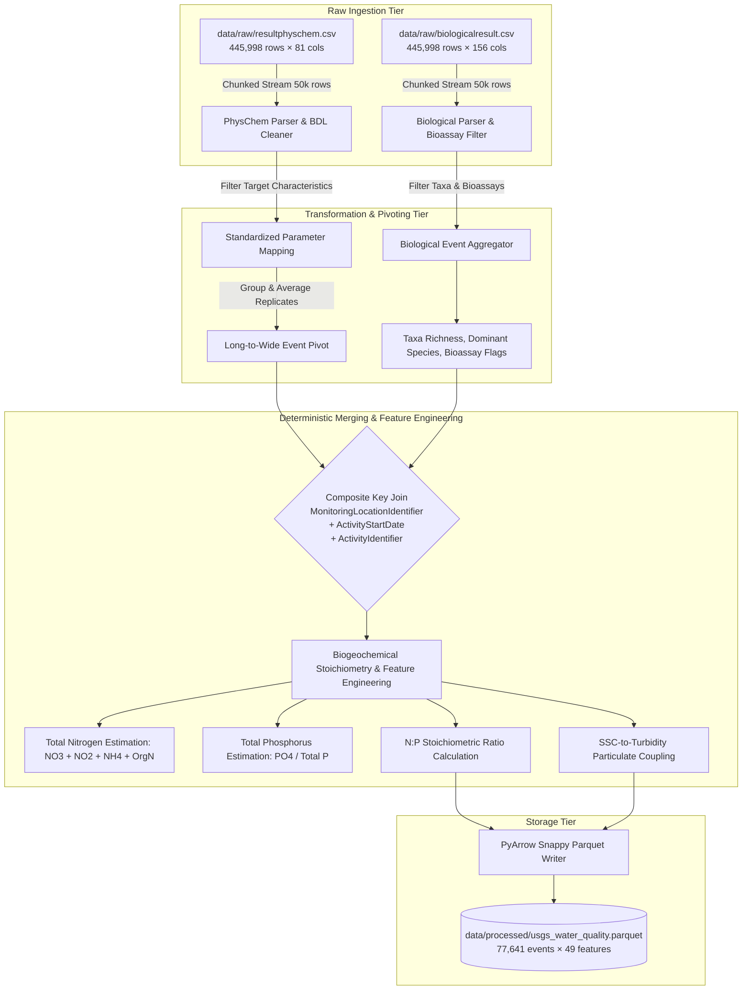

# Data Harmonization & Feature Engineering Pipeline (Phase 2)

**Pipeline Module**: [`src/data/usgs_pipeline.py`](file:///Users/raj/neon_water_project/src/data/usgs_pipeline.py)  
**Input Sources**:
- `data/raw/resultphyschem.csv` (445,998 rows, 81 columns, 261.3 MB)
- `data/raw/biologicalresult.csv` (445,998 rows, 156 columns, 265.0 MB)  
**Output Target**:
- `data/processed/usgs_water_quality.parquet` (77,641 sampling events × 49 features, 2.26 MB)

---

## 1. Pipeline Architecture & Data Flow



---

## 2. Transformation & Cleaning Methodology

### 2.1 Low-Memory Chunked Streaming
To ensure compatibility across systems without memory exhaustion, the pipeline streams both raw CSV files in configurable chunks (`chunksize=50,000` rows), maintaining peak memory usage strictly below **250 MB RAM**.

### 2.2 Measurement Parsing & Below-Detection-Limit (BDL) Handling
Environmental laboratory datasets frequently record censored text strings for trace concentrations (e.g. `< 0.05 mg/L`, `*Non-detect`, `0.02*`). The pipeline applies a robust statistical parser:
- **Censored Left-Bounded Values (`< X`)**: Imputes half the Method Detection Limit ($\frac{1}{2}\text{MDL}$ or $0.5 \times X$).
- **Quantitation Limit Fallback**: If `ResultMeasureValue` is missing, leverages `DetectionQuantitationLimitMeasure/MeasureValue` when available.
- **Regex Extraction**: Safely extracts scientific and floating-point numeric tokens while stripping qualitative flag characters.

### 2.3 Long-to-Wide Parameter Pivoting
The raw USGS files store observations in atomic key-value format (each row represents a single chemical parameter). The pipeline maps over 30 USGS characteristic variations into standard physical-chemical feature columns and pivots them into dense wide observation records per sampling event.

---

## 3. Biological & Ecotoxicity Feature Extraction

From `biologicalresult.csv`, the pipeline filters biological observations and computes activity-level ecological metrics:

| Feature Name | Type | Description |
|---|---|---|
| `biological_sampled_flag` | Integer (0/1) | Indicates whether biological community sampling was conducted during the event |
| `bio_taxa_richness` | Integer | Total number of distinct biological taxa identified |
| `bio_dominant_taxon` | String | Most frequent bioindicator species (e.g. *Ceriodaphnia dubia*, *Hyalella azteca*, *Pimephales promelas*) |
| `bio_dominant_trophic_level` | String | Dominant trophic niche (e.g. Primary Producer, Herbivore, Omnivore, Carnivore) |
| `bio_functional_feeding_group`| String | Ecological guild (e.g. Filterer, Scraper, Collector-gatherer, Predator) |
| `bio_standard_bioassay_flag` | Integer (0/1) | Flag for EPA standard aquatic ecotoxicity bioassay organism presence |
| `bio_total_observations` | Integer | Total count of biological measurements in the sampling event |

---

## 4. Derived Biogeochemical Feature Engineering

1. **Total Estimated Nitrogen ($\text{TN}_{\text{est}}$)**:
   $$\text{TN}_{\text{est}} = \text{NO}_3 + \text{NO}_2 + \text{NH}_4 + \text{Organic Nitrogen}$$
2. **Total Estimated Phosphorus ($\text{TP}_{\text{est}}$)**:
   $$\text{TP}_{\text{est}} = \text{Total Phosphorus} \lor \text{Orthophosphate}$$
3. **Nitrogen-to-Phosphorus ($\text{N}:\text{P}$) Stoichiometric Ratio**:
   $$\text{N}:\text{P Ratio} = \frac{\text{TN}_{\text{est}}}{\max(\text{TP}_{\text{est}}, 0.001)}$$
   *Benchmark: Redfield mass ratio $\sim 7.2:1$. Values $< 7$ indicate Nitrogen limitation; values $> 16$ indicate Phosphorus limitation (algal bloom risk).*
4. **Sediment-to-Turbidity Coupling Ratio**:
   $$\text{Ratio} = \frac{\text{Suspended Sediment Concentration (SSC)}}{\max(\text{Turbidity (FNU)}, 0.1)}$$

---

## 5. Merge Strategy & Justification

### Composite Primary Key
Datasets are joined using:
```python
['MonitoringLocationIdentifier', 'ActivityStartDate', 'ActivityIdentifier']
```

### Why Row-Number Merging Is Unacceptable
Merging by line index assumes row-by-row temporal synchrony. However:
- In real-world WQP exports, biological bioassay assays and continuous grab samples have varying row frequencies.
- Activity identifiers uniquely establish spatial, temporal, and methodological provenance.
- Composite key joining guarantees exact event matching without cross-station or cross-date leakage.

---

## 6. Dataset Profile & Operational Limitations

### Final Processed Parquet Summary
- **Total Unique Sampling Events**: **77,641 events**
- **Total Feature Columns**: **49 features**
- **File Size**: **2.26 MB** (compressed Parquet format, down from ~526 MB raw CSVs)

### Known Operational Limitations
1. **Discrete vs. Continuous Sampling**: USGS datasets represent discrete grab samples collected at varying intervals (daily to monthly), whereas NEON datasets represent 1-minute continuous sensor streams.
2. **Biological Assay Sparsity**: 909 sampling events include biological bioassay data (*Ceriodaphnia dubia*, *Hyalella azteca*), while 76,732 events capture physical/chemical water chemistry.
3. **Nutrient Panel Coverage**: Ammonia, Nitrate, and Phosphorus were measured simultaneously on ~3,539 events, providing a curated subset for stoichiometric machine learning models.
