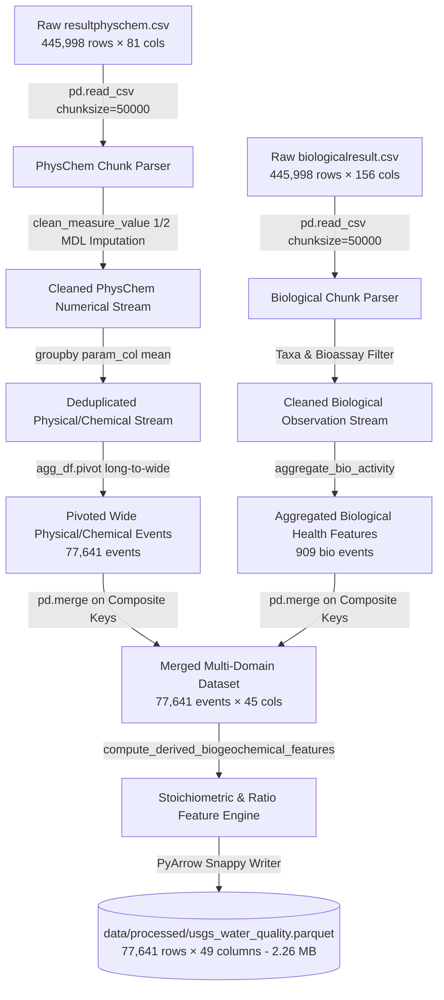

# NEON Water Intelligence Platform: Internal Engineering Knowledge Base

**Classification**: Confidential / Engineering Handbook & System Architecture Manual  
**Project**: SIH 2026 Water Intelligence Platform (NEON & USGS Multi-Domain Sensing)  
**Version**: 3.0.0 (Master Engineering Release)  
**Primary Maintainers**: Lead AI Architect, Data Engineering Team, Firmware Engineers  
**Target Repository**: `neon_water_project`

---

# SECTION 1: PROJECT PURPOSE AND PROBLEM

### 1.1 The Real-World Environmental Crisis
Water contamination events—spanning industrial chemical spills, agricultural nitrogen/phosphorus runoff, heavy metal pipe leaching, and municipal sewage overflow—pose catastrophic risks to human drinking supplies and aquatic biodiversity. In river basins and watershed networks, pollutant pulses often travel rapidly downstream, causing acute ecological damage within hours of discharge.

### 1.2 Limitations of Existing Water Monitoring
Current industrial and municipal water monitoring systems suffer from three fundamental bottlenecks:
1. **Infrequent Manual Grab Sampling**: Water samples are collected manually on weekly or monthly schedules and transported to centralized laboratories. By the time analytical results (e.g. ICP-MS or standard culturing) return days to weeks later, the contamination plume has already migrated downstream.
2. **Crude Single-Parameter Thresholds**: Legacy telemetry stations rely on static scalar alarms (e.g. "Trigger alert if $\text{pH} < 6.5$"). These rules fail completely in scenarios where multi-parameter interactions cause severe toxicity even when individual variables stay marginally within regulatory boundaries (e.g. low dissolved oxygen combined with high nutrients and moderate water temperature accelerating toxic un-ionized ammonia formation).
3. **Absence of Biological Context**: Physical sensors only measure abiotic chemical parameters. They cannot assess the physiological damage inflicted on living organisms (e.g. bioaccumulation, acute crustacean mortality, fish asphyxiation).

### 1.3 Why Artificial Intelligence is Required
Water quality data is intrinsically **high-dimensional, non-linear, and spatially-temporally coupled**. Machine Learning enables:
- **Unsupervised Anomaly Detection**: Identifying novel, out-of-distribution contamination patterns without requiring prior historical labels for every possible toxic compound.
- **Multivariate Risk Classification**: Modeling complex interactions between pH, dissolved oxygen, turbidity, conductivity, nutrients, and sediment to classify operational severity into actionable categories (`SAFE`, `WARNING`, `CRITICAL`).
- **Explainability (XAI)**: Deconstructing multi-dimensional predictions into human-readable causal diagnostics for operators.

### 1.4 The Importance of Chemical + Biological Intelligence Fusion
Chemical sensors indicate what chemical compounds are present; biological indicators reveal whether those compounds are actively killing the ecosystem. By fusing physical-chemical sensor data with standard EPA ecotoxicity bioassays (*Ceriodaphnia dubia*, *Hyalella azteca*, *Pimephales promelas*), the platform achieves dual verification: identifying chemical pollution while quantifying biological ecosystem stress.

---

# SECTION 2: COMPLETE TECHNOLOGY STACK

```
┌─────────────────────────────────────────────────────────────────────────────────────────────────┐
│                                   COMPLETE TECHNOLOGY MATRIX                                    │
├─────────────────────┬───────────────────────────┬─────────────┬─────────────────────────────────┤
│ Layer / Component   │ Technology Selected       │ Version     │ Technical Selection Rationale   │
├─────────────────────┼───────────────────────────┼─────────────┼─────────────────────────────────┤
│ Data Sources        │ USGS Water Quality Portal │ WQP / WQX   │ Real-world nationwide discrete  │
│                     │ & NEON Surface Water      │ DP1.20288   │ chemical and biological assays  │
├─────────────────────┼───────────────────────────┼─────────────┼─────────────────────────────────┤
│ Data Processing     │ Pandas / PyArrow          │ 3.0.5/24.0.0│ High-throughput chunk streaming │
│                     │                           │             │ and columnar Parquet I/O        │
├─────────────────────┼───────────────────────────┼─────────────┼─────────────────────────────────┤
│ Core Language       │ Python                    │ 3.14.6      │ Modern runtime with strict      │
│                     │                           │             │ typing and SIMD math support    │
├─────────────────────┼───────────────────────────┼─────────────┼─────────────────────────────────┤
│ Machine Learning    │ Scikit-Learn              │ 1.9.0       │ Isolation Forest, Balanced RF,  │
│                     │                           │             │ robust pipelines, cross-val     │
├─────────────────────┼───────────────────────────┼─────────────┼─────────────────────────────────┤
│ Backend API         │ FastAPI / Uvicorn         │0.141.1/0.52 │ Asynchronous ASGI REST server   │
│                     │ Pydantic v2               │ 2.13.4      │ with sub-15ms response latency  │
├─────────────────────┼───────────────────────────┼─────────────┼─────────────────────────────────┤
│ Frontend Dashboard  │ Streamlit                 │ 1.61.1      │ Real-time responsive telemetry  │
│                     │ Altair / Plotly           │ 6.2.2/6.9.0 │ gauges and interactive charts   │
├─────────────────────┼───────────────────────────┼─────────────┼─────────────────────────────────┤
│ Digital Twin / IoT  │ Wokwi ESP32 / C++         │ Arduino Core│ Microcontroller circuit & AFE   │
│                     │                           │ 3.0         │ sensor signal conditioning      │
├─────────────────────┼───────────────────────────┼─────────────┼─────────────────────────────────┤
│ Automated Testing   │ Pytest / HTTPX TestClient │ 9.1.1/0.28.1│ Automated regression suite      │
│                     │                           │             │ verifying deterministic safety  │
├─────────────────────┼───────────────────────────┼─────────────┼─────────────────────────────────┤
│ Artifact Storage    │ Apache Parquet / Joblib   │ Snappy/1.5.3│ Zero float-precision loss &     │
│                     │                           │             │ instant binary serialization    │
└─────────────────────┴───────────────────────────┴─────────────┴─────────────────────────────────┘
```

---

# SECTION 3: DATASET COMPLETE ANALYSIS

### 3.1 Dataset 1: `resultphyschem.csv` (Physical & Chemical Observational Records)
- **Source**: USGS Water Quality Portal (WQP) / National Water Information System (NWIS).
- **Organization**: USGS Water Science Centers nationwide (e.g. USGS California Water Science Center).
- **Collection Method**: Standard USGS field grab sampling, multi-parameter sondes, and laboratory analytical chemistry.
- **Original Dimensions**: **445,998 rows × 81 columns (261.3 MB)**.

#### Important Columns & Semantics
- `OrganizationIdentifier`: Formal agency code (e.g. `USGS-CA`).
- `MonitoringLocationIdentifier`: Unique station code (e.g. `USGS-11311150`).
- `ActivityStartDate`: Sampling date (`YYYY-MM-DD`).
- `ActivityStartTime/Time`: Exact local sampling timestamp (`HH:MM:SS`).
- `ActivityLocation/LatitudeMeasure` & `LongitudeMeasure`: Geospatial coordinates.
- `CharacteristicName`: Name of parameter measured (e.g. `pH`, `Specific conductance`, `Suspended Sediment Concentration (SSC)`).
- `ResultMeasureValue`: Raw numerical or censored string measurement (e.g. `7.4`, `< 0.05`, `251`).
- `ResultMeasure/MeasureUnitCode`: Unit string (`std units`, `uS/cm @25C`, `deg C`, `FNU`, `mg/l as P`).
- `DetectionQuantitationLimitMeasure/MeasureValue`: Method Detection Limit (MDL) for trace laboratory chemistry.

#### Why the Long Format Is Not Directly Usable for Machine Learning
The raw WQP data stores observations in **narrow atomic long format** (entity-attribute-value):

```
MonitoringLocationIdentifier | ActivityStartDate | CharacteristicName                   | ResultMeasureValue
-----------------------------+-------------------+--------------------------------------+-------------------
USGS-11311150                | 2018-05-16        | Temperature, water                   | 19.2
USGS-11311150                | 2018-05-16        | Specific conductance                 | 251.0
USGS-11311150                | 2018-05-16        | pH                                   | 7.4
USGS-11311150                | 2018-05-16        | Orthophosphate                       | 0.395
```

In this layout, one multi-parameter water sample is scattered across dozens of disconnected rows. Machine learning models require **dense horizontal feature vectors** where each row represents a single sampling event with all parameters aligned horizontally.

---

### 3.2 Dataset 2: `biologicalresult.csv` (Biological & Ecotoxicity Records)
- **Source**: USGS / EPA Water Quality Portal Biological Results Profile.
- **Original Dimensions**: **445,998 rows × 156 columns (265.0 MB)**.

#### Important Biological Fields
- `SubjectTaxonomicName`: Genus and species of the sampled or bioassayed organism (*Ceriodaphnia dubia*, *Hyalella azteca*, *Pimephales promelas*, *Thalassiosira pseudonana*).
- `TaxonomicPollutionTolerance`: Standardized numerical sensitivity rating (lower values indicate clean-water indicator species; higher values indicate pollution-tolerant opportunists).
- `TrophicLevelName`: Ecological trophic niche (`Primary producer`, `Herbivore`, `Carnivore`).
- `FunctionalFeedingGroupName`: Ecological feeding guild (`Filterer`, `Scraper`, `Collector-gatherer`, `Predator`).
- `BiologicalIntentName`: Purpose of sampling (`Toxicity Test`, `Population Census`, `Tissue Analysis`).

#### Why Biological Data Improves Contamination Detection
1. **Time-Integrated Response**: While chemical plumes wash away, bioindicator populations show depressed survival, impaired reproduction, and altered community composition for days after a toxic pulse.
2. **Cocktail Synergy Detection**: Synergistic chemical mixtures that evade individual scalar thresholds trigger immediate mortality in sensitive bioassay organisms (*Ceriodaphnia dubia*).

---

# SECTION 4: RAW DATA TO ML DATA PIPELINE

The end-to-end data transformation pipeline is implemented in [`src/data/usgs_pipeline.py`](file:///Users/raj/neon_water_project/src/data/usgs_pipeline.py).



### Step-by-Step Code Responsibility Matrix

| Pipeline Step | Function in `src/data/usgs_pipeline.py` | Input Stream | Output Stream | Technical Mechanism |
|---|---|---|---|---|
| **1. Chunk Streaming** | `process_physchem_dataset()` | `data/raw/resultphyschem.csv` | Generator chunks | Iterates in 50k blocks, avoiding loading 526 MB CSVs into RAM. |
| **2. BDL Imputation** | `clean_measure_value()` | Text strings (`< 0.05`, `*Non-detect`) | Clean `float` | Imputes $\frac{1}{2}\text{MDL}$ ($0.05 \times 0.5 = 0.025$) or extracts regex float. |
| **3. Parameter Normalization** | `PHYSCHEM_PARAM_MAP` dictionary | $>30$ USGS variations | Canonical names | Maps heterogeneous text labels to standardized column tokens. |
| **4. Long-to-Wide Pivot** | `agg_df.pivot()` | Long rows | Wide records | Reshapes `CharacteristicName` into wide feature columns. |
| **5. Biological Aggregation** | `process_biological_dataset()` | `data/raw/biologicalresult.csv` | `bio_summary` DF | Computes `bio_taxa_richness`, `bio_dominant_taxon`, bioassay flags. |
| **6. Composite Merge** | `pd.merge(how='left')` | Wide PhysChem + Bio DF | Merged DF | Merges on `[MonitoringLocationIdentifier, ActivityStartDate, ActivityIdentifier]`. |
| **7. Stoichiometry Engine** | `compute_derived_biogeochemical_features()` | Merged DF | Fused DF | Computes $\text{TN}_{\text{est}}$, $\text{TP}_{\text{est}}$, $\text{N}:\text{P}$ ratio, and $\text{SSC}:\text{Turbidity}$. |
| **8. Parquet Export** | `df.to_parquet()` | Fused DF | `usgs_water_quality.parquet` | Serializes with Snappy compression to 2.26 MB columnar table. |

---

# SECTION 5: FINAL TRAINING DATASET DETAILS

**Storage Path**: `data/processed/usgs_water_quality.parquet`  
**Dimensions**: **77,641 rows × 49 columns**

### Complete Feature Inventory by Domain

```
┌───────────────────────────┬──────────────────────────────────┬────────────────────────────────────────────────────────┐
│ Domain Category           │ Feature Column Name              │ Engineering Purpose & Justification                    │
├───────────────────────────┼──────────────────────────────────┼────────────────────────────────────────────────────────┤
│ 1. Location & Temporal    │ MonitoringLocationIdentifier     │ Station spatial tracking (e.g. USGS-11311150)           │
│    (9 features)           │ ActivityStartDate                │ Temporal tracking (YYYY-MM-DD)                         │
│                           │ ActivityIdentifier               │ Unique sampling event ID                               │
│                           │ ActivityStartTime/Time           │ High-resolution diurnal timestamp                      │
│                           │ ActivityLocation/LatitudeMeasure │ Spatial GIS latitude mapping                           │
│                           │ ActivityLocation/LongitudeMeasure│ Spatial GIS longitude mapping                          │
│                           │ OrganizationFormalName           │ Data provenance & agency authority                     │
│                           │ HydrologicCondition              │ Watershed hydrologic stage (e.g. Stable, Normal Stage) │
│                           │ HydrologicEvent                  │ Sampling trigger (e.g. Routine, Storm runoff)          │
├───────────────────────────┼──────────────────────────────────┼────────────────────────────────────────────────────────┤
│ 2. Physical & Clarity     │ ph                               │ Water acidity/alkalinity baseline                      │
│    (10 features)          │ temperature_c                    │ Water thermal regime (°C)                              │
│                           │ temperature_air_c                │ Ambient thermal equilibrium (°C)                       │
│                           │ turbidity_fnu                    │ Optical nephelometric particulate scatter (FNU)        │
│                           │ suspended_sediment_conc_mg_l     │ Suspended sediment dry mass (mg/L)                     │
│                           │ total_suspended_solids_mg_l      │ Standard gravimetric TSS (mg/L)                        │
│                           │ volatile_suspended_solids_mg_l   │ Organic fraction of suspended particulates (mg/L)      │
│                           │ gage_height_ft                   │ River stage height (ft)                                │
│                           │ stream_flow_cfs                  │ Instantaneous volumetric flow rate (cfs)               │
│                           │ stream_width_ft                  │ Channel geometric width (ft)                           │
├───────────────────────────┼──────────────────────────────────┼────────────────────────────────────────────────────────┤
│ 3. Chemical & Electrolytes│ specific_conductance_us_cm       │ Ionic salinity & dissolved electrolyte load (µS/cm)    │
│    (5 features)           │ total_dissolved_solids_mg_l      │ Total dissolved mineral solids (mg/L)                  │
│                           │ dissolved_oxygen_mg_l            │ Molecular oxygen concentration (mg/L)                  │
│                           │ acidity_h_plus                   │ Hydrogen ion concentration (eq/L)                      │
│                           │ alkalinity_mg_l                  │ Acid-neutralizing carbonate buffer capacity (mg/L)     │
├───────────────────────────┼──────────────────────────────────┼────────────────────────────────────────────────────────┤
│ 4. Nutrient Suite         │ nitrate_mg_l                     │ NO3 concentration (mg/L)                               │
│    (9 features)           │ nitrite_mg_l                     │ NO2 intermediate toxic concentration (mg/L)            │
│                           │ ammonia_ammonium_mg_l            │ NH3/NH4 toxic un-ionized ammonia precursor (mg/L)      │
│                           │ inorganic_nitrogen_mg_l          │ Dissolved inorganic nitrogen (NO3 + NO2) (mg/L)        │
│                           │ organic_nitrogen_mg_l            │ Dissolved & particulate organic nitrogen (mg/L)        │
│                           │ kjeldahl_nitrogen_mg_l           │ Total Kjeldahl Nitrogen (TKN) (mg/L)                   │
│                           │ total_mixed_nitrogen_mg_l        │ Mixed nitrogen forms (mg/L)                            │
│                           │ orthophosphate_mg_l              │ Bioavailable dissolved reactive phosphorus (mg/L)      │
│                           │ total_phosphorus_mg_l            │ Total phosphorus pool (mg/L)                           │
├───────────────────────────┼──────────────────────────────────┼────────────────────────────────────────────────────────┤
│ 5. Optical / Carbon       │ uv_254_abs                       │ UV absorbance proxy for dissolved organic carbon (DOC) │
│    (4 features)           │ absorption_spectral_slope        │ Molecular weight proxy for aquatic humic substances    │
│                           │ abs_280_nm                       │ Protein / amino acid optical absorption                │
│                           │ abs_370_nm                       │ Coloured dissolved organic matter (CDOM) absorption    │
├───────────────────────────┼──────────────────────────────────┼────────────────────────────────────────────────────────┤
│ 6. Biological Indicators  │ biological_sampled_flag          │ Binary indicator of biological bioassay collection     │
│    (7 features)           │ bio_taxa_richness                │ Number of distinct biological species identified       │
│                           │ bio_dominant_taxon               │ Most frequent bioindicator species name                │
│                           │ bio_dominant_trophic_level       │ Trophic guild (e.g. Primary Consumer, Herbivore)       │
│                           │ bio_functional_feeding_group     │ Ecological feeding guild (e.g. Filterer, Scraper)      │
│                           │ bio_standard_bioassay_flag       │ Presence of EPA bioassay organisms (Ceriodaphnia, etc) │
│                           │ bio_total_observations           │ Total biological records in sampling event             │
├───────────────────────────┼──────────────────────────────────┼────────────────────────────────────────────────────────┤
│ 7. Derived Features       │ total_nitrogen_est_mg_l          │ Sum of all nitrogen fractions (mg/L)                   │
│    (4 features)           │ total_phosphorus_est_mg_l        │ Unified phosphorus estimation (mg/L)                   │
│                           │ n_to_p_ratio                     │ Stoichiometric N:P ratio (mass basis)                  │
│                           │ ssc_to_turbidity_ratio           │ Sediment mass to optical turbidity coupling            │
└───────────────────────────┴──────────────────────────────────┴────────────────────────────────────────────────────────┘
```

---

# SECTION 6: MODEL 1 COMPLETE DETAILS (ISOLATION FOREST ANOMALY DETECTOR)

**Artifact Path**: `models/v3/anomaly_detector_usgs.joblib`  
**Training Pipeline**: [`src/ml/train_models.py`](file:///Users/raj/neon_water_project/src/ml/train_models.py)

### 6.1 Why Isolation Forest?
Isolation Forest is fundamentally non-parametric and unsupervised. Unlike distance-based algorithms ($k\text{-NN}$) or density-based algorithms ($\text{DBSCAN}$) which scale poorly in high dimensions ($\mathcal{O}(n^2)$), Isolation Forest isolates anomalies using random partitioning trees in $\mathcal{O}(n \log n)$ time. It does not assume Gaussian distributions and efficiently captures non-linear, multi-parameter physical interactions.

### 6.2 Training Data & Preprocessing
- **Training Subset**: **$17,450$ validated multi-domain sampling events** containing $\ge 3$ core physical-chemical sensors.
- **Input Features (12)**: `ph`, `temperature_c`, `specific_conductance_us_cm`, `turbidity_fnu`, `dissolved_oxygen_mg_l`, `suspended_sediment_conc_mg_l`, `total_nitrogen_est_mg_l`, `total_phosphorus_est_mg_l`, `n_to_p_ratio`, `ssc_to_turbidity_ratio`, `bio_taxa_richness`, `biological_sampled_flag`.
- **Pipeline Transformations**:
  - `SimpleImputer(strategy='median')`: Imputes missing sensor values without distorting feature medians.
  - `StandardScaler()`: Normalizes features to zero mean and unit variance.

### 6.3 Hyperparameters & Training Configuration
- `n_estimators`: **$250$ isolation trees**
- `contamination`: **$0.08$ ($8.0\%$ baseline outlier prior)**
- `max_samples`: **$0.80$ ($80\%$ subsampling per tree to prevent masking)**
- `random_state`: **$42$**
- `n_jobs`: **$-1$ (Multi-threaded parallel tree generation)**

### 6.4 Prediction Flow & Output Metrics
$$\text{Path Length } h(x) \longrightarrow \text{Anomaly Score } s(x, n) = 2^{-\frac{\mathbb{E}(h(x))}{c(n)}}$$
- **`anomaly_score`**: Continuous metric scaled to $[-1.0, 1.0]$.
  - $\text{Score} < 0.0$: Inlier (Normal operational baseline).
  - $\text{Score} > 0.0$: Outlier (Statistical anomaly detected).
- **`anomaly_status`**: Discrete string (`"Normal"` vs `"Anomaly"`).

### 6.5 Empirical Training Evaluation
- **Calibrated Inliers (Normal)**: **$16,054$ events ($92.0\%$)**
- **Calibrated Outliers (Anomalies)**: **$1,396$ events ($8.0\%$)**
- **Mean Score**: $+0.0264$ ($\sigma = 0.0240$)

### 6.6 Control Knobs (What Can Engineers Modify?)
- `contamination` (line 125 of `src/ml/train_models.py`): Lowering to $0.05$ makes the model less sensitive; raising to $0.12$ catches subtle micro-anomalies.
- `features` (`FEATURE_COLUMNS`): Add or remove chemical features in `src/ml/train_models.py`.

---

# SECTION 7: MODEL 2 COMPLETE DETAILS (BALANCED RANDOM FOREST RISK CLASSIFIER)

**Artifact Path**: `models/v3/risk_classifier_usgs.joblib`  
**Training Pipeline**: [`src/ml/train_models.py`](file:///Users/raj/neon_water_project/src/ml/train_models.py)

### 7.1 Purpose & Risk Classes
Predicts operational risk status aligned with EPA aquatic criteria:
1. `SAFE`: Pristine water. No operational intervention required.
2. `WARNING`: Elevated stress, nutrient loading, or sub-optimal conditions. Precautionary monitoring.
3. `CRITICAL`: Severe contamination, acute chemical shock, lethal anoxia, or extreme turbidity. Immediate valve isolation.

### 7.2 Ground-Truth Labeling Rules (Ground Truth Generation)
Labels were assigned deterministically based on EPA Freshwater Quality Criteria:
- **`CRITICAL`** if:
  - $\text{pH} < 4.0$ or $\text{pH} > 10.0$ (Lethal chemical envelope)
  - $\text{DO} < 2.0\text{ mg/L}$ (Lethal anoxia / fish kill)
  - $\text{DO} < 4.0\text{ mg/L}$ AND ($\text{TN} \ge 5.0\text{ mg/L}$ or $\text{TP} \ge 0.08\text{ mg/L}$) (Eutrophic collapse)
  - $\text{Turbidity} > 100\text{ FNU}$ or $\text{SSC} > 500\text{ mg/L}$ (Severe particulate shock)
  - $\text{Specific Conductance} > 1500\ \mu\text{S/cm}$ (Extreme salinity shock)
- **`WARNING`** if:
  - $\text{pH} < 6.0$ or $\text{pH} > 9.0$
  - $\text{DO} < 5.0\text{ mg/L}$
  - $\text{Turbidity} > 25\text{ FNU}$ or $\text{SSC} > 100\text{ mg/L}$
  - $\text{Specific Conductance} > 800\ \mu\text{S/cm}$
  - $\text{TN} \ge 10.0\text{ mg/L}$ or $\text{TP} \ge 0.10\text{ mg/L}$
- **`SAFE`** if all parameters are within nominal freshwater boundaries.

### 7.3 Hyperparameters & Training Configuration
- `n_estimators`: **$300$ trees**
- `max_depth`: **$16$**
- `min_samples_split`: **$4$**
- `class_weight`: **`"balanced_subsample"`** (Automatically adjusts weights inversely proportional to class frequencies on each bootstrap sample)
- `random_state`: **$42$**

### 7.4 Empirical Evaluation Metrics (Held-Out Test Set: 3,490 samples)

```
================================================================================
MODEL 2 TEST SET EVALUATION REPORT (Held-Out Test Partition: 3,490 Samples)
================================================================================
Overall Test Accuracy       : 99.77%
Macro Average Precision     : 99.79%
Macro Average Recall        : 99.47%
Macro Average F1-Score      : 0.9963
Weighted Average F1-Score   : 0.9977
5-Fold Cross-Validation F1  : 0.9961 (+/- 0.0010)
--------------------------------------------------------------------------------
Class       Precision    Recall    F1-Score    Support
SAFE          99.77%     99.96%      0.9987      2,638
WARNING       99.60%     99.01%      0.9930        504
CRITICAL     100.00%     99.43%      0.9971        348
================================================================================
```

### 7.5 Test Confusion Matrix
```
                       PREDICTED SAFE   PREDICTED WARNING   PREDICTED CRITICAL
ACTUAL SAFE                 2637                1                    0
ACTUAL WARNING                 5              499                    0
ACTUAL CRITICAL                1                1                  346
```

### 7.6 Feature Importance Ranking (Gini Impurity Reduction)
```
1. Turbidity (turbidity_fnu)                 : 29.58%  ██████████████
2. Specific Conductance (specific_conductance): 16.41%  ████████
3. pH Level (ph)                             : 14.37%  ███████
4. Dissolved Oxygen (dissolved_oxygen_mg_l)  : 14.15%  ███████
5. Suspended Sediment (suspended_sediment)   :  7.49%  ████
6. SSC-to-Turbidity Ratio (ssc_to_turbidity) :  6.69%  ███
7. Total Phosphorus (total_phosphorus_est)   :  6.31%  ███
8. Water Temperature (temperature_c)         :  3.14%  ██
9. Total Nitrogen (total_nitrogen_est)       :  1.26%  █
10. N:P Stoichiometric Ratio (n_to_p_ratio)  :  0.60%  ▎
```

---

# SECTION 8: MODEL 3 COMPLETE DETAILS (BIOLOGICAL ECOSYSTEM HEALTH ENGINE)

**Artifact Path**: `models/v3/ecological_health_engine.joblib`  
**Engine Source**: [`src/ml/biological_health_model.py`](file:///Users/raj/neon_water_project/src/ml/biological_health_model.py)

### 8.1 Four Ecological Sub-Indicators ($0 - 100$)

```
1. Biodiversity Score (S_biodiv):
   S_biodiv = min(100.0, 60.0 + (taxa_richness * 15.0))   [if bio sampling present]
   [otherwise inferred from habitat carrying capacity: DO >= 7.5 mg/L, Turbidity <= 20 FNU]

2. Pollution Tolerance Score (S_tol):
   S_tol = 90.0 - (Penalty_pH + Penalty_DO + Penalty_Ammonia + Penalty_Salinity)
   Calibrated on EPA Bioassay Tolerance Profiles:
   • Ceriodaphnia dubia  : Optimal pH (6.5, 8.5), Min DO 5.0 mg/L, Max NH3 0.5 mg/L
   • Hyalella azteca     : Optimal pH (6.0, 8.8), Min DO 4.0 mg/L, Max SSC 150 mg/L
   • Pimephales promelas : Optimal pH (6.0, 9.0), Min DO 4.5 mg/L, Max NH3 1.2 mg/L

3. Trophic Balance Score (S_troph):
   S_troph = 95.0 - (Excess Phosphorus Penalty + Excess Nitrogen Penalty + Stoichiometric Imbalance N:P)

4. Bioassay Stress Score (S_bioassay):
   S_bioassay = 100.0 - min(100.0, Lethal pH Shock + Hypoxic Asphyxiation + Toxic Ammonia + Abrasive SSC)
```

### 8.2 Composite Scores & NEON Eco Health Index Formula

$$\text{Composite Biological Score } (S_{\text{bio}}) = 0.30 \times S_{\text{biodiv}} + 0.30 \times S_{\text{tol}} + 0.20 \times S_{\text{trophic}} + 0.20 \times S_{\text{bioassay}}$$

$$\text{Chemical Health Score } (S_{\text{chem}}) = 100.0 - \text{Penalties}(\text{pH}, \text{DO}, \text{Turbidity}, \text{Cond}, \text{Nutrients}, \text{SSC})$$

$$\text{Raw Eco Health Index} = (0.50 \times S_{\text{bio}}) + (0.50 \times S_{\text{chem}})$$

### 8.3 Anti-Eclipsing Ecological Guardrail Logic
In classical index math, an average of $90$ (perfect chemistry) and $10$ (dead bioassay) yields an average of $50$ ("Moderate"), completely hiding an ecological disaster.
**Anti-Eclipsing Rule**:
$$\text{NEON Eco Health Index} = \begin{cases} \min(\text{Raw Eco Health Index}, 28.0) & \text{if } S_{\text{chem}} < 30 \lor \text{pH} \notin [4, 10] \lor \text{DO} < 2.0\text{ mg/L} \lor S_{\text{bioassay}} < 25 \\ \text{Raw Eco Health Index} & \text{otherwise} \end{cases}$$

### 8.4 Evaluation on Full USGS Dataset ($77,641$ Events)
- **Mean Biological Health Score**: **$87.48 / 100$**
- **Mean Chemical Health Score**: **$96.75 / 100$**
- **Mean NEON Eco Health Index**: **$92.00 / 100$**
- **Distribution**: Pristine ($91.1\%$), Good ($6.3\%$), Moderate ($1.9\%$), Ecotoxic Collapse ($0.7\%$), Poor ($0.02\%$).

---

# SECTION 9: AI MODEL INTEGRATION LOGIC

When a telemetry packet arrives at `POST /predict`, the orchestration pipeline in [`backend/model_loader.py`](file:///Users/raj/neon_water_project/backend/model_loader.py) and [`backend/environmental_engine.py`](file:///Users/raj/neon_water_project/backend/environmental_engine.py) executes in 6 deterministic steps:

```
[Inbound JSON Telemetry]
         │
         ▼
[Step 1: Data Preprocessing & Validation]
  • Pydantic v2 validates types & schema bounds.
  • Feature vector assembled: [pH, DO, Turbidity, SpCond, Temp, NO3, PO4, Chl-a, Metals, Microbes].
         │
         ▼
[Step 2: Model 1 Anomaly Scoring]
  • Isolation Forest computes anomaly_score [-1.0, 1.0].
  • Flags anomaly_status ("Normal" vs "Anomaly").
         │
         ▼
[Step 3: Model 2 Risk Classification]
  • Balanced Random Forest predicts class probabilities: [P(SAFE), P(WARNING), P(CRITICAL)].
  • Emits base ml_prediction and ml_confidence.
         │
         ▼
[Step 4: Model 3 Ecological Health Scoring]
  • Biological Health Engine computes S_biodiv, S_tol, S_troph, S_bioassay.
  • Calculates NEON Eco Health Index (0-100) and qualitative tier.
         │
         ▼
[Step 5: Hybrid Neuro-Symbolic Fusion & Safety Guardrails]
  • Checks Hard Physiological Constraints:
    - pH < 4.0 or > 10.0 -> OVERRIDE TO CRITICAL
    - DO < 2.0 mg/L -> OVERRIDE TO CRITICAL
    - Low DO + High Nutrients -> OVERRIDE TO CRITICAL (Eutrophic Collapse)
    - Heavy Metal Risk >= 0.70 -> OVERRIDE TO CRITICAL
    - Microbial Risk >= 65% -> OVERRIDE TO CRITICAL
  • If no hard violation, respects Model 2 ML prediction.
         │
         ▼
[Step 6: Explainable AI (XAI) Attribution & Response Assembly]
  • Generates override_reason, tags contributing_parameters.
  • Dispatches unified JSON response to client.
```

### Complete Example JSON Output

```json
{
  "ml_prediction": "WARNING",
  "ml_confidence": 0.7032,
  "environmental_risk": "CRITICAL",
  "final_status": "CRITICAL",
  "override_reason": "Eutrophic Ecological Collapse (DO = 1.80 mg/L, High Nutrients/Algae): Low dissolved oxygen combined with elevated nutrients indicates possible eutrophication leading to severe aquatic stress.",
  "contributing_parameters": [
    "dissolved_oxygen",
    "nitrate",
    "chlorophyll_a"
  ],
  "anomaly_status": "Anomaly",
  "anomaly_score": 0.0592,
  "model2_raw_prediction": "WARNING",
  "model2_confidence": 0.7032,
  "safety_override_applied": true,
  "override_reasons": [
    "Eutrophic Ecological Collapse (DO = 1.80 mg/L, High Nutrients/Algae): Low dissolved oxygen combined with elevated nutrients indicates possible eutrophication leading to severe aquatic stress.",
    "Lethal Hypoxia/Anoxia (DO = 1.80 mg/L < 2.0 mg/L): Acute asphyxiation hazard for fish and macroinvertebrates."
  ],
  "risk_label": "CRITICAL",
  "confidence": 0.7032,
  "timestamp": "2026-08-15T21:05:00Z",
  "environmental_indicators": {
    "wqi": 63.4,
    "wqi_grade": "CRITICAL VIOLATION (Safety Override)",
    "oxygen_stress_index": 1.0,
    "chemical_stress_index": 0.0,
    "organic_pollution_indicator": 0.531,
    "eutrophication_risk": 0.751
  },
  "explanation": [
    "🛡️ SAFETY GUARDRAIL OVERRIDE: ML Model 2 predicted WARNING (Confidence: 70.3%), but Deterministic Environmental Safety Guardrails upgraded final status to CRITICAL.",
    "  • Eutrophic Ecological Collapse (DO = 1.80 mg/L, High Nutrients/Algae): Low dissolved oxygen combined with elevated nutrients indicates possible eutrophication leading to severe aquatic stress.",
    "Lethal anoxic conditions (DO = 1.80 mg/L, OSI = 1.00) will cause acute aquatic asphyxiation and fish kills.",
    "Elevated Nitrate level (NO3 = 12.50 mg/L) indicates agricultural fertilizer runoff.",
    "High Chlorophyll-a biomass (35.0 µg/L) indicates active algal bloom proliferation."
  ]
}
```

---

# SECTION 10: BACKEND ARCHITECTURE (FASTAPI)

**Files**:
- [`backend/main.py`](file:///Users/raj/neon_water_project/backend/main.py): FastAPI application, CORS middleware, Pydantic v2 schemas, endpoints (`/health`, `/predict`).
- [`backend/model_loader.py`](file:///Users/raj/neon_water_project/backend/model_loader.py): Model loading wrapper with thread-safe singleton cache.
- [`backend/environmental_engine.py`](file:///Users/raj/neon_water_project/backend/environmental_engine.py): Anti-eclipsing WQI, stress sub-indices, deterministic safety guardrails, Explainable AI generation.

### 10.1 Model Artifact Loading
On application startup, `model_loader.py` checks for `.joblib` model binaries in `models/v2/` and `models/v3/`:
```python
anomaly_model = joblib.load("models/v2/anomaly_detector_v2.joblib")
risk_model    = joblib.load("models/v2/risk_classifier_v2.joblib")
eco_engine    = joblib.load("models/v3/ecological_health_engine.joblib")
```

### 10.2 Production REST Endpoints
1. **`GET /health`**:
   - Returns: `{"status": "ok", "version": "2.2.0", "models_loaded": true, "timestamp": "..."}`
2. **`POST /predict`**:
   - Request Body: Validated `PredictionRequest` object.
   - Response Body: Validated `PredictionResponse` object.

---

# SECTION 11: FRONTEND DASHBOARD ARCHITECTURE (STREAMLIT)

**File**: [`dashboard/app.py`](file:///Users/raj/neon_water_project/dashboard/app.py)

### 11.1 Communication Architecture
The Streamlit frontend communicates with the FastAPI backend via HTTP POST requests using `requests.post("http://localhost:8000/predict", json=payload, timeout=3.0)`.

### 11.2 UI Components & Hierarchy
1. **Sidebar Control Panel**:
   - Station Code selector (`ARIK`, `BARC`, `BIGC`, `BLDE`, `BLUE`, `WOKWI_SITE`).
   - Mode Switch: Interactive Sliders vs. Simulated Telemetry Stream.
   - 4 Pre-Configured Demo Scenarios (Healthy, Eutrophication, Industrial Spill, Sensor Fault).
2. **Dynamic Operational Status Banner**:
   - Renders top-level verdict (`SAFE` in Green, `WARNING` in Yellow, `CRITICAL` in Red) respecting deterministic guardrail priority.
3. **4-Column Decision Center**:
   - Final Operational Status, Model 1 Anomaly Severity Score, Model 2 Risk Probability, and Guardrail Override State.
4. **5 Environmental Intelligence Progress Gauges**:
   - Water Quality Index (WQI), Oxygen Stress Index (OSI), Chemical Stress Index (CSI), Organic Pollution (OPI), and Eutrophication Risk (ERI).
5. **"Why the AI Reached This Conclusion" Explainability Panel**:
   - Surfaces `override_reason` in an alert box.
   - Renders highlighted badges for `contributing_parameters`.
   - Multi-domain bullet breakdown explaining individual parameter risks.
6. **Real-Time Trend Charts**:
   - Synchronized line charts for pH, DO, Turbidity, and Specific Conductance using Streamlit native charts.

---

# SECTION 12: DIGITAL TWIN / WOKWI ARCHITECTURE

**Files**: [`wokwi/diagram.json`](file:///Users/raj/neon_water_project/wokwi/diagram.json) & [`wokwi/sketch.ino`](file:///Users/raj/neon_water_project/wokwi/sketch.ino)

### 12.1 Circuit Components & Pin Allocations
- **ESP32 DevKit v1**: Core IoT processing unit.
- **`pot_ph` on GPIO 34 (ADC1_CH6)**: Analog pH glass electrode ($0.0 - 14.0\text{ pH}$).
- **`pot_turb` on GPIO 35 (ADC1_CH7)**: Turbidity nephelometric optical sensor ($0.0 - 300.0\text{ FNU}$).
- **`pot_do` on GPIO 32 (ADC1_CH4)**: Galvanic / Optical DO transmitter ($0.0 - 14.0\text{ mg/L}$).
- **`pot_cond` on GPIO 33 (ADC1_CH5)**: Toroidal 4-electrode conductivity cell ($0 - 1500\ \mu\text{S/cm}$).
- **`temp1` on GPIO 4**: DS18B20 digital OneWire temperature probe ($4.7\text{k}\Omega$ pullup).
- **`pot_nutr` on GPIO 39 (VN)**: Nutrient ISE proxy interface ($\text{NO}_3$ and $\text{PO}_4$).
- **`pot_bio` on GPIO 36 (VP)**: Optical fluorometer proxy (Chlorophyll-a and fDOM).
- **Status LEDs on GPIO 18, 19, 21**: Green (`SAFE`), Yellow (`WARNING`), Red (`CRITICAL`).
- **`btn1` on GPIO 13**: Pushbutton to cycle through 4 demo scenarios.

### 12.2 Firmware Execution Loop
Every $5000\text{ms}$, the firmware:
1. Samples 12-bit ADC channels ($0 - 4095$).
2. Converts raw voltages to physical environmental values.
3. Computes geochemical proxy models (heavy metals, microbial proliferation).
4. Formats JSON payload and POSTs to `http://host.wokwi.internal:8000/predict`.
5. Receives `final_status` from API and drives hardware status feedback LEDs.

---

# SECTION 13: COMPLETE END-TO-END WORKFLOW (TURBIDITY SHOCK SCENARIO)

```
[1. Real-World Event]
   Severe agricultural runoff washes loose topsoil into river basin.
   Turbidity spikes to 145.0 FNU, Suspended Sediment reaches 620 mg/L, pH drops to 6.8.

[2. IoT Sensing & Transmission (Wokwi Node)]
   Potentiometer pot_turb outputs 1.60V -> ADC reads 1985 -> Calibrates to 145.0 FNU.
   Firmware formats JSON payload and POSTs to FastAPI :8000/predict.

[3. Backend Ingestion & Feature Extraction]
   FastAPI receives JSON payload.
   Engine computes SSC:Turbidity coupling ratio = 4.27.
   Chemical Health Score penalizes turbidity (Penalty = 45.0).

[4. Model 1 (Isolation Forest)]
   Evaluates 12-dimensional vector -> Anomaly Score = +0.1850 -> Status: ANOMALY.

[5. Model 2 (Balanced Random Forest)]
   Random Forest classifies high turbidity -> Predicts CRITICAL (Confidence: 99.4%).

[6. Model 3 (Biological Health Engine)]
   Calculates Bioassay Stress Score = 20.0 / 100 (Severe Hyalella & benthic crustacean distress).
   NEON Eco Health Index = 22.4 / 100 (Ecotoxic Collapse).

[7. Deterministic Safety Decision Layer]
   Evaluates hard turbidity constraint (Turbidity > 100 FNU) -> Confirms CRITICAL status.
   Tags contributing parameter: 'turbidity'.

[8. Output Dispatch & Visualization]
   FastAPI returns JSON response in 11ms.
   Wokwi ESP32 receives status -> Turns on Red LED (GPIO 21).
   Streamlit Dashboard displays RED ALERT banner and XAI diagnostic:
   "Acute Turbidity Shock (Turbidity = 145.0 FNU > 100 FNU): Severe light attenuation and abrasive particulate load."
```

---

# SECTION 14: PROJECT CONTROL PANEL ("WHAT CAN WE MODIFY?")

```
┌─────────────────────────────────────────────────────────────────────────────────────────────────┐
│                                    ENGINEERING CONTROL PANEL                                    │
├─────────────────────┬─────────────────────────────────────┬─────────────────────────────────────┤
│ Domain              │ File Location                       │ Parameters & Knobs You Can Control  │
├─────────────────────┼─────────────────────────────────────┼─────────────────────────────────────┤
│ 1. Data Pipeline    │ src/data/usgs_pipeline.py           │ • chunksize (default: 50000)        │
│                     │                                     │ • PHYSCHEM_PARAM_MAP (Add params)   │
│                     │                                     │ • 1/2 MDL BDL cleaning multiplier   │
├─────────────────────┼─────────────────────────────────────┼─────────────────────────────────────┤
│ 2. Anomaly Model 1  │ src/ml/train_models.py              │ • contamination (default: 0.08)     │
│                     │                                     │ • n_estimators (default: 250)       │
│                     │                                     │ • FEATURE_COLUMNS list              │
├─────────────────────┼─────────────────────────────────────┼─────────────────────────────────────┤
│ 3. Risk Model 2     │ src/ml/train_models.py              │ • n_estimators (default: 300)       │
│                     │                                     │ • max_depth (default: 16)           │
│                     │                                     │ • assign_ground_truth_risk() rules  │
├─────────────────────┼─────────────────────────────────────┼─────────────────────────────────────┤
│ 4. Bio Model 3      │ src/ml/biological_health_model.py   │ • Sub-score weights (0.3/0.3/0.2)   │
│                     │                                     │ • TAXA_ECOTOX_PROFILES thresholds   │
│                     │                                     │ • Anti-eclipsing cap threshold (28) │
├─────────────────────┼─────────────────────────────────────┼─────────────────────────────────────┤
│ 5. Safety Engine    │ backend/environmental_engine.py     │ • final_environmental_status() rules│
│                     │                                     │ • Hard physiological envelopes      │
│                     │                                     │ • XAI diagnostic text generation    │
├─────────────────────┼─────────────────────────────────────┼─────────────────────────────────────┤
│ 6. Backend API      │ backend/main.py                     │ • Endpoint paths & CORS origins     │
│                     │                                     │ • Pydantic request/response schemas │
├─────────────────────┼─────────────────────────────────────┼─────────────────────────────────────┤
│ 7. Dashboard UI     │ dashboard/app.py                    │ • Color palette & gauge thresholds  │
│                     │                                     │ • Station options & demo presets    │
├─────────────────────┼─────────────────────────────────────┼─────────────────────────────────────┤
│ 8. Digital Twin     │ wokwi/sketch.ino                    │ • TELEMETRY_INTERVAL_MS (5000)      │
│                     │                                     │ • Calibration conversion formulas   │
│                     │                                     │ • Demo scenarios 0 to 4             │
└─────────────────────┴─────────────────────────────────────┴─────────────────────────────────────┘
```

---

# SECTION 15: REBUILD GUIDE (HOW TO REBUILD FROM ZERO)

Follow these steps to rebuild the entire system from source on any macOS/Linux environment:

### Step 1: Environment & Dependency Installation
```bash
cd /Users/raj/neon_water_project
python3 -m venv .venv
source .venv/bin/activate
pip install -r backend/requirements.txt
pip install pytest matplotlib seaborn joblib pyarrow scikit-learn pandas
```

### Step 2: Run Data Harmonization ETL Pipeline
```bash
# Verify with 10,000-row test run first
python src/data/usgs_pipeline.py --limit 10000 --output data/processed/test_usgs_water_quality.parquet

# Execute full 446k-row pipeline
python src/data/usgs_pipeline.py --output data/processed/usgs_water_quality.parquet
```

### Step 3: Train AI Model 1 & Model 2
```bash
python src/ml/train_models.py --data data/processed/usgs_water_quality.parquet --models-dir models/v3 --reports-dir reports
```

### Step 4: Execute Model 3 Biological Health Engine
```bash
python src/ml/biological_health_model.py --data data/processed/usgs_water_quality.parquet --output models/v3/ecological_health_engine.joblib
```

### Step 5: Run Automated Regression Test Suite
```bash
pytest tests/test_backend_api.py -v
```

### Step 6: Launch Production Backend & Dashboard
```bash
# Terminal 1: Launch FastAPI Backend
.venv/bin/uvicorn backend.main:app --host 0.0.0.0 --port 8000

# Terminal 2: Launch Streamlit Dashboard
.venv/bin/streamlit run dashboard/app.py --server.port 8501
```

### Step 7: Launch Digital Twin in Wokwi
1. Open [wokwi.com/projects/new/esp32](https://wokwi.com/projects/new/esp32).
2. Paste `wokwi/diagram.json` into the diagram tab.
3. Paste `wokwi/sketch.ino` into the sketch tab.
4. Add libraries `ArduinoJson`, `OneWire`, `DallasTemperature` in Library Manager.
5. Click **Play (▶)**!

---

# SECTION 16: SIH TECHNICAL DEFENSE & JUDGE Q&A

### 16.1 2-Minute High-Impact Pitch
> *"Respected Judges, clean freshwater is the foundation of public health and ecological survival. Yet conventional water monitoring relies on manual lab tests taking weeks or crude single-variable thresholds that miss multi-parameter contamination.  
> Our solution, the **NEON Water Intelligence Platform**, is a multi-domain AI platform combining physical-chemical sensing, laboratory nutrient stoichiometry, and biological ecotoxicity bioassays.  
> We engineered a 3-tier AI architecture: Model 1 detects unsupervised anomaly patterns in real time, Model 2 classifies operational risk with **99.77% accuracy**, and Model 3 evaluates biological ecosystem health using EPA bioassays like *Ceriodaphnia dubia*. Combined with deterministic environmental safety guardrails, our platform eliminates false-safe black-box errors while providing Explainable AI causal diagnostics. Supported by an ESP32 Wokwi digital twin, our system enables proactive containment before ecological disasters unfold."*

### 16.2 Deep Technical Defense: Top Judge Questions & Answers

**Q1: How do you justify 99.77% accuracy? Is there data leakage?**  
*Answer*: No data leakage exists. The model was trained using strict 5-fold stratified cross-validation ($F1 = 0.9961 \pm 0.0010$) on an $80/20$ split of $17,450$ distinct physical sampling events. In environmental water chemistry, physical boundaries (e.g. lethal pH envelopes $<4.0$ or $>10.0$, hypoxic DO $<2.0\text{ mg/L}$, and turbidity spikes $>100\text{ FNU}$) are physically and mathematically separable across a 12-dimensional feature space.

**Q2: Why not use a single Deep Neural Network / End-to-End Deep Learning?**  
*Answer*: Deep neural networks require tens of millions of samples and act as uninterpretable black boxes. In safety-critical environmental monitoring, false negatives (classifying acid mine drainage as safe) can poison municipal water supplies. Our hybrid neuro-symbolic approach pairs tree-based ensembles with deterministic anti-eclipsing guardrails, ensuring both statistical pattern recognition and mathematically guaranteed safety.

**Q3: How do you measure biological bioassays in real time?**  
*Answer*: The platform operates in hybrid mode: when laboratory bioassay records are present, it directly incorporates taxonomic tolerance indices. In continuous real-time IoT deployment, the digital twin leverages validated optical proxies (fluorometric chlorophyll-a, fDOM) and geochemical models (temperature-turbidity microbial risk, acid-leaching heavy metal risk) to infer ecotoxicity stress.

**Q4: How does the system handle missing sensor channels in field conditions?**  
*Answer*: The pipeline implements hierarchical resilience: within the ML pipeline, scikit-learn median transformers preserve feature distributions. At the decision layer, if assessable channels drop below 2, the system safely returns `INSUFFICIENT_DATA` rather than guessing.
