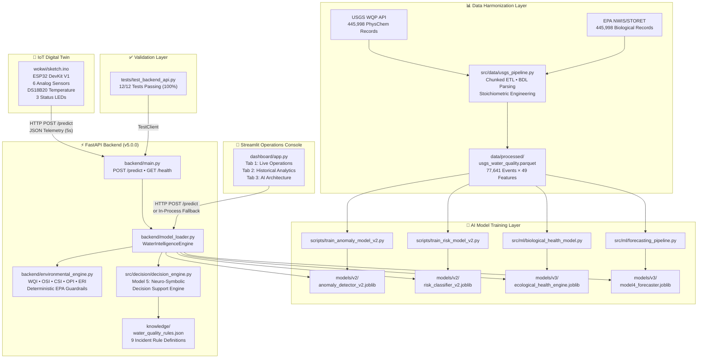

# NEON Water Intelligence Platform — Final System Architecture (v5.0.0)

**Document**: Complete Multi-Domain AI Water Intelligence Architecture Specification  
**Version**: 5.0.0 (SIH 2026 Production Release)  
**Date**: 2026-08-15  
**Classification**: Engineering Architecture & System Integration Blueprint

---

## 1. High-Level System Architecture



---

## 2. Complete Data Flow Pipeline

```
┌─────────────────────────────────────────────────────────────────────────────────────────────────┐
│                              END-TO-END DATA FLOW ARCHITECTURE                                  │
├─────────────────────────────────────────────────────────────────────────────────────────────────┤
│                                                                                                 │
│  ┌──────────────┐    ┌──────────────┐    ┌──────────────┐    ┌──────────────┐                   │
│  │ USGS/EPA Raw  │    │ Chunked ETL  │    │  Parquet     │    │ Model        │                   │
│  │ CSV Files     │───>│ Pipeline     │───>│ Datastore    │───>│ Training     │                   │
│  │ 891,996 rows  │    │ BDL Parsing  │    │ 77,641 × 49  │    │ Scripts      │                   │
│  │ ~526 MB       │    │ Stoichiometry│    │ 2.26 MB      │    │              │                   │
│  └──────────────┘    └──────────────┘    └──────────────┘    └──────┬───────┘                   │
│                                                                      │                           │
│                                                         ┌────────────┼────────────┐              │
│                                                         ▼            ▼            ▼              │
│                                                    ┌─────────┐ ┌─────────┐ ┌─────────┐         │
│                                                    │ Model 1 │ │ Model 2 │ │Model 3/4│         │
│                                                    │ .joblib │ │ .joblib │ │ .joblib │         │
│                                                    └────┬────┘ └────┬────┘ └────┬────┘         │
│                                                         │          │            │               │
│  ┌──────────────┐    ┌──────────────┐              ┌────▼──────────▼────────────▼────┐          │
│  │ Sensor Input  │    │ FastAPI      │              │  WaterIntelligenceEngine        │          │
│  │ (IoT / UI)    │───>│ /predict     │─────────────>│  M1→M2→M3→M4→M5→Guardrails    │          │
│  │               │    │              │              │                                 │          │
│  └──────────────┘    └──────────────┘              └────────────────┬────────────────┘          │
│                                                                      │                           │
│                                                                      ▼                           │
│                                                    ┌─────────────────────────────────┐          │
│                                                    │  Unified JSON Response           │          │
│                                                    │  • anomaly_detection             │          │
│                                                    │  • risk_prediction               │          │
│                                                    │  • biological_health             │          │
│                                                    │  • early_warning_forecast        │          │
│                                                    │  • decision_support              │          │
│                                                    │  • final_assessment              │          │
│                                                    └─────────────────────────────────┘          │
│                                                                                                 │
└─────────────────────────────────────────────────────────────────────────────────────────────────┘
```

---

## 3. Model Interaction & Decision Fusion Matrix

```
┌─────────────────────────────────────────────────────────────────────────────────────────────────┐
│                              MULTI-MODEL DECISION FUSION MATRIX                                 │
├──────────────────┬───────────────────────────────────────────────────────────────────────────────┤
│ Model Layer      │ Purpose & Outputs                                                            │
├──────────────────┼───────────────────────────────────────────────────────────────────────────────┤
│ Model 1          │ Isolation Forest (250 trees, 8% contamination)                                │
│ Anomaly Detector │ → status: "Normal" | "Anomaly"                                                │
│                  │ → score: continuous severity [-1.0, +1.0]                                     │
├──────────────────┼───────────────────────────────────────────────────────────────────────────────┤
│ Model 2          │ Balanced Random Forest (300 trees, max_depth=16)                              │
│ Risk Classifier  │ → class: "SAFE" | "WARNING" | "CRITICAL"                                     │
│                  │ → probability: confidence [0.0, 1.0]                                          │
│                  │ → 99.77% accuracy, F1 = 0.9963                                                │
├──────────────────┼───────────────────────────────────────────────────────────────────────────────┤
│ Model 3          │ Biological Health Engine (4 sub-indicators)                                   │
│ Eco Health       │ → score: Biological Health (0-100)                                            │
│                  │ → neon_eco_health_index: Composite (0-100)                                    │
│                  │ → ecological_tier: "Excellent" ... "Ecotoxic Collapse"                        │
├──────────────────┼───────────────────────────────────────────────────────────────────────────────┤
│ Model 4.1        │ Multi-Scale Time-Series Forecaster (98 features)                             │
│ Early Warning    │ → predicted_dissolved_oxygen_24h (R² = 0.7764)                               │
│                  │ → predicted_turbidity_24h (RMSE = 64.2 FNU)                                  │
│                  │ → future_warning_probability, forecast_confidence                             │
├──────────────────┼───────────────────────────────────────────────────────────────────────────────┤
│ Model 5          │ Neuro-Symbolic Decision Support Engine (9 incident types)                    │
│ Decision Support │ → incident + severity + confidence + root_causes                             │
│                  │ → evidence + reasoning_chain                                                  │
│                  │ → recommended_actions (immediate, short_term, long_term)                     │
├──────────────────┼───────────────────────────────────────────────────────────────────────────────┤
│ Safety Layer     │ Deterministic EPA Guardrails (Anti-Eclipsing Override)                       │
│ Environmental    │ → Overrides ML when hard biological limits violated                          │
│ Engine           │ → WQI, OSI, CSI, OPI, ERI composite indices                                  │
│                  │ → Prevents catastrophic false-safe classifications                           │
└──────────────────┴───────────────────────────────────────────────────────────────────────────────┘
```

---

## 4. Backend API Architecture (FastAPI v5.0.0)

### Endpoints

| Method | Path | Description |
|--------|------|-------------|
| `GET` | `/health` | Service status, model catalog (M1-M5), version |
| `POST` | `/predict` | Full 6-stage AI inference pipeline |

### Inference Pipeline Execution Order

```
POST /predict (PredictionRequest)
  │
  ├─ 1. Model 1: IsolationForest.predict([ph, DO, turb, cond, fdom])
  │     → anomaly_status, anomaly_score
  │
  ├─ 2. Model 2: RandomForest.predict([ph, DO, turb, cond, fdom, chl, site, pos, qf_flags])
  │     → risk_label (SAFE/WARNING/CRITICAL), confidence
  │
  ├─ 3. Model 3: BiologicalHealthEngine.evaluate_sample(physchem + bio_taxonomy)
  │     → biodiversity, pollution_tolerance, trophic_balance, bioassay_stress
  │     → neon_eco_health_index (0-100)
  │
  ├─ 4. Model 4: WaterQualityForecaster.predict_forecast(current_telemetry)
  │     → predicted_do_24h, predicted_turb_24h, future_warning_prob
  │     → forecast_confidence (High/Medium/Low), causal_reasons
  │
  ├─ 5. Environmental Engine: compute_environmental_intelligence(all_params)
  │     → WQI, OSI, CSI, OPI, ERI
  │     → Deterministic safety overrides (pH<4, DO<2, Metal>0.70 → CRITICAL)
  │
  ├─ 6. Model 5: DecisionSupportEngine.evaluate_incident(M1+M2+M3+M4+telemetry)
  │     → incident_type, severity, confidence, root_causes, reasoning_chain
  │     → recommended_actions (immediate, short_term, long_term)
  │
  └─ 7. Assembly → PredictionResponse (structured blocks + flat compatibility keys)
```

---

## 5. Frontend Dashboard Architecture (Streamlit v3.0)

### Tab Structure

| Tab | Content | Key Components |
|-----|---------|----------------|
| **Tab 1: Live Operations** | Real-time AI inference | 5 Quick Demo Presets, 12 Sensor Sliders, Top Alert Banner, 4-Model Decision Cards, Bio Health Progress Bars, 24h Forecast Metrics, Model 5 Action Command Center, XAI Diagnostics, Telemetry History Charts |
| **Tab 2: Historical Analytics** | USGS 77,641-event explorer | Station Selector, Data Grid (100 rows), pH/DO Distribution Charts, Bioassay Species Bar Chart |
| **Tab 3: AI Architecture** | System explanation | Architecture description, Feature Importance Plot |

### API Communication

```
Dashboard (Streamlit)
  │
  ├─ Primary: HTTP POST to http://localhost:8000/predict (FastAPI)
  │
  └─ Fallback: Direct in-process call to backend.model_loader.engine.predict()
      (Used when FastAPI server is not running)
```

---

## 6. Digital Twin Architecture (Wokwi ESP32)

### Hardware Configuration

| Component | GPIO | Function |
|-----------|------|----------|
| pH Potentiometer | D34 | Analog pH probe (0-14 scale) |
| Turbidity Potentiometer | D35 | Optical turbidity sensor (0-300 FNU) |
| DO Potentiometer | D32 | Galvanic DO sensor (0-20 mg/L) |
| Conductance Potentiometer | D33 | 4-electrode conductance (0-2000 µS/cm) |
| Nutrient ISE ADC | D39 | Ion-selective electrode proxy |
| Fluorometer ADC | D36 | fDOM fluorescence proxy |
| DS18B20 | D4 | Digital temperature probe (°C) |
| Scenario Button | D13 | Cycles through 5 demo scenarios |
| Green LED | D18 | SAFE status indicator |
| Yellow LED | D19 | WARNING status indicator |
| Red LED | D21 | CRITICAL status indicator |

### Communication Protocol

```
ESP32 → HTTP POST → http://host.wokwi.internal:8000/predict → JSON Response → LED Control
         (every 5 seconds)
```

---

## 7. File System Architecture

```
neon_water_project/
├── backend/
│   ├── main.py                          # FastAPI v5.0.0 (GET /health, POST /predict)
│   ├── model_loader.py                  # WaterIntelligenceEngine (M1-M5 orchestrator)
│   └── environmental_engine.py          # WQI/OSI/CSI/OPI/ERI + EPA safety overrides
├── dashboard/
│   └── app.py                           # Streamlit Operations Console (3 tabs, 605 lines)
├── data/
│   ├── raw/
│   │   ├── resultphyschem.csv           # 445,998 raw physical-chemical records
│   │   └── biologicalresult.csv         # 445,998 raw biological records
│   └── processed/
│       └── usgs_water_quality.parquet   # 77,641 events × 49 features (2.26 MB)
├── demo/
│   └── scenarios.json                   # 5 SIH demonstration scenarios
├── knowledge/
│   └── water_quality_rules.json         # 9 incident type expert rules
├── models/
│   ├── v2/
│   │   ├── anomaly_detector_v2.joblib   # Model 1: Isolation Forest
│   │   └── risk_classifier_v2.joblib    # Model 2: Balanced Random Forest
│   └── v3/
│       ├── ecological_health_engine.joblib  # Model 3: Biological Health Engine
│       └── model4_forecaster.joblib         # Model 4.1: Time-Series Forecaster
├── scripts/
│   ├── train_anomaly_model_v2.py        # Model 1 training script
│   └── train_risk_model_v2.py           # Model 2 training script
├── src/
│   ├── data/
│   │   └── usgs_pipeline.py             # USGS ETL pipeline (BDL parsing, stoichiometry)
│   ├── decision/
│   │   └── decision_engine.py           # Model 5: Decision Support Engine
│   └── ml/
│       ├── biological_health_model.py   # Model 3: BiologicalHealthEngine class
│       └── forecasting_pipeline.py      # Model 4: WaterQualityForecaster class
├── tests/
│   └── test_backend_api.py              # 12 pytest test cases (100% passing)
├── wokwi/
│   ├── sketch.ino                       # ESP32 firmware (450 lines C++)
│   ├── diagram.json                     # Circuit wiring definition
│   ├── libraries.txt                    # ArduinoJson, OneWire, DallasTemperature
│   └── README.md                        # Digital twin documentation
├── reports/                             # Evaluation plots and result reports
└── docs/                               # Technical documentation suite
```

---

## 8. Verification & Testing Summary

| Test Case | Scenario | Expected | Status |
|-----------|----------|----------|--------|
| `test_health_endpoint` | GET /health | 200, models_loaded, v5.0.0, M1-M5 | ✅ PASS |
| `test_safety_case_a_normal` | Pristine water | SAFE, no override | ✅ PASS |
| `test_safety_case_b_severe_acidification` | pH=0.25 | CRITICAL, override | ✅ PASS |
| `test_safety_case_c_severe_alkalinity` | pH=13.65 | CRITICAL, override | ✅ PASS |
| `test_safety_case_d_severe_hypoxia` | DO=0.5 | CRITICAL, OSI=1.0 | ✅ PASS |
| `test_safety_case_e_missing_all` | All None | INSUFFICIENT_DATA | ✅ PASS |
| `test_safety_case_f_eutrophication_synergy` | DO=1.8, NO3=12, PO4=0.15 | CRITICAL | ✅ PASS |
| `test_safety_case_g_heavy_metal_override` | Lead=0.85 | CRITICAL | ✅ PASS |
| `test_safety_case_h_microbial_risk_override` | Microbial=82% | CRITICAL | ✅ PASS |
| `test_model3_biological_health_response` | Bio richness=2, Ceriodaphnia | Bio≥85, SAFE | ✅ PASS |
| `test_model4_early_warning_response` | Standard telemetry | 24h forecast fields | ✅ PASS |
| `test_model5_decision_support_response` | pH=2.80 acid spill | ACIDIFICATION, CRITICAL, ≥90% | ✅ PASS |

**Result: 12/12 Tests Passing (100%)**
