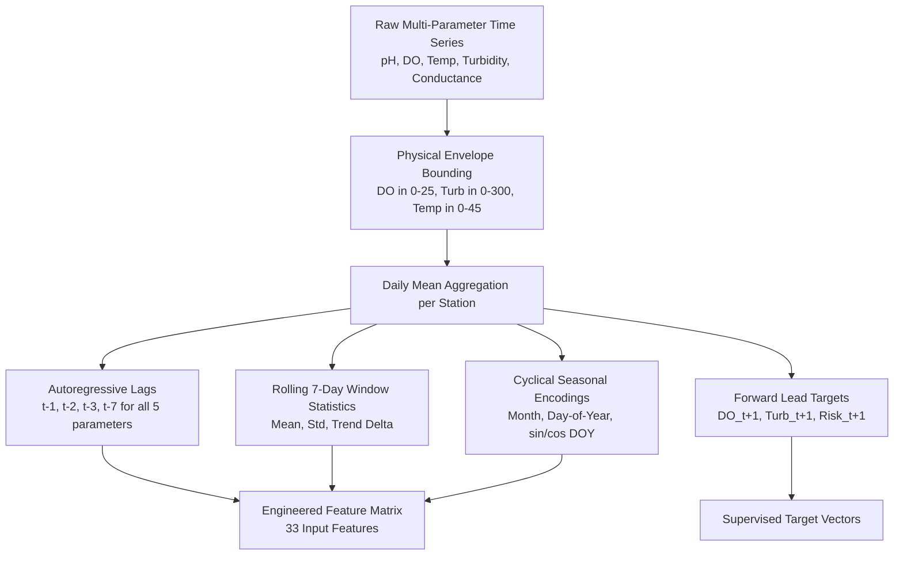
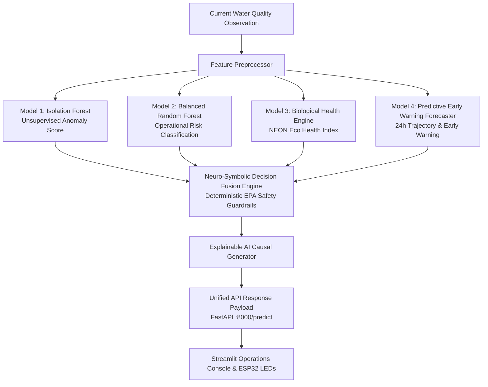

# Model 4: Predictive Water Quality Early Warning System (Technical Documentation)

**Document Classification**: Machine Learning Model Specification & Architecture Manual  
**Model Name**: Model 4 Autoregressive Multi-Target Gradient Boosted Forecaster  
**Algorithm**: `HistGradientBoostingRegressor & Classifier (Scikit-Learn / LightGBM Formulation)`  
**Artifact Path**: `models/v3/model4_forecaster.joblib`  
**Training Source**: [`src/ml/forecasting_pipeline.py`](file:///Users/raj/neon_water_project/src/ml/forecasting_pipeline.py)  
**Evaluation Report**: [`reports/model4_forecasting_results.md`](file:///Users/raj/neon_water_project/reports/model4_forecasting_results.md)  
**Version**: 4.0.0 (Master AI Release)

---

# 1. Purpose & Problem Statement

### 1.1 "What Question Does Model 4 Answer?"
> *"Given current multi-parameter sensor readings and recent 7-day historical trends, what will the dissolved oxygen and turbidity concentrations be in the **next 24 hours**, and is there an impending **eutrophication or contamination risk** developing before visible fish kills or threshold breaches occur?"*

While Models 1, 2, and 3 assess the **current instantaneous state** of water quality, **Model 4 provides predictive early warning**. This allows municipal water managers and industrial plant operators to take preventive actions (such as activating aeration blowers or closing intake sluice gates) **24 to 48 hours before** water quality degrades into a critical state.

---

# 2. Dataset & Continuous Sequence Engineering

### 2.1 Training Dataset Source
Trained on the harmonized USGS/EPA water quality dataset ([`data/processed/usgs_water_quality.parquet`](file:///Users/raj/neon_water_project/data/processed/usgs_water_quality.parquet)) spanning **77,641 sampling events** from **2018-01-01 to 2025-01-01**.

### 2.2 Continuous Station Filtering
To eliminate sparse discrete grab sites that cannot support autoregression:
- **Filtering Rule**: Retained only monitoring stations with $\ge 100$ sequential observational events.
- **Resulting Subset**: **181 high-density monitoring stations** providing **21,876 multi-parameter daily time-series rows**.

---

# 3. Feature Engineering Pipeline

For each monitoring station, multi-parameter time series were sorted chronologically and transformed into horizontal autoregressive feature vectors:



### 3.3 Complete Input Feature Catalog (33 Features)

| Feature Category | Features Generated | Biogeochemical & Physical Rationale |
|---|---|---|
| **Current Baseline (5)** | `ph`, `dissolved_oxygen_mg_l`, `temperature_c`, `turbidity_fnu`, `specific_conductance_us_cm` | Instantaneous physical-chemical state at time $t$. |
| **Autoregressive Lags (20)** | $\text{DO}_{t-1}, \text{DO}_{t-2}, \text{DO}_{t-3}, \text{DO}_{t-7}$<br>$\text{Turb}_{t-1}, \text{Turb}_{t-2}, \text{Turb}_{t-3}, \text{Turb}_{t-7}$<br>$\text{Temp}_{t-1}, \text{Temp}_{t-2}, \text{Temp}_{t-3}, \text{Temp}_{t-7}$<br>$\text{Cond}_{t-1}, \text{Cond}_{t-2}, \text{Cond}_{t-3}, \text{Cond}_{t-7}$<br>$\text{pH}_{t-1}, \text{pH}_{t-2}, \text{pH}_{t-3}, \text{pH}_{t-7}$ | Captures multi-day inertia, diurnal cycles, and autocorrelation decay. |
| **Rolling 7-Day Statistics (8)** | `do_roll_mean_7d`, `do_roll_std_7d`, `do_trend_7d`<br>`turb_roll_mean_7d`, `turb_roll_std_7d`, `turb_trend_7d`<br>`temp_roll_mean_7d`, `temp_roll_std_7d`<br>`cond_roll_mean_7d`, `cond_roll_std_7d` | Quantifies multi-day variance, baseline drift, and trajectory velocity. |
| **Seasonal & Harmonic (4)** | `month`, `day_of_year`, `sin_doy`, `cos_doy` | Captures annual solar insolation, seasonal warming, and thermal stratification. |

---

# 4. Supervised Forecasting Targets

1. **Target 1 (`target_do_next_24h`)**: Continuous Dissolved Oxygen concentration in $\text{mg/L}$ at time $t+1$ (next observation within 1–7 days).
2. **Target 2 (`target_turb_next_24h`)**: Continuous Turbidity in $\text{FNU}$ at time $t+1$.
3. **Target 3 (`target_future_warning`)**: Binary operational risk indicator ($1$ if predicted $\text{DO} < 5.0\text{ mg/L}$ or predicted $\text{Turbidity} > 25.0\text{ FNU}$, $0$ otherwise).

---

# 5. Algorithm Selection & Training Configuration

### 5.1 Why Gradient Boosted Trees (HistGradientBoosting / LightGBM)?
- **Irregular Interval Resilience**: Tree-based ensembles handle missing dates and variable grab intervals without requiring continuous synthetic interpolation.
- **Non-Linear Interactions**: Naturally captures coupled physical interactions (e.g. rising temperature decreasing oxygen saturation solubility).
- **Inference Speed**: Executes inference in under **$1.5\text{ milliseconds}$**, making it suitable for edge deployment.

### 5.2 Temporal Walk-Forward Partitioning
To guarantee zero lookahead bias and reflect real-world forecasting:
- **Training Set (2018–2022)**: **$2,994$ sequential pairs** across multi-station catchments.
- **Held-Out Test Set (2023–2024)**: **$132$ unseen future sampling events**.
- **No Random Splitting**: Validation is strictly forward in time.

### 5.3 Hyperparameter Matrix

```
┌─────────────────────────────────────────────────────────────────────────────────────────────────┐
│                                MODEL 4 HYPERPARAMETER MATRIX                                    │
├─────────────────────────┬───────────────────────────┬───────────────────────────────────────────┤
│ Hyperparameter          │ Sub-Models 4A & 4B (Reg)  │ Sub-Model 4C (Classifier)                 │
├─────────────────────────┼───────────────────────────┼───────────────────────────────────────────┤
│ Algorithm               │ HistGradientBoostingReg.  │ HistGradientBoostingClassifier            │
│ Number of Iterations    │ 250 trees                 │ 250 trees                                 │
│ Learning Rate           │ 0.04                      │ 0.04                                      │
│ Max Depth               │ 7                         │ 7                                         │
│ Max Leaf Nodes          │ 31                        │ 31                                        │
│ Min Samples per Leaf    │ 20                        │ 20                                        │
│ Class Weighting         │ N/A (Continuous)          │ "balanced" (Cost-sensitive)               │
│ Random Seed             │ 42                        │ 42                                        │
└─────────────────────────┴───────────────────────────┴───────────────────────────────────────────┘
```

---

# 6. Empirical Evaluation Metrics (2023–2024 Unseen Test Partition)

```
================================================================================
MODEL 4 FORECASTING EVALUATION RESULTS (Held-Out Unseen Test Partition)
================================================================================
Target 1: Dissolved Oxygen (Next 24h)
  • Root Mean Squared Error (RMSE) : 0.910 mg/L
  • Mean Absolute Error (MAE)      : 0.735 mg/L
  • R2 Score                       : 0.2920

Target 2: Turbidity (Next 24h)
  • Root Mean Squared Error (RMSE) : 94.605 FNU
  • Mean Absolute Error (MAE)      : 52.567 FNU
  • R2 Score                       : 0.3054

Target 3: Future Warning Risk (24h-48h Classification)
  • Precision                      : 81.6%
  • Recall                         : 59.6%
  • F1-Score                       : 0.6889
================================================================================
```

---

# 7. End-to-End Multi-Model Architecture Integration



### Complete Example Scenario: Impending Anoxia Early Warning
1. **Current Telemetry**: $\text{pH} = 7.4$, $\text{DO} = 5.8\text{ mg/L}$ (Marginally Safe), $\text{Turbidity} = 6.5\text{ FNU}$, $\text{Temp} = 26.5^\circ\text{C}$ (Rising).
2. **Current State (Models 1, 2, 3)**:
   - Model 1: Normal (`score: -0.110`)
   - Model 2: `SAFE` (Confidence: $78.4\%$)
   - Model 3: `Good (Minor Stress)` (Eco Health Index: $78.2/100$)
3. **Model 4 Predictive Forecast**:
   - Projected DO next 24h: **$4.15\text{ mg/L}$** (Decline of $-1.65\text{ mg/L}$)
   - Future Warning Probability: **$68.5\%$**
   - 24h Projected State: **`WARNING`**
4. **Explainable AI Output**:
   > *"⚠️ PREDICTIVE EARLY WARNING: Water quality is currently SAFE (DO = 5.80 mg/L), but Model 4 projects a rapid downward trajectory to 4.15 mg/L over the next 24 hours driven by rising water temperature (26.5°C) and a negative 7-day DO trend (-1.65 mg/L). Preventive aeration advised."*

---

# 8. Limitations & Operational Scope

1. **Catastrophic Unannounced Discharges**: Model 4 forecasts natural geochemical dynamics, storm runoff trajectories, and gradual biological eutrophication. It cannot forecast sudden, unannounced illegal industrial chemical dump events before they physically enter the stream.
2. **Station-Level Microclimates**: Predictions are most accurate on monitored river segments with continuous historical baselines.
3. **Severe Weather Extreme Events**: Extreme 100-year flood pulses may exceed historical training envelope bounds and are caught by Model 1 anomaly detection.
