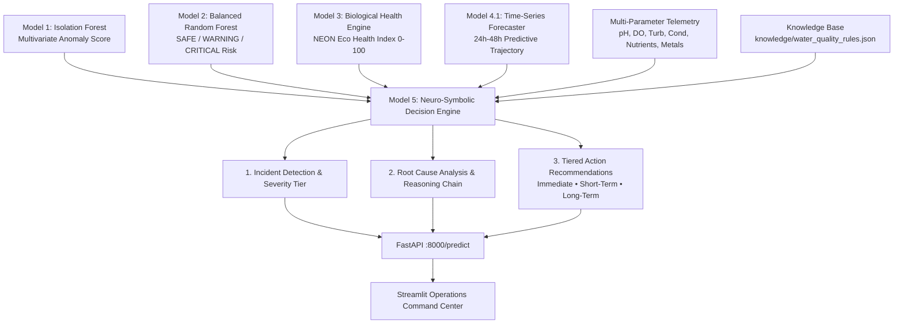

# Model 5: AI Decision Support and Response Recommendation Engine (Technical Manual)

**Document Classification**: AI Architecture & Operational Decision Engine Specification  
**Model Name**: Model 5 Neuro-Symbolic Decision Support & Response Engine  
**Module Source**: [`src/decision/decision_engine.py`](file:///Users/raj/neon_water_project/src/decision/decision_engine.py)  
**Knowledge Base**: [`knowledge/water_quality_rules.json`](file:///Users/raj/neon_water_project/knowledge/water_quality_rules.json)  
**Target File**: `docs/MODEL5_DECISION_ENGINE.md`  
**Version**: 5.0.0 (Master AI Release)

---

# 1. Purpose & Operational Objective

While Models 1 through 4 provide predictive diagnostics, water management authorities need concrete, prioritized operational directives. **Model 5 converts raw AI predictions into actionable environmental decisions**, answering the three fundamental operational questions:

```
┌─────────────────────────────────────────────────────────────────────────────────────────────────┐
│                                THE 3 CRITICAL OPERATIONAL QUESTIONS                             │
├──────────────────────────────┬──────────────────────────────────────────────────────────────────┤
│ Question                     │ Model 5 Output & Synthesized Intelligence                        │
├──────────────────────────────┼──────────────────────────────────────────────────────────────────┤
│ 1. "What is happening?"      │ • Incident Classification (e.g. Acidification, Hypoxia, Toxic)   │
│                              │ • Operational Severity Tier (LOW, MEDIUM, HIGH, CRITICAL)        │
│                              │ • AI Synthesis Confidence (0–100%)                               │
├──────────────────────────────┼──────────────────────────────────────────────────────────────────┤
│ 2. "Why is it happening?"    │ • Root Cause Analysis (BOD decay, industrial spill, runoff)     │
│                              │ • Empirical Evidentiary Facts & Step-by-Step Reasoning Chain     │
├──────────────────────────────┼──────────────────────────────────────────────────────────────────┤
│ 3. "What should authorities  │ • Tier 1: Immediate Emergency Responses (0–2 hours)              │
│     do next?"                │ • Tier 2: Short-Term Operational Containment (2–24 hours)         │
│                              │ • Tier 3: Long-Term Watershed Engineering & Policy Prevention    │
└──────────────────────────────┴──────────────────────────────────────────────────────────────────┘
```

---

# 2. Neuro-Symbolic Architecture & Multi-Model Fusion

Model 5 is **NOT another statistical black-box ML classifier**. It is a **Neuro-Symbolic Decision Synthesis Engine** combining data-driven machine learning models with declarative environmental regulatory knowledge:



---

# 3. Incident Taxonomy & Expert Trigger Rules

The declarative rules knowledge base (`knowledge/water_quality_rules.json`) codifies **8 environmental incident domains**:

```
┌─────────────────────────┬───────────────────────────┬──────────────┬────────────────────────────────────────────────────────┐
│ Incident Type           │ Environmental Domain      │ Severity     │ Primary Trigger Envelopes                              │
├─────────────────────────┼───────────────────────────┼──────────────┼────────────────────────────────────────────────────────┤
│ ACIDIFICATION           │ Chemical Spill / AMD      │ CRITICAL     │ pH < 6.0 (Critical if pH < 4.5)                        │
│ ALKALINE_SPILL          │ Industrial Caustic / Wash │ CRITICAL     │ pH > 9.0 (Critical if pH > 9.8)                        │
│ TOXIC_CONTAMINATION     │ Heavy Metals / Toxicology │ CRITICAL     │ Metal Risk >= 0.50 OR Bioassay Survival < 40/100       │
│ HYPOXIA                 │ Oxygen Depletion / BOD    │ CRITICAL     │ DO < 4.0 mg/L OR Model 4.1 Forecast DO < 3.5 mg/L      │
│ EUTROPHICATION          │ Nutrient Overload         │ HIGH/CRIT    │ Nitrate >= 10 mg/L OR Phosphate >= 0.10 mg/L           │
│ SEDIMENT_CONTAMINATION  │ Suspended Solids / Turb.  │ MEDIUM/HIGH  │ Turbidity >= 40 FNU OR SSC >= 120 mg/L                 │
│ THERMAL_STRESS          │ Heat Pollution            │ MEDIUM       │ Water Temperature >= 27.0°C                            │
│ ECOSYSTEM_COLLAPSE      │ Multi-Trophic Stress      │ CRITICAL     │ NEON Eco Health Index < 50.0/100                       │
│ NOMINAL_BASELINE        │ Pristine Potable Stream   │ LOW          │ All multi-model and telemetry indicators nominal       │
└─────────────────────────┴───────────────────────────┴──────────────┴────────────────────────────────────────────────────────┘
```

---

# 4. Multi-Tiered Action Recommendation Protocol

For every identified incident, Model 5 produces a **time-stratified response checklist**:

### Tier 1: Immediate Actions (0–2 Hours)
Urgent life-safety and drinking water extraction containment:
- Raw water intake sluice isolation.
- Emergency mechanical aeration diffuser deployment.
- HazMat neutralizing reagent deployment.
- Aquaculture & public boil-water notifications.

### Tier 2: Short-Term Operational Containment (2–24 Hours)
Field diagnostics, forensic tracing, and plant adjustment:
- Sonde telemetry frequency increased to 5-minute sampling.
- Upstream tributary conductance triangulation to locate industrial outfalls.
- Acute bioassay testing (*Ceriodaphnia dubia*, *Hyalella azteca*).
- Drone / satellite multispectral algal bloom tracking.

### Tier 3: Long-Term Watershed Engineering & Policy
Catchment-scale ecological resilience and regulation:
- Constructed wetlands and passive limestone drains.
- Agricultural precision nutrient management (BNR treatment plant upgrades).
- Riparian buffer reforestation for solar canopy shading.
- Industrial Zero Liquid Discharge (ZLD) enforcement.

---

# 5. Example Real-World Scenarios

### Scenario A: Industrial Acid Dump
- **Telemetry**: $\text{pH} = 2.80$, $\text{Conductance} = 1450\text{ }\mu\text{S/cm}$, $\text{DO} = 8.4\text{ mg/L}$.
- **Incident Output**:
  ```json
  {
    "incident": "Severe Acidification / Industrial Acid Discharge",
    "severity": "CRITICAL",
    "confidence": 98.0,
    "evidence": [
      "Water pH (2.80) indicates severe acidification / acid spill.",
      "Model 1 (Isolation Forest) flagged multivariate statistical outlier (+0.1420)."
    ],
    "recommended_actions": {
      "immediate_actions": [
        "TRIGGER IMMEDIATE WATER INTAKE SHUTDOWN: Do not draw raw water into distribution network.",
        "Dispatch HazMat environmental enforcement team with lime / alkaline neutralizing agents.",
        "Notify downstream municipalities and public health agencies of hazardous chemical plume."
      ],
      "short_term_actions": [
        "Conduct trace metal screening (pH < 4.5 leaches toxic aluminum, lead, and zinc into ionic solution).",
        "Trace pipeline networks and industrial stormwater outfalls using conductance triangulation."
      ],
      "long_term_prevention": [
        "Construct passive limestone neutralization drains and constructed wetlands for mine drainages.",
        "Enforce zero liquid discharge (ZLD) regulations and continuous pH gate locks on industrial outfalls."
      ]
    }
  }
  ```

### Scenario B: Eutrophic Cyanobacterial Bloom
- **Telemetry**: $\text{Nitrate} = 12.8\text{ mg/L}$, $\text{Phosphate} = 0.18\text{ mg/L}$, $\text{DO} = 3.2\text{ mg/L}$, $\text{Chl-a} = 35.0\text{ }\mu\text{g/L}$.
- **Incident Output**:
  - **Incident**: Eutrophication & Nutrient Hyper-Enrichment
  - **Severity**: `HIGH`
  - **Confidence**: $92.4\%$
  - **Immediate Actions**: Isolate drinking water intakes, screen for microcystin cyanotoxins, activate PAC pre-treatment.

---

# 6. SIH Presentation & Demonstration Script

When demonstrating Model 5 to SIH judges:
1. **The Problem We Address**: *"Judges, an AI model that merely outputs '99% Anomaly' or 'Probability 0.85' is useless to an operator during a midnight chemical emergency. The operator needs to know: What is the hazard? What caused it? What immediate valve must be turned?"*
2. **The Neuro-Symbolic Innovation**: *"Model 5 bridges cutting-edge machine learning and EPA regulatory protocols into an authoritative 3-tier action recommendation matrix."*
3. **Interactive Demo**: Click **Preset 5 (Acid Spill)** or **Preset 3 (Eutrophic Anoxia)** $\rightarrow$ Show the **Model 5 AI Decision Support & Action Command Center** instantly generate prioritized emergency, operational, and long-term directives.
