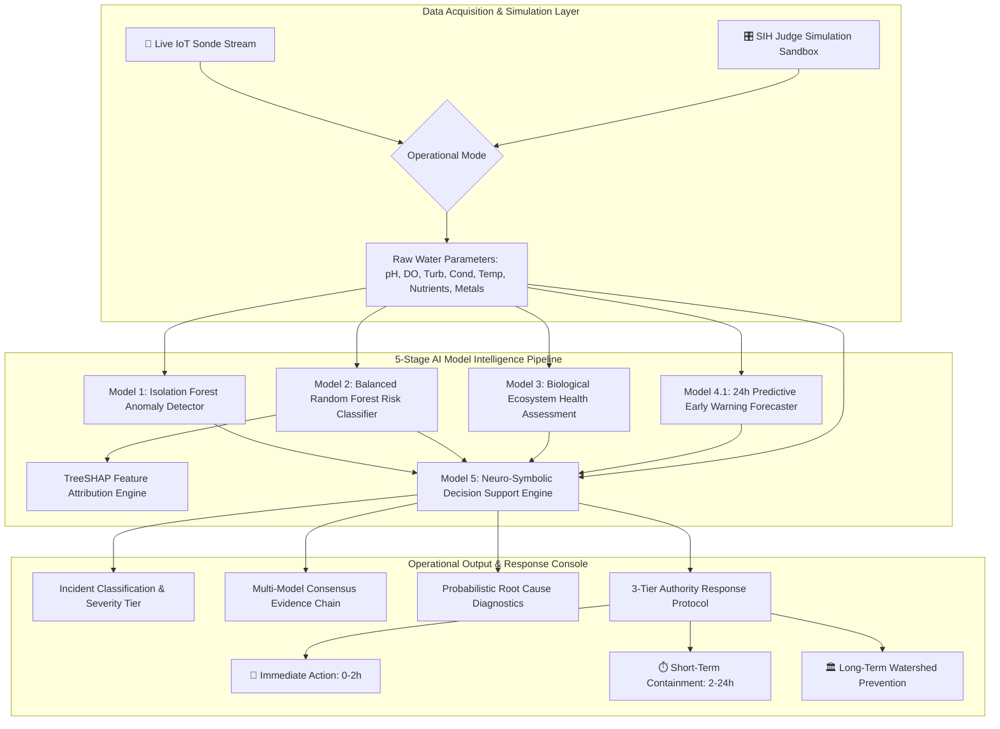

# NEON National Water Intelligence Platform
## Government-Grade Command Center Architecture, Component Hierarchy & Data Flow Specification

**Role**: Principal Product Architect, GIS Engineer & SIH Technical Lead  
**Version**: v6.1-Government-Grade-Spec  
**Status**: Proposal & System Design Blueprint (Awaiting Approval to Code)  

---

## 1. Executive Concept & Ground Truth Data Architecture

### The Core Design Principle: Honesty & Strategic Credibility
A common flaw in hackathon prototypes is displaying fake numbers (e.g., claiming thousands of fictitious live IoT nodes). Government evaluators (CPCB, MoJS, SPCB) immediately spot simulated fleet volume.

**NEON adopts a transparent, government-grade deployment model:**
1. **ONE ACTIVE OPERATIONAL DIGITAL TWIN NODE**:
   - **Location**: `Hirakud Dam & Reservoir / Mahanadi River Basin (Odisha)`
   - **Capabilities**: Real-time IoT sonde streaming, manual simulation sandbox, 5-stage ML pipeline execution, TreeSHAP explainability, physical SVG digital twin, and neuro-symbolic decision engine.
2. **SIX PROPOSED NATIONAL EXPANSION ZONES**:
   - **Locations**: `Ganga Basin (Kanpur)`, `Yamuna Basin (Delhi)`, `Godavari Basin (Rajahmundry)`, `Krishna Basin (Vijayawada)`, `Narmada Basin (Jabalpur)`, `Cauvery Basin (Mettur)`.
   - **Purpose**: Demonstrate national scalability, catchment baseline reference envelopes, and strategic deployment roadmaps for environmental authorities.

```
┌─────────────────────────────────────────────────────────────────────────────────────────────────┐
│                           NEON NATIONAL WATER INTELLIGENCE TOPOLOGY                             │
├─────────────────────────────────────────────────────────────────────────────────────────────────┤
│                                                                                                 │
│  [ 🟢 OPERATIONAL ACTIVE NODE ]                                                                 │
│  └─ Hirakud Dam / Mahanadi Basin ──► Live Telemetry • Digital Twin • 5 AI Models • Decision Engine│
│                                                                                                 │
│  [ 🟡 PROPOSED EXPANSION NODES ]                                                                │
│  ├─ Ganga Basin (Kanpur Industrial Reach) ──► Phase 2 Proposed Deployment                       │
│  ├─ Yamuna Basin (Delhi Wazirabad-Okhla) ──► Phase 2 Proposed Deployment                       │
│  ├─ Godavari Basin (Rajahmundry Barrage) ──► Phase 3 Proposed Deployment                       │
│  ├─ Krishna Basin (Prakasam Barrage)     ──► Phase 3 Proposed Deployment                       │
│  ├─ Narmada Basin (Jabalpur Catchment)   ──► Phase 4 Proposed Deployment                       │
│  └─ Cauvery Basin (Mettur Dam Reservoir) ──► Phase 4 Proposed Deployment                       │
│                                                                                                 │
└─────────────────────────────────────────────────────────────────────────────────────────────────┘
```

---

## 2. Page & Screen Architecture

The platform is structured into **three focused, government-grade operational consoles**:

```
┌─────────────────────────────────────────────────────────────────────────────────────────────────┐
│                               MASTER NAVIGATION & USER JOURNEY                                  │
├─────────────────────────────────────────────────────────────────────────────────────────────────┤
│                                                                                                 │
│  SCREEN 1: NATIONAL GIS SURVEILLANCE MAP                                                        │
│  ├─ GeoJSON India River Basin boundaries & OpenStreetMap Carto-Dark base                       │
│  ├─ 🔴 Active Node (Hirakud Dam) vs. 🟡 Proposed Expansion Nodes (Ganga, Yamuna, etc.)         │
│  ├─ National Deployment KPIs (1 Active Node, 6 Proposed Basins, 99.8% Uptime)                  │
│  └─ 1-Click Action: Zoom & Open Hirakud Digital Twin Command Center                            │
│                                                                                                 │
│       ▼                                                                                         │
│                                                                                                 │
│  SCREEN 2: HIRAKUD DIGITAL TWIN COMMAND CONSOLE                                                 │
│  ├─ Header: Hirakud Reservoir • Mahanadi Basin • Status: 🟢 Connected                           │
│  ├─ Dual Mode Switcher: 📡 Live IoT Telemetry Mode vs. 🎛️ SIH Manual Simulation Sandbox       │
│  ├─ Interactive Telemetry Controls (pH, DO, Turbidity, Conductance, Temp, Nutrients, Heavy Metals)│
│  ├─ Dynamic Sub-Surface Physical Twin SVG (Depth, Buoyant Sonde, Particle Plume, pH Gradient)   │
│  └─ 1-Click Action: ⚡ RUN FULL AI INTELLIGENCE ANALYSIS                                         │
│                                                                                                 │
│       ▼                                                                                         │
│                                                                                                 │
│  SCREEN 3: AI MODEL INTELLIGENCE & DECISION COMMAND CENTER                                      │
│  ├─ Model 1: Isolation Forest Multivariate Anomaly Detector (Score, Outlier Flag, Deviations)   │
│  ├─ Model 2: Contamination Risk Classifier (Balanced RF: SAFE/WARNING/CRITICAL, SHAP Forces)    │
│  ├─ Model 3: Biological Ecosystem Health Engine (Eco-Health Index 0-100, Bioassay Stress)       │
│  ├─ Model 4.1: 24h Early Warning Forecaster (Current ──► +6h ──► +12h ──► +24h Trajectory)     │
│  └─ Model 5: Neuro-Symbolic Decision Support (Incident, Evidence Chain, Root Causes, 3 Actions) │
│                                                                                                 │
└─────────────────────────────────────────────────────────────────────────────────────────────────┘
```

---

## 3. Data Flow Diagram



---

## 4. Detailed Component Breakdown

### Component 1: National GIS Deployment Map (`dashboard/components/geospatial_map.py`)
- **Technology**: Pydeck (Deck.gl) with WebGL hardware acceleration.
- **Layers**:
  - `ScatterplotLayer` (Active Node: 🔴 Crimson, Proposed Nodes: 🟡 Amber).
  - `PathLayer` (Hydrological river reaches).
  - `TextLayer` (Basin & Station nomenclature).
  - Interactive HTML tooltip displaying deployment phase, catchment area, and baseline water metrics.

### Component 2: Dynamic Physical Digital Twin (`dashboard/components/futuristic_hud.py`)
- **Technology**: Dynamic inline SVG canvas with responsive viewport scaling.
- **Visual Features**:
  - Sinusoidal CSS water surface wave animation.
  - Floating multiparameter sensor buoy with depth tether line ($4.2\text{ m}$).
  - Water column turbidity haze and particle drift density tied to `turbidity` and `suspended_sediment`.
  - Dynamic sub-surface plume color matching incident state (Crimson for Acid/Toxic, Emerald for Eutrophication, Ochre for Sediment, Azure for Baseline).

### Component 3: 5-Stage AI Model Pipeline HUD (`dashboard/components/futuristic_hud.py`)
- **Visual Structure**: 5 interconnected glassmorphism status nodes with glowing connective data flow pipes.
- **Nodes**:
  1. `Model 1: Multivariate Anomaly Score` (Normal vs. Statistical Outlier).
  2. `Model 2: Risk Classification` (SAFE / WARNING / CRITICAL with class probabilities).
  3. `Model 3: Ecological Health Index` (0–100 score and trophic category).
  4. `Model 4.1: 24h Predictive Forecaster` (Stable / Degrading / Improving / Emergency Override).
  5. `Model 5: Incident Diagnostic & Severity` (Action trigger).

### Component 4: TreeSHAP Feature Contribution Waterfall (`dashboard/components/futuristic_hud.py`)
- **Technology**: Plotly horizontal diverging bar chart.
- **Features**: Visualizes exact SHAP force values ($\Delta \text{Log-Odds}$) showing which specific sensor parameters drove the risk prediction towards CRITICAL.

### Component 5: Model 5 Response Recommendation Center (`dashboard/app.py`)
- **Visual Structure**: High-contrast 3-column native container matrix with distinct operational color tiers.
- **Sections**:
  - 🚨 **IMMEDIATE ACTION (0–2 HOURS)**: Tactical emergency procedures (intake lockdown, HazMat dispatch, public notices).
  - ⏱️ **SHORT-TERM CONTAINMENT (2–24 HOURS)**: Catchment monitoring (transect grab sampling, drone surveillance).
  - 🏛️ **LONG-TERM PREVENTION**: Watershed policy (limestone neutralization beds, ZLD enforcement, riparian buffer strips).

---

## 5. Visual Design System: NASA + Palantir + Environmental AI

```css
/* Color System */
--bg-deep-space:     #050811; /* Canvas background */
--bg-surface-hud:    #0B132B; /* Card & container panels */
--border-subtle:     rgba(56, 189, 248, 0.18); /* Scientific grid borders */
--status-active-red: #EF4444; /* Active operational node */
--status-prop-amber: #F59E0B; /* Proposed expansion node */
--status-safe-green: #10B981; /* Nominal baseline water */
--status-cyan-flow:  #38BDF8; /* Primary telemetry stream */

/* Typography */
Header Metrics:  'Orbitron', -apple-system, sans-serif
Body Copy:       'Inter', system-ui, sans-serif
Telemetry Data:  'JetBrains Mono', monospace
```

---

## 6. Implementation Plan & Quality Assurance

1. **Step 1: Update Geospatial Nodes Dataset (`data/geo/national_water_nodes.json`)**:
   - Label Hirakud as the single `ACTIVE` operational node.
   - Label Ganga, Yamuna, Godavari, Krishna, Narmada, and Cauvery as `PROPOSED_DEPLOYMENT` nodes with future expansion metadata.
2. **Step 2: Update Pydeck Geospatial Engine (`dashboard/components/geospatial_map.py`)**:
   - Render active vs. proposed markers with high-contrast scientific styling.
3. **Step 3: Refactor Streamlit Command Console (`dashboard/app.py`)**:
   - Screen 1: National Deployment Map (1 Active Node + 6 Expansion Zones).
   - Screen 2: Hirakud Digital Twin Command Center (Live IoT / Manual Simulation Sandbox).
   - Screen 3: AI Model Intelligence Center (Deep Model 1-5 outputs, SHAP XAI, and Response Recommendations).
4. **Step 4: Regression Verification**:
   - Run `pytest tests/test_backend_api.py -v` (verify all 29 tests pass with 100% success rate).
