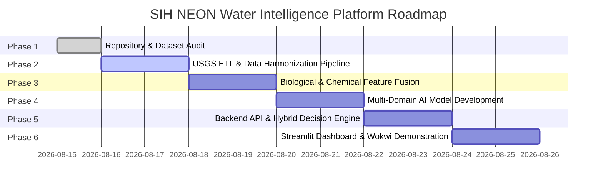

# Project Development Roadmap: NEON Water Intelligence System

**Project**: SIH Water Intelligence Platform  
**Target Delivery**: Production-Ready Prototype & Multi-Domain Demonstration  
**Version**: 3.0.0

---

## 1. Roadmap Overview & Implementation Phases

The project is structured into **6 sequential development phases**, advancing from raw data harmonization to AI modeling, real-time IoT integration, and presentation-ready dashboard analytics:

---

## 2. Phase-by-Phase Execution Plan

### Phase 1: Technical Repository & Dataset Audit (Completed)
- **Objective**: Complete systematic audit of existing ML models, backend services, Streamlit dashboard, and new USGS datasets (`resultphyschem.csv` and `biologicalresult.csv`).
- **Deliverables**:
  - [`docs/AUDIT_REPORT.md`](file:///Users/raj/neon_water_project/docs/AUDIT_REPORT.md)
  - [`docs/PROJECT_ROADMAP.md`](file:///Users/raj/neon_water_project/docs/PROJECT_ROADMAP.md)
  - [`docs/Architecture.md`](file:///Users/raj/neon_water_project/docs/Architecture.md)
- **Output**: Verified baseline codebase and architectural specifications.

---

### Phase 2: USGS Data Ingestion, Cleaning & Harmonization Pipeline
- **Objective**: Ingest, parse, clean, and standardize the 445,998 rows of physical, chemical, and biological water quality observations.
- **Key Tasks**:
  1. Unit standardization (Convert temperatures to $^\circ\text{C}$, specific conductance to $\mu\text{S/cm @25}^\circ\text{C}$, turbidity to $\text{FNU/NTU}$, nutrients to $\text{mg/L as N}$ and $\text{mg/L as P}$).
  2. Handle non-detect / below-detection-limit (BDL) values using $\frac{1}{2}\text{MDL}$ or robust censored imputation.
  3. Reshape long-format observations into wide sampling events `(MonitoringLocationIdentifier, ActivityStartDate, ActivityStartTime)`.
  4. Save partitioned parquet tables in `data/processed/usgs/`.
- **Expected Output**: Clean, wide, typed parquet dataset (`data/processed/usgs_water_quality_wide.parquet`).

---

### Phase 3: Biological & Chemical Feature Engineering & Fusion
- **Objective**: Mathematically fuse physicochemical water chemistry with biological ecotoxicity and taxonomic bioindicators.
- **Key Tasks**:
  1. Calculate biogeochemical stoichiometry: Total Nitrogen to Total Phosphorus ($\text{N}:\text{P}$) ratios, organic carbon to sediment absorption ratios ($\text{fDOM}:\text{SSC}$).
  2. Compute Biological Ecotoxicity Indices:
     - Bioassay Survival / Toxicity Response for bioindicator species (*Ceriodaphnia dubia*, *Hyalella azteca*, *Pimephales promelas*).
     - Taxonomic Pollution Tolerance Score & Assemblage Stress Index.
  3. Calculate Authoritative Water Quality Indices (Weighted Arithmetic WQI with Anti-Eclipsing Single-Parameter Guardrails).
- **Expected Output**: Fused multi-domain dataset (`data/processed/fused_biochem_dataset.parquet`) and audit report.

---

### Phase 4: Multi-Domain Machine Learning & Ecotoxicity Models
- **Objective**: Develop dual-layer AI models trained on both continuous sensor streams and discrete physical-chemical-biological sampling regimes.
- **Key Tasks**:
  1. **Model 1 (Multivariate Anomaly Detector)**:
     - Algorithm: Extended Isolation Forest / Local Outlier Factor.
     - Features: Physicochemical telemetry + nutrient ratios + sediment load.
     - Output: Continuous anomaly score $[-1.0, +1.0]$ and binary alert flag.
  2. **Model 2 (Ecosystem Operational Risk & Toxicity Classifier)**:
     - Algorithm: Balanced Multi-Class Random Forest / XGBoost with Class-Weighting.
     - Target: Operational Risk States (`SAFE`, `WARNING`, `CRITICAL`, `ECOTOXIC_COLLAPSE`).
     - Evaluation: Train/Test Split ($80/20$), Stratified K-Fold CV, Precision, Recall, F1-Score, ROC-AUC, Confusion Matrix.
  3. Serialize model artifacts to `models/v3/`.
- **Expected Output**: Serialized model artifacts (`anomaly_detector_v3.joblib`, `risk_classifier_v3.joblib`) and evaluation reports (`reports/model_v3_results.md`).

---

### Phase 5: Backend Integration & Hybrid Decision Engine
- **Objective**: Connect the expanded multi-domain data pipeline and AI models to the FastAPI production backend.
- **Key Tasks**:
  1. Update `backend/model_loader.py` to load v3 multi-domain models.
  2. Enhance `backend/environmental_engine.py` to include biological toxicity thresholds, sediment criteria (SSC limits), and nutrient eutrophication guardrails.
  3. Maintain strict backwards-compatibility with Wokwi ESP32 IoT nodes and real-time inference callers.
  4. Add `/predict/batch` endpoint for bulk historical USGS catchment file processing.
- **Expected Output**: High-performance FastAPI server supporting single-sample real-time inference and bulk catchment batch analysis.

---

### Phase 6: Dashboard Analytics & Wokwi Digital Twin Demo
- **Objective**: Deliver an interactive Streamlit operational dashboard and calibrated Wokwi ESP32 IoT simulation for SIH demonstration.
- **Key Tasks**:
  1. **Dashboard UI Enhancements**:
     - Live Real-Time IoT Stream Tab: Connected to Wokwi ESP32 node.
     - Historical USGS Catchment Analytics Tab: Interactive map, temporal trend charts, correlation heatmaps, species toxicity distributions.
     - Neuro-Symbolic Decision Center: "Why the AI reached this conclusion" explainability panel.
  2. **Wokwi Digital Twin Node**:
     - Pre-configured hardware scenarios (Healthy, Eutrophication, Industrial Spill, Telemetry Loss).
  3. Validation and end-to-end rehearsal.
- **Expected Output**: Production-grade SIH demo platform running locally with interactive visualization and hardware emulation.
