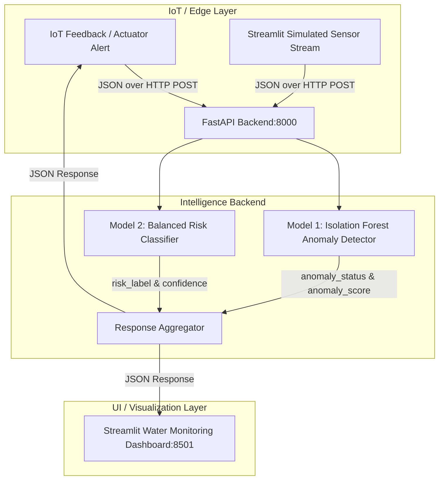

# SIH 2026 Water Intelligence Platform — Demo & Integration Guide

**Platform Version**: 2.0.0  
**Target Event**: Smart India Hackathon (SIH) 2026  
**Architecture Status**: Fully Integrated (FastAPI + Model 1 + Model 2 + Streamlit + Wokwi IoT)

---

## 1. System Architecture



---

## 2. End-to-End Data Flow

1. **Telemetry Acquisition**: Sensor nodes (Wokwi virtual ESP32 or physical probes) capture `pH`, `dissolved_oxygen`, `turbidity`, `specific_conductance`, `fdom`, `temperature`, and site metadata.
2. **REST API Ingestion**: Telemetry packet is dispatched to `POST /predict` on the FastAPI backend.
3. **Decoupled AI Inference**:
   - **Model 1 (`anomaly_detector_v2.joblib`)**: Identifies multidimensional out-of-distribution patterns and outputs continuous severity score (`anomaly_score`) and status (`Normal` vs `Anomaly`).
   - **Model 2 (`risk_classifier_v2.joblib`)**: Applies site-specific baseline adaptation and multi-parameter risk classification (`SAFE`, `WARNING`, `CRITICAL`, `INSUFFICIENT_DATA`) with predictive confidence.
4. **Dashboard Synchronization**: Real-time KPI update, live trend plotting, and emergency alert banners for immediate water authority action.

---

## 3. API Contract Specification

### A. Health Check: `GET /health`

**Endpoint**: `http://localhost:8000/health`

**Response (`200 OK`)**:
```json
{
  "status": "ok",
  "models_loaded": true,
  "version": "2.0.0",
  "architecture": {
    "model_1": "IsolationForest (Anomaly Detection)",
    "model_2": "RandomForestClassifier (Balanced Risk Classification)",
    "labels": "operational_risk_labels_v2.0"
  }
}
```

---

### B. Inference Pipeline: `POST /predict`

**Endpoint**: `http://localhost:8000/predict`  
**Headers**: `Content-Type: application/json`

#### Expected Request JSON from IoT / Wokwi:
```json
{
  "ph": 7.20,
  "dissolved_oxygen": 8.00,
  "turbidity": 5.00,
  "specific_conductance": 300.0,
  "fdom": 20.0,
  "temperature": 21.5,
  "site_id": "ARIK",
  "sensor_position": "102"
}
```

#### Response JSON:
```json
{
  "anomaly_status": "Normal",
  "anomaly_score": -0.1060,
  "risk_label": "SAFE",
  "confidence": 0.6320,
  "timestamp": "2026-08-15T09:52:27Z"
}
```

---

## 4. 3 Predefined SIH Presentation Scenarios

During the live SIH jury demonstration, test these 3 reference scenarios directly from the dashboard:

| Scenario | Input Profile | Expected Model Output | Presentation Narrative |
|---|---|---|---|
| **Scenario A: Normal Water** | $\text{pH}=7.40$, $\text{DO}=9.20\text{ mg/L}$, $\text{Turbidity}=2.10\text{ FNU}$, $\text{SpCond}=140\ \mu\text{S/cm}$ | `SAFE`  <br>`Normal` (Confidence: 97.9%) | Demonstrates baseline stability across pristine mountain/stream waters. |
| **Scenario B: Pollution Inflow** | $\text{pH}=5.20$, $\text{DO}=1.80\text{ mg/L}$, $\text{Turbidity}=185.0\text{ FNU}$, $\text{SpCond}=980\ \mu\text{S/cm}$ | `CRITICAL` 🚨 <br>`Anomaly` (Severity: +0.2144) | Demonstrates rapid detection of severe industrial runoff or storm event triggering emergency protocols. |
| **Scenario C: Sensor Failure** | Missing values (`pH=None, DO=None, Turbidity=None`) | `INSUFFICIENT_DATA` 🔌 <br>Confidence: 0.0% | Demonstrates scientific integrity: missing sensors are **not** hallucinated as safe. |

---

## 5. Wokwi ESP32 IoT Integration Guide

### Step 1: Wokwi Circuit Setup
In [Wokwi.com](https://wokwi.com), create an **ESP32** project with:
- **Potentiometer 1** (GPIO 34) $\rightarrow$ pH sensor emulation ($0 - 14\text{ pH}$)
- **Potentiometer 2** (GPIO 35) $\rightarrow$ Turbidity sensor emulation ($0 - 300\text{ FNU}$)
- **Potentiometer 3** (GPIO 32) $\rightarrow$ Dissolved Oxygen emulation ($0 - 20\text{ mg/L}$)
- **RGB LED** (GPIO 18, 19, 21) $\rightarrow$ Real-time risk status indicator (Green = SAFE, Yellow = WARNING, Red = CRITICAL)

### Step 2: ESP32 Arduino C++ Code Snippet

```cpp
#include <WiFi.h>
#include <HTTPClient.h>
#include <ArduinoJson.h>

const char* ssid = "Wokwi-GUEST";
const char* password = "";

// Replace with your workstation IP or local tunnel URL (e.g. ngrok / cloudflared)
const char* serverUrl = "http://192.168.1.100:8000/predict";

void setup() {
  Serial.begin(115200);
  WiFi.begin(ssid, password);
  while (WiFi.status() != WL_CONNECTED) {
    delay(500);
    Serial.print(".");
  }
  Serial.println("\nWiFi Connected!");
}

void loop() {
  if (WiFi.status() == WL_CONNECTED) {
    HTTPClient http;
    http.begin(serverUrl);
    http.addHeader("Content-Type", "application/json");

    // Read simulated ADC values
    float raw_ph = analogRead(34) * (14.0 / 4095.0);
    float raw_turb = analogRead(35) * (300.0 / 4095.0);
    float raw_do = analogRead(32) * (20.0 / 4095.0);

    StaticJsonDocument<256> doc;
    doc["ph"] = raw_ph;
    doc["dissolved_oxygen"] = raw_do;
    doc["turbidity"] = raw_turb;
    doc["specific_conductance"] = 350.0;
    doc["fdom"] = 25.0;
    doc["temperature"] = 22.5;
    doc["site_id"] = "BIGC";
    doc["sensor_position"] = "112";

    String requestBody;
    serializeJson(doc, requestBody);

    int httpResponseCode = http.POST(requestBody);
    if (httpResponseCode > 0) {
      String response = http.getString();
      Serial.println("Response from AI Backend:");
      Serial.println(response);
    } else {
      Serial.printf("Error occurred: %s\n", http.errorToString(httpResponseCode).c_str());
    }
    http.end();
  }
  delay(3000); // 3-second telemetry packet interval
}
```

---

## 6. Launching the Demo Stack

### Terminal 1: Start FastAPI Backend
```bash
.venv/bin/uvicorn backend.main:app --host 0.0.0.0 --port 8000 --reload
```

### Terminal 2: Start Streamlit Dashboard
```bash
.venv/bin/streamlit run dashboard/app.py --server.port 8501
```

Access Points:
- **Interactive Web Dashboard**: `http://localhost:8501`
- **FastAPI OpenAPI Swagger Documentation**: `http://localhost:8000/docs`
- **API Health Check**: `http://localhost:8000/health`
