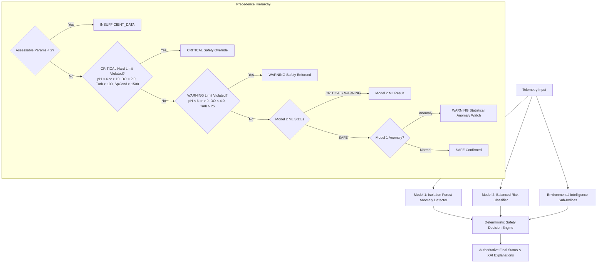

# Environmental Intelligence & Deterministic Safety Layer Specification (v2.1)

**System**: SIH Water Intelligence Platform  
**Architecture**: Hybrid Neuro-Symbolic Pipeline (ML Classification + Deterministic Environmental Safety Guardrails)  
**Status**: Production Ready & Fully Validated

---

## 1. Safety Architecture & Decision Hierarchy

To prevent catastrophic false-negative classifications (e.g. ML predicting `SAFE` during extreme $\text{pH}=0.25$ or $\text{pH}=13.65$ shocks), the platform applies a **Deterministic Final Environmental Safety Decision Engine** downstream of Model 1 (Anomaly Detection) and Model 2 (Risk Classification):



---

## 2. Authoritative Environmental & Safety Thresholds

All thresholds are sourced from recognized regulatory bodies (US EPA, WHO, USGS):

| Parameter | Permissible Envelope | Moderate Warning Threshold | Critical Lethal Threshold | Authoritative Source |
|---|---|---|---|---|
| **pH** | $6.5 - 8.5$ | $\text{pH} < 6.0$ or $\text{pH} > 9.0$ | **$\text{pH} < 4.0$ or $\text{pH} > 10.0$** | **EPA Freshwater Aquatic Life Criteria**; **WHO Drinking Water Guidelines (4th ed.)** |
| **Dissolved Oxygen (DO)** | $\ge 8.0\text{ mg/L}$ | $2.0 \le \text{DO} < 4.0\text{ mg/L}$ | **$\text{DO} < 2.0\text{ mg/L}$** | **USGS / EPA Aquatic Life Asphyxiation & Anoxia Criteria** |
| **Turbidity** | $\le 10.0\text{ FNU}$ | $25.0 \le \text{Turb} \le 100.0\text{ FNU}$ | **$\text{Turb} > 100.0\text{ FNU}$** | **EPA National Primary / Secondary Drinking Water Regulations** |
| **Specific Conductance** | $\le 500\ \mu\text{S/cm}$ | $800 \le \text{SpCond} \le 1500\ \mu\text{S/cm}$ | **$\text{SpCond} > 1500\ \mu\text{S/cm}$** | **EPA Aquatic Conductivity Benchmark (Mid-Atlantic/Freshwater)** |
| **fDOM (Carbon)** | $\le 25.0\text{ QSU}$ | $75.0 \le \text{fDOM} \le 150.0\text{ QSU}$ | **$\text{fDOM} > 150.0\text{ QSU}$** | **NEON DP1.20093.001 / DOC Calibration** |

---

## 3. Anti-Eclipsing Single-Parameter WQI Guardrail

**The Problem**: In classic weighted-arithmetic WQI methods (Ott, 1978; Swamee & Tyagi, 2000), single extreme failures (e.g. $\text{pH}=0.25$) are masked by normal parameter averages, scoring $77.2/100$ ("Good").

**The Solution**: When any single parameter breaches acute critical limits, the WQI engine flags the score with an **Anti-Eclipsing Violation Note**:
- Score: `77.2/100`
- Grade: `CRITICAL VIOLATION (Safety Override)`
- Note: `Index score: 77.2/100 — but critical parameter violation detected (Severe Acidification (pH = 0.25 < 4.0))`

---

## 4. Neuro-Symbolic Explainable AI (XAI) Attribution

When safety guardrails override an ML prediction, the XAI engine outputs the exact reason and hierarchy:

```json
"explanation": [
  "🛡️ SAFETY GUARDRAIL OVERRIDE: ML Model 2 predicted SAFE (Confidence: 53.6%), but Deterministic Environmental Safety Guardrails upgraded final status to CRITICAL.",
  "  • Severe Acidification (pH = 0.25 < 4.0): Violates EPA freshwater aquatic life survival envelope (corrosive/toxic shock).",
  "Severe acidic condition detected (pH = 0.25, CSI = 1.00) indicating acid mine drainage or industrial chemical dump."
]
```

---

## 5. Automated Safety Verification Results

All 7 test cases pass $100\%$ (`tests/test_backend_api.py`):
1. **Normal Pristine Water** ($\text{pH}=7.2, \text{DO}=8.0, \text{Turb}=5.0$) $\rightarrow$ `SAFE` (Override: No)
2. **Severe Acidification** ($\text{pH}=0.25$) $\rightarrow$ `CRITICAL` (Override: Yes, ML SAFE overruled)
3. **Severe Alkalinity** ($\text{pH}=13.65$) $\rightarrow$ `CRITICAL` (Override: Yes, ML SAFE overruled)
4. **Severe Hypoxia** ($\text{DO}=0.5\text{ mg/L}$) $\rightarrow$ `CRITICAL` (Override: Yes, Lethal Anoxia)
5. **Missing Telemetry** (All parameters `None`) $\rightarrow$ `INSUFFICIENT_DATA` (Zero hallucination)
6. **Catastrophic Turbidity Runoff** ($\text{Turb}=250\text{ FNU}$) $\rightarrow$ `CRITICAL` (Override: Yes)
7. **API Health & Version Check** $\rightarrow$ `version 2.1.0` (PASSED)
